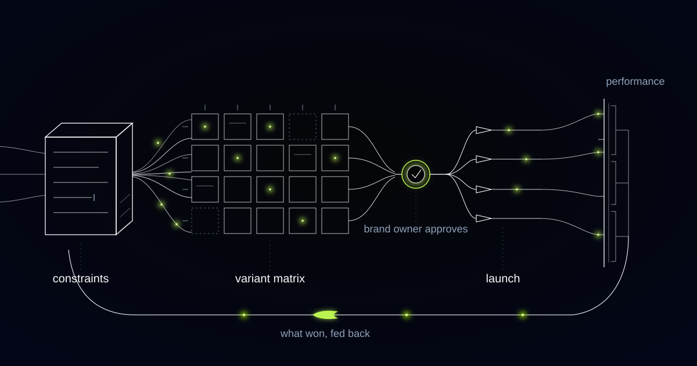

# An Ad Creative Engine That Refuses to Make More Ads Than You Can Read

> How we built a closed-loop creative engine for a direct-to-consumer brand buying across several European markets, and why an account's weekly conversion volume, not its studio, sets how fast any advertiser can learn.

## You cannot learn faster than your conversion volume will pay for

The number of creative tests a brand can read in a month is set by how many conversions its account buys, not by how many assets its team can produce. Most of a creative programme is negotiable. That part is arithmetic, and creative operations are usually built to ignore it.

Our customer sells physical products direct to consumers across several European markets, buying on paid social and search with a creative team you could fit around one table. Targeting and bidding, the levers performance marketers used to spend careers on, now belong to the platforms' own optimisation systems. Creative is the main input the advertiser still controls, and the standing assumption is that more of it is always better.

More of it is better only up to the point where the account can still tell the variants apart. Past that point, extra volume buys no extra learning. It buys a wider matrix of cells too thin to distinguish, and conclusions drawn from noise. A brand in that state retires hooks it never actually tested, with a dashboard open in front of it.

## Fifty events in seven days sets the cycle time, not your designers

Meta's delivery system holds an ad set in the learning phase until it accumulates roughly fifty optimisation events within a seven-day window, and a significant edit to a delivering ad set sends it back into that phase. That floor is the clock a creative programme runs on. The studio's turnaround time is not.

Two consequences follow, and most creative programmes ignore both. The first is a ceiling: the number of readable test cells available in a week is bounded by the account's weekly conversion volume divided by that event floor. An account buying a few hundred purchases a week can read a small handful of cells honestly. It cannot read twenty-four, however fast the assets arrive.

The second consequence is more expensive. Shipping fresh variants as edits into the ad set that is currently winning resets the learning phase on the incumbent you were trying to beat. The challenger is then measured against a competitor you destabilised yourself, and the comparison is worthless in a way that looks exactly like a result.

## A twenty-four cell matrix that could never have produced an answer

We shipped a twenty-four cell matrix: four hooks by three formats by two markets, every asset stamped with its coordinates at the moment it was created, so the tagging that makes learning possible was structural rather than retro-fitted into a spreadsheet weeks later. On the tagging we were right. On the sizing we were wrong before a single impression was served.

The data came back beautifully structured and completely unreadable. Per-cell conversion counts sat in single digits, so every roll-up by hook was noise dressed as a finding, and the hook that appeared to lose had been judged on a handful of conversions. Because several variants had gone in as edits to existing ad sets, we also reset learning on the account's best performer during the same week we were trying to measure against it.

What that cost was not a batch of assets but a cycle, and cycles are the scarce thing. The fix was not a cleverer statistical treatment of thin data. It was sizing the matrix before generating anything.

*Variants go out, performance comes back, and the next round is shaped by what returned.*

## Readable cells, and the batch we refuse to generate

The engine now sizes the matrix before it generates a single asset. Given the account's recent conversion rate and the spend the team will actually commit over the test window, it derives how many cells can reach a readable event count inside the learning window, and it will not generate wider than that.

Readable cell: a cell of the creative matrix that accumulated enough optimisation events inside the platform's learning window for its performance to be distinguished from the other cells. A cell below that threshold is reported as untested, never as a loser, because retiring a hook on a handful of conversions is how a closed loop optimises itself into a corner.

New variants ship into new ad sets rather than as edits to delivering ones, so the incumbent keeps its delivery history and the comparison stays honest. A cell that misses its event floor comes back marked untested and rejoins the queue instead of the archive.

The refusal is the part clients do not expect. Asked for more variants than the account's conversion volume can read, the engine declines and says how many cells are affordable. A creative system that produces more assets than it can learn from is a production line pretending to be an experiment, and it will confidently retire a hook that never actually lost.

There is a point where this build is the wrong one. If the account cannot buy enough events for even two readable cells, do not commission a creative engine. Optimise toward a higher-frequency event, label it plainly as a proxy for the outcome you care about, or run cells sequentially over longer windows and accept a slower calendar.

## Claims come from a signed-off library, never from the model

Generation draws only on claims the brand has already substantiated, either verbatim or inside a paraphrase range legal has signed off. The model may not invent a benefit, quantify a result, or improve a claim by making it stronger, which is precisely what an unconstrained model does, because stronger claims read better.

Constraining the input costs less than policing the output, and it moves the compliance conversation to one library instead of one ad at a time forever. Anything drawing on a regulated claim routes to whoever owns claims before it can ship, and that route has no bypass.

Three decisions stay outside the machine permanently. It does not move budget: it can report that a hook is outperforming, and a human moves the money. It does not choose positioning, because who the brand wants to be to its customers is not a metric the loop can read. And every pattern it surfaces stays a hypothesis until a performance marketer agrees it is a rule. Every batch arrives with its reasoning attached, which cells it fills and what it is testing, and nothing reaches a platform unapproved.

## Fatigue is a shape, which is why we keep the curve and not the average

The system stores each asset's performance curve over time rather than a lifetime average, because fatigue is a shape rather than a number. One format holding up for weeks while another decays within days is a planning fact that changes how a quarter is booked, and a lifetime average hides it completely.

Platform-reported conversions are treated as directional, reconciled against the brand's own order data wherever the join is honest and marked as platform-reported wherever it is not. A learning loop fed by numbers the team privately distrusts is worse than no loop, because it launders a suspicion into a rule.

Retired branches are archived rather than deleted, with the evidence behind each retirement attached and the event counts visible. A brand that cannot see what it already tried will re-brief a hook it disproved last year, usually within one change of agency.

## Common questions

### How many creative variants should we actually be testing at once?

Divide your account's weekly conversion volume by the platform's learning-phase event floor, roughly fifty optimisation events in seven days on Meta. That quotient is your ceiling on readable cells for the week. Most brands running a dozen live variants can honestly read three or four of them. The remainder are assets in market, not tests.

### Will this replace our creative team or our agency?

No. The engine produces variants inside the brand's constraints and proposes what to test next, and a performance marketer approves every batch before it reaches a platform. Concept work and positioning stay with people. What goes away is the manual production of the twentieth resize, and the quarterly slide of creative learnings that gets read once.

### What happens to a variant that does not get enough data?

It is reported as untested and returns to the queue, never reported as a loser. Retiring a hook on single-digit conversions is the fastest way to teach a closed loop a false rule, and false rules compound: the next brief inherits the exclusion, and the brand quietly stops generating the thing that would have worked.

### Can the engine manage budget as well?

It can recommend, and it shows how much evidence sits behind each recommendation. It cannot move money, pause an ad set or scale one. Budget is where an error compounds silently across an account before anyone reads a report, so it stays with the person accountable for the account's number.

## Is your creative programme testing more than your account can read?

If your matrix is wider than your weekly conversion volume can support, you are producing rather than learning, and some of the hooks you retired were never actually beaten. We build creative engines that size the test before they generate the assets and leave budget with a human. Tell us what you are buying and what the account converts in a week, and we will tell you how many cells you can afford.
