# An Analytics Agent That Cannot Write a Wrong Join, Because It Cannot Write a Join

> Prompt instructions cannot stop a model writing a fanned-out join, so this agent's output space contains no SQL at all: it selects governed metrics and the semantic layer writes the query.

## The schema went into the prompt and the SQL came back valid

Take the DDL and a handful of sample rows, put them into the context window, let the model write the SQL, check that the SQL parses and executes, post the result back into the Slack thread. That was the first build, and it demonstrated beautifully. A satisfying afternoon of work.

It parsed. It executed. It joined orders to order_lines, summed the order-level total, and inflated revenue by the average number of lines per order. Nobody caught it for a while, because the number was larger than expected and the quarter was going well. A number wrong in the upward direction attracts far less scrutiny than one wrong in the other.

Our validator had checked everything except the only thing that mattered. Syntax valid, tables exist, query returns rows, execution inside the timeout, no destructive statements. Every check passed on a query that was quietly multiplying the company's revenue.

The dangerous output of a text-to-SQL agent is not a hallucinated table name, which errors loudly and gets fixed within the hour. It is a syntactically perfect join across a one-to-many relationship that silently duplicates a measure and returns a number nobody has reason to question.

## The fan trap: a valid join, a wrong number, and no error message

The fan trap, also called a fan-out join, is what happens when a fact table is joined to a one-to-many child and a parent-level measure is then aggregated. Each parent row is duplicated once per child row, and the measure duplicates with it. An order with four lines contributes its total four times to the sum. No database raises an error, because nothing illegal has occurred: the join is valid, the aggregate is valid, the answer is wrong.

Mature semantic layers defeat this with symmetric aggregates, which hash each row's primary key so that a summed value can be de-duplicated across the fanned-out result set. Looker's implementation of symmetric aggregates is why a BI tool can join orders to order_lines and still report order revenue correctly. Hand-written SQL does not do this unless its author remembers to. Language models do not do it either, and what a language model writes is hand-written SQL.

Prompt engineering does not fix this. You can put a careful paragraph about grain and cardinality into the system prompt, and the model will honour it most of the time, and "most of the time" describes a number nobody can act on. The failure is silent, so the error rate is not observable from the outputs, and you cannot measure how often the instruction worked.

## We stopped letting the model write SQL and let it write a metric selection

We removed SQL from the model's output space entirely. The agent now emits a structured metric selection: which measure, which dimensions, which filters, which grain. The semantic layer takes that selection and compiles the SQL itself, using the relationship cardinalities it already holds and applying symmetric aggregates wherever a join fans out. The model can no longer express a join, so it can no longer express a wrong one.

A governed analytics agent is one whose output space is metric selections, not SQL strings. It chooses among measures, dimensions and filters that a human has already defined, and a semantic layer compiles the query. It cannot produce a wrong join because it cannot produce a join.

*The agent sits on top of the governed layer. It cannot invent a definition, only use one.*

The failure modes that survive this design are ones a business can live with. The agent can select the wrong measure, and every answer prints the measure it selected. It can apply a filter the asker did not intend, and the filters print alongside. Both are visible errors, argued about in the thread and corrected in the next message. The invisible error is gone because the mechanism that produced it is gone.

We refuse to give an analytics agent raw-table access. That includes read-only access, and it includes access accompanied by careful prompt instructions about grain, because prompt-level warnings are not a control surface. We equally refuse the other common design, a queue where the data team approves every answer before it goes out, because that rebuilds the bottleneck the project existed to remove and adds a language model to it. The data team owns definitions. It does not own answers.

Defining a metric, widening an existing definition to fit a question, substituting a near-enough metric when the requested one is missing: those three decisions belong to the data team, in the layer, under version control.

## "That metric does not exist yet" is the sentence that makes every other answer credible

When somebody asks for a number that has no governed definition, the agent says so and names the nearest metric that does exist. A system able to decline is a system whose answers carry information. A system that answers everything is indistinguishable from one that is guessing, and users work that out faster than anybody expects them to.

Every answer carries its definition and its filters, printed with the chart: active customers defined as accounts with a paid subscription and at least one product login in the trailing thirty days, trials excluded. That single detail changed the arguments inside the company. Disputes stopped being about whose number was right and became about whether the definition was right, which the data team can settle once, in one place, for everybody.

Analysts who want to check the work can expand the compiled query. The compiled SQL comes from the semantic layer, not from the model, so reviewing it means reviewing the definition instead of a language model's improvisation.

## Every unanswerable question is a modelling ticket, so the layer grows along the grain of real questions

Refusals are inputs to the roadmap. Any user can flag an answer or a refusal, every flag becomes a ticket, and the usual resolution is a new or refined definition in the semantic layer. A question the agent could not answer this month becomes one it answers correctly next month, and the person who originally asked gets told.

This inverts how semantic layers normally grow. The usual approach is speculative upfront modelling: a data team decides which metrics the business will want, models them, and discovers a year later which of them nobody used. Growing the layer from refused questions means every definition added exists because a named person needed it on a specific day.

It also makes the modelling work visible. Definitional work is the least legible thing a data team does, and the flag-to-definition loop turns it into a queue with requesters attached, which is far easier to defend at a planning meeting than a backlog nobody outside the team can read.

## When not to build this: the ungoverned-warehouse test

Do not build this on a warehouse that has no semantic layer. The test takes an afternoon: ask three people to produce last quarter's revenue independently, then compare the queries. If they used three different definitions, an agent pointed at those same tables will confidently produce a fourth, format it beautifully, and post it where everyone can see it.

The order of operations is the whole lesson. Governance first, agent second. If the layer is not there, that is the project to start with, and the agent afterwards is the smaller half of the work. It is also the thing that finally makes the layer worth having to the people who never understood why the data team spent a quarter arguing about "active customer".

## Common questions

### Can we not just give the model read-only access to the warehouse?

Read-only access protects the data. It does nothing about wrong answers, which are the actual risk, and the worst of those come from perfectly valid queries. A read-only agent that fans out a join produces an inflated revenue figure with full permissions and complete confidence. The control that matters sits on the output space, not on the database grants.

### What happens when someone asks something the semantic layer cannot answer?

The agent says the metric does not exist, names the closest one that does, and offers to raise it. The question becomes a ticket for the data team, and the resolution is usually a definition added to the layer, not a one-off query. That is how the layer grows, and it grows towards the questions people are actually asking.

### How is this different from the text-to-SQL feature already in our BI tool?

Most text-to-SQL features generate SQL and check that it runs. This one cannot generate SQL at all: it selects from governed metrics, and the semantic layer compiles the query with the correct cardinality handling. If your BI assistant is constrained to your governed model rather than your raw tables, it is doing the same job, and the first thing to establish is which of the two it does.

### Does this just move the bottleneck to metric definition?

It moves the work from answering questions to defining terms, and those carry very different volumes. One definition of "active customer" serves every future question that uses it, while one pulled number serves one meeting. The queue shrinks because the unit of work becomes reusable, and the data team spends its time on the part that needs judgement.

## Could your warehouse survive an agent asking it questions?

If three people at your company would write three different queries for last quarter's revenue, an analytics agent will make that disagreement faster and more confident rather than resolving it. The fix is a governed layer first and a constrained agent on top of it, in that order. Tell us how "active customer" is defined where you work, and who is allowed to change it.
