# A Candidate Screening Engine That Shows Its Evidence

> How we built a high-volume screening engine for a staffing and recruiting agency, and why the same approach matters for anyone processing more applications than they can read.

## The seconds-long skim is the real black box

Every CV gets read. That's the polite fiction of high-volume recruiting. The reality at the company we built this system for — a staffing and recruiting agency placing candidates into industrial and logistics roles: warehouse operators, forklift drivers, line technicians, delivery crews — was thousands of applications a month landing on a team of recruiters who could give each one a few seconds of attention. The industry measures its CV skim in seconds rather than minutes, and that is not an exaggeration. It is the process.

High-volume recruiting doesn't have a shortage problem. It has an *attention* problem. Good candidates slipped through constantly, for reasons that had nothing to do with their ability to do the job: the crucial certification listed on page two instead of page one, an employer name the recruiter didn't recognize, a CV written in the wrong language for the recruiter who happened to open it, a formatting choice that buried a career's worth of relevant experience below an objective statement. The candidates never knew. Neither, honestly, did the recruiters.

People worry that AI screening will be a black box. We'd put it more bluntly: the seconds-long skim already is one. It's inconsistent between recruiters, undocumented, unexaminable after the fact, and it leaves no trail anyone could audit for fairness. The bar a screening system has to clear is not perfection. It's being more consistent, more thorough, and more accountable than a tired human glance — and being honest about what it should never decide.

## What we built

A screening engine that reads every application properly and shows its work. It parses CVs across formats and languages, scores each candidate against criteria the recruiters define, records the CV evidence behind every score, and hands recruiters a ranked shortlist with suggested interview questions. One principle governs the whole system: it ranks evidence, and humans make every hiring decision. No candidate is rejected by the machine. Ever.

*Evidence lights the criteria that it supports. The ranking is visible, and the decision stays human.*

## How it works

### Component 1: Parsing every CV, whatever shape it arrives in

Applications for industrial and logistics roles arrive in every shape a document can take: polished PDFs, ancient Word templates, photographed paper CVs, job-board exports — and, across this agency's markets, in several languages. The parsing layer normalizes all of it into one structured profile: roles held, dates, certifications and licenses, equipment experience, shift patterns worked, locations.

The design rule that matters here is what happens on failure. When the parser can't confidently read a document, the CV is flagged for a human to look at — not silently dropped. Someone who can drive a reach truck should not lose a job to a formatting choice, and in a high-volume funnel, silent parsing failures are exactly how that happens.

### Component 2: Scoring against criteria the recruiters define

The scoring criteria come from the recruiters and the job spec, never from the model's imagination. For a typical role that means a short, explicit list of concrete criteria: a valid forklift license, cold-storage experience, availability for night shifts, commuting distance, a specific safety certification. Recruiters set them, weight them, and can read them at any time in plain language.

The model's job is deliberately narrow: examine the CV for evidence on each criterion, and score what it finds. It does not form opinions about "culture fit," infer personality, or reward CVs that merely read fluently — the classic failure mode of unstructured screening, human or machine. And because the criteria are explicit, they are contestable. If one turns out to be a proxy for something it shouldn't be, it's a visible line in a configuration that a human can challenge and change — not a weight buried in a model nobody can inspect.

That narrowness is a feature, not a limitation. A system that only answers "what evidence does this CV contain for these stated criteria?" is a system whose behavior recruiters can predict, explain to clients, and defend when questioned. The moment a screening tool starts inferring things nobody asked it to infer, all three of those properties disappear.

### Component 3: An audit trail for every score

Every score links back to the CV passages that produced it. If a candidate scored well on cold-storage experience, the evidence is the cited line about winters spent in a refrigerated warehouse. If they scored low, the trail shows what the system looked for and didn't find — which is precisely the case a human should double-check.

This is the part we consider non-negotiable, and it's essential for fairness and compliance. When a candidate, a client, or a regulator asks why someone was ranked where they were, the agency has an answer built from evidence, not a shrug. It also makes systematic error discoverable: if the system consistently underweights experience from a certain category of employer, the audit trail is where that pattern becomes visible and fixable. Nobody has ever audited a skim that lasts seconds. Every decision this system supports can be audited in full.

### Component 4: Shortlists that prepare the recruiter, not replace them

What recruiters actually receive is a ranked shortlist — short enough that a recruiter can work through it properly — with an evidence summary for each and suggested interview questions aimed at the gaps: "forklift certification listed but no expiry date shown; verify it's current," "gap after the logistics role; ask about it." The human role shifts from skimming CVs to interviewing people, which is the part humans are actually good at.

And the boundary holds at the bottom of the list too. Candidates outside the shortlist are not rejected; they remain one click away, ranked, with the reasons displayed. Recruiters regularly pull people up from below the line because they know something the CV doesn't say. That is the system working as designed: it reduces the arbitrariness of the skim. It does not automate the no.

## Why this generalizes

The shape here is any process where applications arrive faster than qualified humans can read them, and where the decisions carry obligations of fairness. Internal talent-acquisition teams at large industrial and retail employers run the same funnel without the agency in the middle, and inherit the same skim. Universities processing admissions face thousands of files, published criteria, and real scrutiny over consistency — evidence-ranking with a human decision is almost exactly what their process claims to be already. Grant committees reviewing hundreds of proposals against a scoring rubric are the same picture with different documents.

In every case, the honest description of the status quo is the same: far more applications than reading time, triaged by glance. And in every case the right division of labor is the one we built — the system reads everything and organizes the evidence; the humans, with visible and contestable criteria in hand, make every decision that touches a person's future.

## Receiving more applications than your team can actually read?

If your screening process is a stack of CVs and a stopwatch, good candidates are already slipping through it. We build screening systems that read everything, show their evidence, and leave every decision with your people. Tell us what your application volume looks like.
