# A Catalog Enrichment Engine That Turns Supplier Chaos Into Products People Can Find

> How we built an AI enrichment pipeline for a long-tail marketplace ingesting hundreds of thousands of SKUs from thousands of small suppliers, and why the same approach matters for any business whose product data arrives from sources it doesn't control.

## The problem: search can't sell what it can't read

Most marketplaces don't have a traffic problem. They have a *findability* problem.

Our customer is a European long-tail marketplace carrying hundreds of thousands of SKUs from thousands of small suppliers — workshops, importers, specialist distributors, family firms that have been making the same excellent thing for decades. That supplier base is the entire commercial thesis: depth and variety the big platforms can't match. It is also, commercially speaking, a data disaster. Product information arrived however each supplier happened to keep it: spreadsheets with invented column headers, onboarding forms filled in to the halfway mark, exports from inventory software that predates the smartphone. Titles read like internal stock codes — "BRKT SS 40MM V2" — because to the supplier, that is what the product is called. Materials, dimensions, colors, and compatibility notes were missing, buried somewhere in a free-text description, or simply wrong.

It's worth being precise about what this costs, because "messy product data" sounds cosmetic. It isn't. Search and conversion live or die on structured attributes. Faceted filters run on attribute fields. Ranking runs on titles. Recommendations, comparison views, and every ounce of organic search visibility run on structure. When a shopper filters for solid oak and the material field is blank — even though "oak" sits in the third sentence of the description — that product ceases to exist for that shopper. It doesn't rank, it doesn't filter, it doesn't convert. The marketplace was paying real money to bring visitors in, then hiding a meaningful share of its own inventory from them.

The manual fix was a merchandising team you could fit around one table, working item by item: open the spreadsheet, decode the columns, search the web to establish what the product actually is, rewrite the title, fill in the attributes, assign a category. Conscientious work with hopeless arithmetic. The backlog ran to tens of thousands of SKUs and grew every week, because supplier onboarding never pauses to let cleanup catch up.

One reframing shaped the entire project: enrichment is not cleanup work. It is revenue work. Every attribute filled is a product becoming visible in searches where it was invisible before. The merchandisers weren't tidying a database. They were stocking shelves.

## What we built

We built an enrichment engine that sits between supplier chaos and the live catalog. Whatever arrives — a spreadsheet, a half-filled form, an export from software nobody will admit to still running — is normalized into one canonical schema. From there, the engine extracts structured attributes from titles, descriptions, and product images; writes category-appropriate, search-optimized copy in the marketplace's own voice; and then does something most pipelines skip entirely: it judges its own output. High-confidence enrichments publish automatically. Low-confidence ones go to a human, with the machine's evidence attached.

That judgment step is the heart of the system. Nothing goes live on blind faith, and no merchandiser spends a minute on an item the machine has solid grounds to be confident about.

<video src="media/catalog-enrichment-engine.mp4" poster="media/catalog-enrichment-engine-poster.jpg" controls playsinline preload="none" width="1280" height="720"></video>

*Whatever the supplier sends becomes one uniform structure. Confidence decides which rail it takes.*

## How it works

### Layer 1: Feed normalization — whatever arrives becomes one schema

Every supplier speaks a different dialect. The first layer is a translator: it inspects whatever file a supplier sends, works out which fields correspond to which concepts — this column is a price, this one is an EAN, this half-abbreviated header means delivery time — and maps everything into a single canonical product schema. Classic ETL pipelines break here, because there is no stable format to write a parser against; thousands of suppliers means thousands of slowly mutating formats, and the format changes the day after you finish the parser. A language model that reads the file the way a patient human would, proposes a mapping, and hands that mapping to deterministic validation absorbs the variance without leaving behind a graveyard of brittle parsing rules.

### Layer 2: Attribute extraction from titles, descriptions, and images

Most of the missing data was never actually missing. It was unstructured — scattered through descriptions, compressed into cryptic titles, plainly visible in photographs. The extraction layer reads all of it together and fills the attribute schema defined for the product's category: material, dimensions, color, finish, compatibility — whatever that category's shoppers actually filter on. Images earn their place here; for furniture and homeware especially, the photo regularly completed or contradicted the text. Every extracted attribute carries a value, a confidence score, and the evidence it was drawn from. That evidence trail is what makes review fast later: a human checking "material: oak — from image and description" is verifying, not researching.

### Layer 3: Category-aware copy that sounds like one brand

A power tool page should not read like a cushion page. The copy layer generates titles and descriptions from templates defined per category — what leads, which specifications must appear, what length converts — all governed by one set of brand tone rules, so thousands of suppliers stop sounding like thousands of suppliers. Crucially, copy is generated *from* the structured attributes, never alongside them. The text can only claim what extraction has established, which means a generated description cannot invent a feature the product doesn't have. Search copy that lies is a returns problem wearing a marketing hat.

### Layer 4: The confidence gate — publish, or ask a human

Automation earns trust by knowing when to stop. Every enriched SKU receives an aggregate confidence score, and the publishing threshold is tuned per category, because the cost of a mistake is not uniform: a mislabeled cable color is an annoyance, while a wrong load-bearing attribute on children's furniture is a genuinely serious problem. The large majority of items clear that bar and publish automatically, untouched. The remainder lands in a review queue ordered by expected impact, each item presenting the machine's proposal next to its evidence. The merchandiser's role shifts from doing the enrichment to deciding whether the enrichment is correct — faster work, and frankly more interesting work. Every correction feeds back into the system, sharpening extraction and recalibrating the thresholds it publishes against.

## Why this generalizes

The customer is a marketplace, but the shape of the problem is everywhere: revenue that depends on product data produced by people whose tools and incentives you don't control.

Retailers ingesting supplier feeds live this daily — every drop-ship program is a catalog-quality lottery drawn fresh with each new vendor, and the merchandising team is always the house that loses. B2B distributors often hold the hardest version: legacy catalogs where products are named by part number, the attributes live in a long-retired product manager's memory, and the new e-commerce front end can't find half of what is physically sitting in the warehouse. Classifieds platforms face the same mechanics with individual sellers — nobody can force a private seller to fill in a listing form properly, but every listing that becomes findable converts better, and the platform captures that lift at scale.

In every case the pipeline is the same four layers: normalize, extract, generate, gate. What changes is the schema, the tone rules, and where each category's confidence threshold sits. The architecture doesn't care whether the chaos comes from a supplier, a legacy system, or the general public.

## Is your search hiding half your inventory?

If product data arrives in whatever format your suppliers feel like sending, and your team is fixing it one row at a time, the backlog is not going to fix itself — and every un-enriched SKU is a product your customers cannot find. We build engines that turn that arithmetic around. Tell us what your catalog chaos looks like.
