# The Two Catalog Fields No Confidence Score Is Allowed to Fill

> Why a marketplace enrichment engine had to split its category schema into attributes a model may infer and attributes only a supplier may declare.

## Dozens of fields per category, and two that no model may fill

A category schema on a long-tail marketplace runs to dozens of attributes, and a confidence gate can govern almost all of them. Material, dimensions, colour, finish, compatibility: each is an inference from evidence, each can be scored, and each can be routed to a human when the score is low. Two kinds of field break the model entirely, because they are not inferences at all. Manufacturer identity and the product identifier are statements somebody is legally accountable for.

Under the EU General Product Safety Regulation, in application since December 2024, every product offered for sale online must display the manufacturer's name, postal address and electronic address, and where the manufacturer sits outside the EU, the name and address of the EU-established responsible person. A listing missing those details is a non-compliant offer, and the marketplace is the party making the offer. No score, however high, changes who is accountable for the statement.

We learned this from our own confidence gate working exactly as designed. Reading a supplier's spec sheet, the engine extracted a manufacturer name and postal address at high confidence and pushed the listing live. The extraction was accurate. That name really was printed on the sheet. It belonged to the distributor, who was neither the manufacturer nor the responsible person, and there was nothing in the document, the score or the pipeline that could have caught it. Nothing was wrong with the reading. The field simply is not an inference.

## One EAN, eleven sizes, and the deduplication that ate a product line

A second failure had the same root cause, this time in the product identifier. Deduplication had merged an eleven-size range into a single product, because the supplier had printed one EAN across all eleven sizes and our matching logic trusted it. Ten configurations disappeared from the catalog, and the merge looked like a clean win in every quality metric we had.

GS1 allocation rules are unambiguous on this point: a GTIN identifies one specific product configuration, and it must change when the declared net content or the form of the product changes. A supplier who reuses one EAN across a size range is not being sloppy about a reference number. They are asserting that eleven different products are one product, and every downstream system that believes them inherits the assertion.

That single reused identifier corrupts matching, deduplication and the compliance record simultaneously, which is what makes it worth naming as a distinct failure mode. Matching sends the wrong offers into the same product page. Deduplication destroys the range. The compliance record then attaches one set of manufacturer details to eleven products that may not share them.

*Whatever the supplier sends becomes one uniform structure. Confidence decides which rail it takes.*

## Inferable, attested, and the line between them

We split the category schema in two, and the split is now the central structure of the engine. Inferable attributes flow through the confidence gate as before: extracted from titles, descriptions and product images, scored, published automatically when the score clears a per-category threshold, and routed to a merchandiser with the evidence attached when it does not. Attested attributes are populated only by a supplier declaration captured during onboarding.

Attested attribute: a product field whose correctness rests on somebody taking responsibility for it rather than on evidence present in the data. Attested attributes are collected by declaration, never inferred, and no confidence score may stand in for the declaration.

Publication is blocked when an attested attribute is missing, regardless of how confident the engine is about everything else on the listing. An item can have a perfect material extraction, clean dimensions, a category assignment nobody would argue with and copy ready to ship, and it still will not go live without a declared manufacturer and a declared identifier. Aggregate confidence has no vote in that decision.

On attested fields the engine's job shrinks to two things: detecting contradictions and chasing. It compares the declaration against everything else it can read, so a declared manufacturer that appears nowhere on the spec sheet, or an EAN already declared against a different product, raises a discrepancy for a human. It never fills the gap itself.

We refuse to infer any attribute that a regulator, a customer or a court would read as the marketplace making a statement about a product's identity or safety. Confidence is not evidence and a score is not a signature. We also refuse to back-fill an attribute from a competing listing or a web search result, however tempting the coverage gain, because borrowing a rival's spec sheet imports their error and their liability along with their data.

## Copy may only claim what the attributes already establish

Generated copy is written from the structured attributes, never alongside them, so the text cannot claim a property the record does not hold. Titles and descriptions are produced from per-category templates that decide what leads, which specifications must appear and how long the description runs, all governed by one set of tone rules so that thousands of suppliers stop sounding like thousands of suppliers.

The constraint matters most on the fields that carry legal weight. A description that names a manufacturer, asserts a certification or implies a safety standard is making the same kind of statement as the attested field, and it is doing it in prose where no gate is watching. Copy generation reads only from the validated attribute record, which means an undeclared manufacturer cannot leak into a sentence because the model saw the name once in a source document.

Search copy that lies is a returns queue with better typography, and on regulated categories it is a withdrawal notice waiting to happen.

## Chasing a supplier is a product feature, not an admission of defeat

The chase is engineered as carefully as the extraction, because a blocked listing is worthless until somebody fills the gap. Missing attested fields generate a supplier request that names the exact field, explains what the regulation requires, and offers the declaration as a form rather than an email thread. Requests are batched per supplier, ordered by how much catalog value is blocked behind them, and tracked until the declaration arrives.

Merchandisers work the exception queue rather than the catalog. Their job is deciding whether a proposed enrichment is correct and pursuing the declarations that unblock revenue, and the queue is ordered by expected impact so the day starts with the products that matter. Every correction they make feeds back into extraction and recalibrates the thresholds each category publishes against.

The system may not publish a listing with a missing attested attribute, may not populate one from any source other than a supplier declaration, and may not decide whether a declaration is truthful. It flags contradictions and escalates them. A human decides what a supplier's paperwork actually means, and the supplier remains accountable for what it says.

## Common questions

### If the model is confident enough, why not let it fill in the manufacturer?

Because confidence measures how well a fact is supported by the document, not whether the document is authoritative. Our engine once extracted a manufacturer name and address at high confidence and was correct about the text: the name belonged to the distributor. Manufacturer identity under the EU General Product Safety Regulation is a statement of accountability, and only the supplier can make it.

### What happens to listings that are missing manufacturer or responsible person details?

They do not publish. Publication is blocked on any missing attested attribute regardless of aggregate confidence, and the item enters a supplier chase queue with the specific field named. For an existing catalog, the same rule is applied as a sweep: listings without the required details are identified, prioritised by trading volume, and chased before they are quietly delisted.

### Can you fill our gaps from other listings of the same product?

No, and we would push back if asked. Back-filling from a competitor's listing or a web result imports their error and their liability into your catalog, and it produces a compliance record whose ultimate source is an unaccountable third party. Inferable attributes come from the supplier's own material. Attested attributes come from the supplier's declaration.

### Our suppliers reuse EANs across size ranges. How much does that actually cost?

More than it looks. A GTIN identifies one product configuration and must change when the declared net content or form changes, so a reused EAN tells every downstream system that a whole range is one product. Deduplication merges the range and destroys most of it, matching misroutes offers, and the compliance record attaches one manufacturer statement to products that may not share it.

## How many of your live listings could name their manufacturer today?

An answer that starts with a search across supplier emails is a compliance exposure sitting on your live catalog, not a data-quality backlog. We build enrichment engines that separate what a model may infer from what a supplier must declare, and that block publication rather than guessing. Tell us what arrives in your supplier feeds.
