# An Early-Warning System That Names the Reason a Subscriber Is Leaving

> How we built a churn early-warning and save-action engine for a subscription media company, and why the same approach matters for any business that only learns about a decision when someone clicks cancel.

## The problem: by the time they reach the cancel button, the decision is weeks old

Most subscription businesses don't have a churn problem. They have a *lead time* problem.

Our customer is a subscription media company operating across several European markets, with a subscriber base in the millions and a mix of monthly and annual plans. They were not flying blind. There was a churn dashboard, refreshed monthly, with cohort curves and a breakdown by plan and tenure. It was accurate, well built, and useless for changing anything, because everything on it had already happened.

The one real intervention was the cancel flow: a discount offered at the door to anyone who got that far. It saved some people. It also handed money to subscribers who were going to stay anyway, and to subscribers who came back a month later for the same discount now that they knew it existed. And it did nothing at all for the far larger group who never opened the cancel flow — who quietly stopped watching, let the renewal run once or twice out of inertia, and disappeared.

The deeper issue was that the discount was the only tool. Someone whose app stutters on their living-room TV does not need money off. Someone who searches, finds nothing they want, and closes the app does not need money off either — they need to be shown the thing they'd actually watch. Offering a discount to both is the retention equivalent of prescribing one pill for every symptom: expensive when it works, useless when it doesn't, and either way it teaches you nothing.

Everything else was a quarterly campaign segmented by tenure and plan — the two attributes with least to do with whether someone is currently enjoying the product.

## What we built

We built an early-warning engine that scores every subscriber daily for risk of cancelling and — this is the part that matters — attaches the reason to the score. A number alone is not actionable. "At risk, engagement decayed after a series finished" and "at risk, hit playback errors three evenings running" are different problems with different responses.

Those responses come from a fixed catalogue of save actions that humans wrote and humans own. The system chooses among them by reason and expected effect. It does not invent them. There is no path by which the model composes a new commercial offer, adjusts a price, or writes to a customer in terms nobody approved.

Three boundaries are architectural rather than procedural, because money and trust are involved. Discount depth and eligibility live in a policy layer set by the retention lead and finance, enforced outside the model, readable as plain text by anyone who asks. Cancelling is never made harder for a high-risk subscriber; the score influences what we offer, never what we obstruct. And some situations are excluded from targeting entirely — an open complaint, a bereavement notification, an accessibility case — because a save offer is the wrong thing to send then, and the only way to guarantee it is to make those subscribers unreachable by the selector.

*Risk surfaces with a reason code, and the reason decides which save action fires.*

*Behaviour becomes signal, signal becomes a reason, and the reason chooses the action.*

## How it works

### Layer 1: Signal assembly from product telemetry and billing

The engine assembles a daily picture of each subscriber from two families of signal. From the product: session frequency and depth, starts versus completions, how far into the catalogue someone browses, device mix, notification engagement, and searches that end in nothing being played — one of the strongest "there's nothing here for me" signals in the dataset. From billing: card expiry dates, failed payment attempts, plan changes, and exposure to an upcoming price change.

Two design decisions did most of the work. First, everything is measured against the subscriber's own baseline, not a global average. Someone who watches one evening a week has not disengaged; someone who watched five and now watches one has. Second, content seasonality is modelled explicitly. A subscriber who only ever watches one returning series is not decaying between seasons — they are waiting, and treating that as risk is how a retention budget gets spent on people who were never going anywhere.

Failed payments are separated out completely. Involuntary churn is a different animal with a different fix, and folding it into a behavioural score buries a problem that a card-update prompt solves outright.

### Layer 2: Risk scoring with reason codes

The model predicts the probability of cancellation inside a defined window. Alongside it come human-readable reason codes, derived from the signals driving that subscriber's score and mapped to a deliberately short vocabulary: engagement decay, content fit, technical friction, price and value, billing failure, seasonal pattern.

The vocabulary is short on purpose. A hundred fine-grained reasons would be more faithful to the model and useless to the people acting on it. Six route cleanly to six families of response, and each is a sentence a human can agree or disagree with.

Calibration matters more than ranking here. A ranked list tells you who is most at risk; a calibrated probability tells you whether anyone is at enough risk to be worth spending on today.

### Layer 3: Action selection — not everyone gets a discount

The catalogue holds responses of very different costs: a personalised "here's what you'd like next" surface, a heads-up that a followed series is returning, a technical outreach with a device fix, a plan-fit suggestion such as annual billing or an ad-supported tier, a card-update prompt, a human callback for high-value subscribers, and — last, and constrained — a discount.

The selector optimises expected retained value net of the cost of acting, conditioned on the reason code, and it is trained to estimate uplift rather than risk. Risk tells you who is leaving; uplift tells you who will stay *because* you acted. Those populations overlap far less than most retention programmes assume, and the gap between them is where the wasted spend lives.

Doing nothing is a first-class action, chosen frequently and deliberately. The policy layer sits above all of it as hard constraints the model cannot optimise around: contact frequency caps, channel rules, eligibility, discount bands.

### Layer 4: Outcome measurement that retrains the selector

A randomised holdout is permanent, not a launch-phase experiment. A share of at-risk subscribers receive nothing, in every reason code, so the counterfactual is measured rather than assumed. Without it, a retention programme takes credit for everyone who was never going to leave — the most common way these systems flatter themselves into irrelevance.

Outcomes are measured on retained tenure and value over months, not on whether someone stayed until next Tuesday. Discount actions carry cannibalisation tracking, so a save on someone who was never at risk shows up as the cost it is.

The retention lead reads the weekly outcome review and holds the pen on the catalogue. The selector may reweight among approved actions on its own evidence. Adding an action, widening a discount band, or opening a new segment to contact is a decision made by a named human. The machine tunes within the rules; humans write the rules.

## Why this generalizes

The shape is any subscription business where behaviour precedes the decision by weeks and the only recorded event is the cancellation itself. Telecoms and broadband run it almost identically, with network quality data standing in for playback errors and a save desk instead of a cancel flow. B2B software has the same architecture with different signals — seat activation, admin logins, integration health — and reason codes that route to a customer success manager or a product bug rather than an offer. Insurance renewal books are the same picture again, where the reason decides whether a renewal needs a coverage conversation or nothing at all.

The discipline is identical everywhere: predict early, attach the reason, choose the cheapest action that addresses it, and measure against a holdout that tells you the truth.

## Only finding out when they click cancel?

If your churn reporting is monthly and your only save tool is a discount, you are paying full price for the bluntest intervention at the latest possible moment. We build early-warning systems that name the reason, route to a human-owned set of actions, and prove their effect against a holdout. Tell us what your cancel flow looks like today.
