# Somebody Else's Name Is Buried in Every Claim File You Close

> Why we built the subrogation signal into a claims document intelligence system at intake, and why it is walled off from the coverage view by design.

## The responsible party is on page one, unread

A claim file usually names the third party whose failure caused the loss. Systems built to read for damage and coverage position go straight past that name. Subrogation is the insurer's right, after indemnifying its policyholder, to pursue the responsible party in the policyholder's name, and it is the only part of a claim file that can return money rather than spend it.

That right is preserved or destroyed in the first days of a file, which is when nobody is looking for it. Recovery depends on identifying the responsible party, preserving the physical evidence such as the failed appliance or the burst hose before remediation removes it, and not having signed the right away in advance. Commercial leases and construction contracts routinely carry waiver-of-subrogation clauses that extinguish it outright, and the limitation clock against the third party runs from the date of the loss, not from the day the insurer pays.

The insurer in this engagement is a regional property and casualty carrier handling thousands of claims a month, with experienced licensed adjusters whose job is judgment: what the policy covers, whether an estimate is reasonable, whether the evidence holds together. A claim file runs to dozens of documents arriving over days or weeks, so before any judgment happens someone has to read all of it, and then read it again each time a new attachment lands. Recovery was not on that reading list.

## Adjusters read for coverage; recovery hides in the sentences they skip

We built the adjuster brief around coverage and quantum, which is what adjusters ask for, and the recovery signal stayed invisible for months. The brief was good at its stated job. It normalised every attachment, extracted the facts a coverage decision runs on, cross-checked the loss against the policy in force on the date of loss, and footnoted every statement to its source. None of that surfaces a recovery, because a recovery is not a field on a form.

The signals we were missing were unremarkable pieces of text that a coverage reader has no reason to stop on. A throwaway sentence in the first notice of loss narrative saying a plumber had been out the week before. A named manufacturer's part on a line of a repair estimate. A photograph that happens to show the neighbouring unit. Each one is trivial in isolation and each one is a potential defendant.

The extraction that mattered turned out to be relational, not field-level, which is why we added a party graph. Every person and company the documents mention is captured as a node, with their role and the document that ties them to the cause of loss, so the plumber in the narrative, the manufacturer on the estimate line and the neighbour in the photograph become connected entities rather than stray strings in three unrelated files.

*Scattered evidence becomes one cited brief. The final node stays open: the adjuster decides.*

## The party graph, and why it never touches the coverage view

Recovery potential never appears anywhere in the coverage view, and that separation is enforced in code, not written into a style guide. An adjuster who knows a loss might be recoverable has a reason to pay a marginal claim, because the money looks likely to come back. That is a contaminated coverage decision even when it reaches the right answer, and it is the kind of contamination a regulator, a reinsurer or a bad-faith claim will eventually ask about.

So the party graph and the coverage flags are separate surfaces with separate access, and neither one feeds the other. The recovery surface is read by the subrogation team, who are the people the information is useful to and the people whose incentives it does not distort. The coverage surface shows the adjuster the policy, the evidence and the open questions, and shows nothing at all about who else might end up paying.

Building the wall in code costs more than agreeing to a convention, and the cost is the point. Conventions decay under deadline pressure, and a surface that merely omits recovery today will have a helpful recovery badge on it within two release cycles.

## Evidence has a shorter shelf life than the claim

Some facts stop existing long before the claim closes, so extracting them at intake is the only chance you get. Once the burst hose is in a skip there is nothing left to test, and no amount of later reading recovers it. That is why the system fires an evidence-preservation alert before the remediation invoice arrives, triggered by the mitigation vendor's own paperwork rather than by anyone remembering.

Recovery-critical fact: a fact whose evidentiary value expires before the claim closes, such as the identity of a third party, a preserved component, a scene photograph, or a contract clause waiving subrogation. Recovery-critical facts must be extracted at intake, because by the time the claim settles they no longer exist.

The waiver clause deserves its own mention, because it expires in the opposite direction. A waiver of subrogation in a commercial lease or a construction contract kills the recovery on day one, and finding it in week six means the file has spent six weeks investigating a claim against a party who can never be pursued. The system reads the contract documents in the file for waiver language at intake and marks the claim accordingly, which is as often a saving as it is an opportunity.

## Every line footnoted, no line concluded

Every statement in the brief cites the document and passage it came from, and no statement in it reaches a conclusion. Coverage output is deliberately framed as flags with citations: this exclusion may apply, here is the clause, here is the evidence that triggered the flag. Whether the exclusion actually applies is the adjuster's call, and the system is built so it cannot drift into making it.

The system never decides a claim. It does not approve or deny, it never sets or moves a reserve, and it does not draft a denial or a reservation-of-rights letter. Those are the outputs that carry regulatory weight, contractual weight and human weight, and an automated first draft of a denial letter is an automated first draft of a bad-faith exhibit.

There is a version of this problem where the party graph is not worth building. If your book is predominantly first-party losses with no realistic third party, small motor claims settled between insurers under a knock-for-knock arrangement, then coverage and quantum extraction is the whole job. Property losses from escape of water, fire, product failure and contractor damage are the opposite case, and those are the files where a name in a first notice of loss narrative is worth more than the rest of the extraction combined.

## Common questions

### Will the system tell our adjusters which claims are worth pursuing for recovery?

No. Adjusters see coverage, evidence and open questions, and never see recovery potential, because knowing a loss may be recoverable gives an adjuster a reason to pay a marginal claim. The party graph is a separate surface with separate access, used by the subrogation team. The separation is enforced in code, not by policy or training.

### How early does the recovery signal have to be captured?

At intake, and in practice within the first days of the file. The responsible party is usually named in the first notice of loss narrative or the first repair estimate, and the physical evidence is destroyed by remediation, which starts fast. The limitation clock against a third party runs from the loss date, not from the day you indemnify your policyholder.

### Can it set reserves, or issue a denial or reservation-of-rights letter?

None of those. The system prepares decisions and never makes them: no approvals, no denials, no reserve movements, no drafted correspondence that states a coverage position. It assembles the file, cites every fact to its source document, flags the questions an adjuster would otherwise dig for, and stops. A licensed human decides and signs.

### Our subrogation work is outsourced to a recovery vendor. Does this still help?

It usually helps more. Vendors are handed files after the coverage decision, by which point the hose is gone and the scene photographs were never taken. Referring a file with a party graph, preserved evidence and a checked waiver position changes what the vendor can actually pursue, and the referral itself can be triggered at intake rather than at closure.

## What is leaking out of your files before anyone opens them?

If your adjusters are reading for coverage, and nothing in your intake is reading for the third party who should be paying, recoveries are expiring quietly in files that look well handled. We build the reading layer that catches them, with the recovery surface kept away from the coverage decision on purpose. Tell us what your first week on a file looks like.
