# The Note Assistant That Will Not Write a Number the Clinician Did Not Say

> Prose survives end-of-day fatigue and digits do not, so this assistant treats measurements as quotations to confirm against audio, never as text to generate.

## Twenty to seven in the evening, nine notes still to write

The treatment rooms are empty, the last patient left forty minutes ago, and a physiotherapist is at a terminal with nine notes still to write. Each one has to carry the numbers that session produced: goniometric range of motion at a named joint, a score on a validated outcome instrument, the sets, repetitions and load prescribed for the coming week. By this hour those numbers are competing with eight other patients' numbers, and the ones that survive are the ones that were easy to remember.

The clinic chain runs dozens of sites, with clinicians booked back to back from early morning to early evening. Notes written from memory at the end of a day do not fail evenly. Prose survives fatigue; digits are the first thing to go. The subjective paragraph still reads well at nine at night, while the objective field has quietly become "as before, progressing well".

In physiotherapy the load-bearing content of a note is numeric, and that changes what a documentation assistant has to be good at. Fluency is cheap and mostly irrelevant here. The binding constraint is that a number may only enter the record if a clinician actually said it, exactly as they said it.

## The number is the note: outcome measures and why prose fails a payer

Physiotherapy records are built on validated outcome measures, each with a published minimal clinically important difference. The Numeric Pain Rating Scale, the Oswestry Disability Index and the Patient-Specific Functional Scale are the instruments a reviewer expects to find, and each carries a threshold below which a change in score is noise rather than progress.

Continued treatment authorisation and payer scrutiny turn on documented change against those instruments between dated timepoints. A note saying the patient is improving is therefore worthless twice over, clinically and commercially. A dated instrument score is evidence a reviewer can set beside the same patient six weeks earlier, and an impression is not anything a reviewer can use.

Reading whether a change crosses the minimal clinically important difference is clinical interpretation, and it belongs in the assessment, written by the clinician. That line governs everything downstream: capturing a score is transcription, and judging what the score means is practice.

## Maybe about one twenty became 120 degrees, and that is a fabricated measurement

The first drafting layer we built produced a clean objective line reading "knee flexion 120 degrees" from a session in which the clinician said flexion looked better than last time, maybe about one twenty. Nobody typed that figure. A model rounded a hedge into a measurement and formatted it correctly, which made it indistinguishable from every true measurement in the file.

That is a fabricated measurement in a document admissible in a negligence claim. The clinician who signs the note owns it, and the note now asserts a goniometric reading that was never taken.

Speech recognition made it worse in the one range that matters. Fifteen and fifty collide; so do one twenty and one twenty-five. Digits are where transcription is least reliable and where the record is least forgiving, which means a drafting model that smooths transcription noise into plausible clinical values is producing confident fiction in the only fields anyone will litigate over.

*The note is drafted from the session. Nothing reaches the record without the clinician.*

## Verbatim-only fields, and the confirm tap that replaced fluency

We split numbers away from prose entirely, and stopped treating a measurement as text to be generated.

Verbatim-only field: a record field the assistant may populate solely with words the clinician actually spoke, reproduced exactly, with the source audio segment attached. Measurements, outcome-measure scores and exercise prescriptions are verbatim-only fields, and a hedged, inferred or averaged value leaves them blank rather than filled.

A numeric value now enters a measurement field only when it matches a spoken-number pattern carrying an explicit unit or a named instrument, as in "knee flexion one hundred and twenty degrees" or "Oswestry forty-two". It renders in the draft as a quotation with the audio segment attached for playback, and it stays outside the structured field until the clinician taps to confirm it.

Hedged values never populate a measurement field. About, roughly, maybe and looked like all send the phrase into the subjective narrative as reported speech, where it belongs, and the objective field stays empty. A blank field asks a question; a filled one closes it, and closing questions with guesses is how records go bad.

The confirm tap is friction on purpose, and cheaper than it sounds. Two seconds of your own voice before a value lands in a chart is the least expensive verification there is, and the only one aimed at the question that matters: is the number true.

## The assessment is the one section we refuse to draft

Clinical notes run on the SOAP structure: Subjective, what the patient reports; Objective, what was measured; Assessment, what the clinician makes of it; Plan, what happens next. The assistant drafts three of those four sections and leaves the assessment blank. Clinical reasoning is where the liability sits, and it is also the section a fluent model is most eager to supply (it looks like a summary, and models are good at summaries). So we do not generate it at all.

Change scores are the same story. Computing whether an Oswestry movement crosses the minimal clinically important difference is an afternoon of work, and we have not built it, because a pre-filled judgement lands in front of a tired clinician as a default. Defaults get accepted. At nine in the evening, after nine patients, they get accepted without a fight.

There is no bulk approve control. Bulk approval is how a signature becomes a formality, and an unsigned draft here simply expires instead of joining some queue that gets cleared, all at once, on a Friday afternoon.

This architecture is wrong for some records. The test is quick: ask which field a payer or an opposing solicitor reads first. A narrative paragraph means a conventional drafting assistant is proportionate and verbatim-only fields are overhead; a number means they are the minimum, and physiotherapy is firmly the second case.

## Consent, retention, and audio that does not survive the day

Session audio does not survive the drafting window. It is captured under per-session consent, transcribed, used to support the quotations a clinician confirms, then destroyed on a schedule measured in hours. Nothing accumulates into a corpus, and nothing patient-identifiable trains a model.

Consent is genuinely revocable, not a checkbox at the top of a form. Withdraw it mid-session and capture stops, the audio goes, and the clinician writes the note the way they always did. No partial draft left behind, no penalty.

Everything else inherits the record system's existing rules. Patient data stays inside the clinic's own processing environment, access follows the clinical need-to-know the chart already enforces, and the assistant cannot surface anything a clinician could not open themselves. The signature is attributable and timestamped, and every clinician edit is retained, because edits are the most useful diagnostic we have: they show exactly which fields the drafting layer is worst at.

## Common questions

### Can it write the assessment if our clinicians ask it to?

No, and it is not a configuration option. The assessment is where clinical reasoning and liability sit, and a pre-filled interpretation is hardest to argue with at the end of a long day. The assistant drafts subjective, objective and plan, then hands over a note with the interpretive section deliberately empty.

### What happens when a number is mumbled or the transcription is wrong?

The field stays blank and the draft says so. A value reaches a measurement field only when it matches a spoken-number pattern with an explicit unit or named instrument and the clinician confirms it against the audio segment. Ambiguous audio produces an empty field with a prompt, never a plausible substitute.

### How long do you keep the session audio?

Hours, not months. Audio exists to support the quotations a clinician confirms, so it is destroyed on a fixed schedule once the note is signed or the draft expires. It never accumulates into a training corpus, and it stays inside the clinic's own processing environment for its whole short life.

### Does this really save time if every number needs a tap?

Yes, because the tap replaces recall, not typing. The expensive part of an evening note is reconstructing a session from memory across nine patients. Confirming a value you spoke four hours ago against two seconds of your own audio takes moments, and it is the step that produces a defensible objective field.

## Are your clinicians reconstructing measurements from memory at nine at night?

Objective fields filled in hours after the session ended hold recollections rounded into measurements, whatever the template calls them. We build these systems so a value enters a chart only when a clinician said it and confirmed it, and so the interpretation stays theirs. Tell us which fields your template treats as mandatory, and we will show you where the drafting stops.
