# A Price Monitoring Engine That Recommends the Move, Not Just the Alert

> How we built competitive price monitoring with margin-aware recommendations for a consumer electronics retailer, and why the same approach matters for any business whose competitors reprice faster than its people can react.

## The problem: alerts are cheap, matched products are not

Most retailers don't have a price monitoring problem. They have a *matching* problem.

Our customer is a consumer electronics retailer trading across several European markets, with a catalogue in the tens of thousands of active SKUs — televisions, laptops, headphones, and the long tail of cables, mounts and chargers that nobody writes a strategy for and everybody sells. Their competitors reprice continuously, some several times a day and algorithmically, on products whose own price had not been looked at since the last range review.

They were not flying blind. They had bought a monitoring tool, and it produced alerts — a great many alerts. The problem was what an alert actually meant. "A competitor is cheaper on this television" is only useful if it is the same television: same panel generation, same model year, same regional model code, same bundle, sold by the retailer itself rather than a marketplace seller with two units left and no warranty. None of that is guaranteed by the product name. Manufacturers ship near-identical variants under names that differ by a single character. Retailers rename products for their own site search. Bundles hide a free soundbar inside a headline price.

So the category managers did the matching themselves. Every week: a spreadsheet export, a dozen browser tabs, hours confirming that the cheap listing really was the same product — and more hours discovering it wasn't. By the time the comparison was trustworthy the market had moved on, and moves got made on whatever someone had time to check rather than where the margin at stake was largest.

Then the quieter cost. When gross margin moved at the end of a quarter, nobody could reconstruct why. The prices had changed; the reasons had lived in conversations. A price change is not a number. It is a decision, and a decision with no recorded reason is indistinguishable from a mistake.

## What we built

We built an engine that maintains a verified map between the retailer's catalogue and competitor listings, collects prices against that map continuously, and produces a short daily list of recommended moves. Every recommendation carries three things: what the market is doing, what the move does to margin, and a written rationale a category manager can agree or disagree with.

One rule shaped the whole architecture. The engine recommends; the pricing committee decides. Price is a commercial decision with consequences the model cannot see — a vendor rebate agreement, a promotion three weeks out, a deliberate choice to hold a headline price on a hero product and make the margin on accessories. The committee can delegate a narrow band of routine moves to run automatically, defines that band itself in writing, and can revoke it in an afternoon. Everything else waits for a person.

*Matching the same product across retailers is the hard part. The price move is the easy part.*

*Listings converge into verified pairs, margin context joins the flow, and every move passes a human gate before it reaches the shelf edge.*

## How it works

### Layer 1: Catalogue matching across retailers

This is the hard part, and the part every "just scrape competitor prices" pitch skips. Two retailers selling the identical box describe it differently, and that difference decides whether a recommendation is sound or nonsense.

Matching runs on several signals at once. Global trade item numbers where they exist and can be trusted, which on marketplace listings is less often than you would like. Manufacturer part numbers, including the regional suffixes that separate a model sold in one market from the identical-looking model sold in another. Titles normalized against retailer decoration. Specifications pulled from listing text, structured attributes and product images. And a plausibility check, because a price far outside the observed distribution is usually a bad match rather than a bargain.

Every candidate match carries a confidence score and the evidence behind it. Confident matches enter the live map automatically. Ambiguous ones land in a category manager's queue as a side-by-side comparison — two listings, the attributes that agree, the attributes that don't — where confirming or rejecting takes seconds. Those judgments feed back into the matcher, so the queue shrinks instead of growing with the catalogue.

Variants and bundles are modelled explicitly rather than forced into a binary: "same product plus a soundbar" is a related listing with a stated difference, not a match. And one rule is absolute — an unverified match never produces a recommendation. A confident recommendation built on a different product is how a category loses margin for a quarter.

### Layer 2: Price collection and what a price actually is

Collection runs continuously against the verified map, but the number printed on a page is not the price. The system records delivery cost, who is actually selling — the retailer or a third-party marketplace seller — stock status, and the mechanics wrapped around the number: bundle, cashback, trade-in, member price. A cheaper price on an out-of-stock product is not competition. A seller clearing three units is not the market.

Everything is stored as history, which is what turns a feed into a picture: who moves first, who follows, which prices hold for months and which oscillate hourly. That context is what separates a durable shift from noise.

### Layer 3: Margin-aware recommendation

Here the retailer's own numbers join: landed cost, vendor rebates, freight and handling, the returns rate that quietly differs by category, stock cover, and the elasticity assumptions the commercial team will stand behind. Recommendations are generated against explicit policy — the margin floor per category, the position to hold against each named competitor, and the protected lines that do not move on competitive pressure at all.

The output is ordered by what the moves are worth, not by how loud the alert was. Each shows current price, recommended price, what the relevant competitors are doing and for how long, margin per unit before and after, and a rationale written to be argued with.

"Do nothing" is a first-class recommendation. A competitor undercutting you on a product where you hold the range, the stock and the service is frequently not a reason to move. The engine will not recommend a price below the floor, will not chase an outlier seller, and will not walk a whole category downward. Racing to the bottom is the easiest thing an automated repricer does, and the hardest to undo.

### Layer 4: The pricing committee gate

Category managers own the recommendations for their range. The pricing committee — commercial lead, category managers, finance — works the list on a fixed rhythm: approve, adjust, or reject with a reason, recorded with the evidence that was on screen at the time.

That record turns out to be the most valuable output of the system. When margin moves, the story is reconstructable move by move, reason attached to each one. Pricing stops being folklore.

The boundaries are architectural, not advisory. The engine cannot cross a margin floor, cannot touch a protected line, cannot act on a match no human has confirmed, and cannot move a product covered by a vendor agreement it was never told about. The delegated automatic band is deliberately unglamorous: small moves on accessories, inside the floor, on human-confirmed matches. Everything else goes to the committee, and the human role shifts from rebuilding the comparison to judging the recommendation.

## Why this generalizes

Nothing here is specific to televisions. The pattern is comparable goods sold against visible competitors, where "the same product" is hard to establish and margin varies line by line. Online grocery and drugstore retail lives it daily: pack sizes, multibuys and own-label near-equivalents make matching harder than electronics, not easier. Auto parts and industrial distribution is the matching problem in its purest form — OEM and aftermarket equivalence across catalogues never designed to agree. Hotel and travel rate management is the same architecture with different attributes, where room type, board basis and cancellation terms decide whether two rates are comparable at all.

In each case the move is the same. Stop buying alerts. Build the verified map, put margin in the loop, and make every price change carry its reasoning.

## Repricing from a spreadsheet somebody rebuilds every Monday?

If your competitive comparison takes days to assemble and hours to trust, you are pricing against last week's market with this week's costs. We build these engines matching-first and approval-first: verified products, margin in the loop, and a human committee that owns every move. Tell us what your catalogue looks like.
