# A Contract Review Copilot That Reads Past the Four Corners of the Lease

> Why a commercial property legal team's review copilot had to stop judging clauses on their drafting and start tracking the conditions attached to every right inside them.

## We built clause extraction first, and it read everything correctly

The build we shipped first segments each document into clauses, classifies them, compares every clause against the team's preferred position, its fallbacks and its walk-away line, then flags each deviation and proposes a redline with the rationale attached. Clause extraction against a written playbook, in other words. The client is the in-house legal function of a commercial real-estate group, a team you could count on one hand, reading hundreds of leases, service contracts and NDAs a year, on counterparty paper at least as often as on their own templates.

The extraction layer held up on documents built to defeat it. Counterparty paper hides things, occasionally on purpose: the indemnity that matters is a sub-paragraph inside "General Provisions", and the liability cap is split across two schedules. Classification therefore runs on what a clause does rather than on what its heading says, against a taxonomy of a few dozen clause types: indemnities, liability caps, assignment and change of control, break options, rent review mechanisms, insurance obligations, termination rights.

Then it read a break clause and passed it. The drafting matched the playbook's preferred position, the flag said exactly that, and the flag was accurate. Every word of the clause was standard, and the copilot was right about every word.

## The break clause was fine. The break was not.

A conditional break option is construed strictly, so a clause drafted precisely to your preferred position can still fail on the day the tenant tries to use it. Where the break depends on giving vacant possession and paying all sums due, leaving fitted-out items behind or carrying a trivial shortfall on the rent account can invalidate the exercise, and the lease simply runs on for the rest of its term. The words were never the exposure. The facts were, and those facts live outside the document: the rent account, the service charge account, whether the fit-out actually comes out in time.

The same pattern shows up before the lease is even signed. Contracting out of security of tenure under Part II of the Landlord and Tenant Act 1954 requires the landlord's warning notice and the tenant's declaration or statutory declaration to be completed before the lease is entered into. Get the sequence wrong and the tenant holds renewal rights the deal never priced, on the strength of a defect in a document dated before the lease itself. A copilot reading the executed lease sees a clean contracting-out recital and nothing else, because the notice and the declaration sit in the deal bundle rather than in the lease.

On institutional commercial leases, the clause is rarely the risk. A conditional right turns on facts the four corners of the paper cannot show you, which is how a reviewer restricted to the document approves every word and still misses what the deal is exposed to.

*Clauses run against the playbook. What deviates diverts, and a lawyer decides what to do about it.*

## The playbook four people carried, and the fortnight one of them took off

The team's negotiation playbook already existed in full; it had simply never been written down, so it left the building whenever its authors did. Ask any of the lawyers about assignment clauses and you got the preferred position, two acceptable fallbacks, the walk-away line, and a war story about the negotiation that shaped each one. When one of them took a fortnight off, every other queue swelled and a share of the institutional standard went offline with the out-of-office reply.

Writing it down was the least technical part of the project and the part that changed the most. We ran sessions where we mostly asked questions and typed, and the document that came out would have earned its keep even if no software had followed: onboarding manual, continuity plan and negotiation standard in one file. The lawyers own it, so when a hard negotiation changes their view of an acceptable cap they edit it, and every future review inherits the change.

We refuse to license an external clause library or benchmark anything against market standard, and that refusal is not squeamishness. "Market standard" is a negotiating claim rather than a fact, and a copilot that imports one starts quietly arguing for positions the team never took. The only standard this system applies is the one the team wrote down.

## Conditions, evidence, and the diary the copilot may not write

We rebuilt flagging around conditions and their evidence, so every conditional right now generates a dated obligation that carries the evidence source it depends on. That source might be the rent account, the service charge account, a licence to assign, a landlord's consent to alterations, or the contracting-out notice sitting in the deal bundle. A clause whose conditions cannot be evidenced is escalated even when its language is perfect, which inverts the original design: good drafting stopped being a reason to pass something.

Conditional right: a contractual option whose exercise depends on facts outside the clause, such as payment history, vacant possession or a consent obtained. In review, a conditional right is assessed on its conditions and the evidence for them, never on how it is drafted.

The consequence reached into the architecture. Extraction had to stop being document-scoped and start reaching into the deal file, because a lease review that cannot see the rent account, the licence to assign or the section 38A paperwork is a review of one PDF rather than a review of the deal. That is a heavier integration than clause extraction, and it is the difference between a tool that reads contracts and a tool that reviews them.

The copilot proposes dates. It does not write them. Break dates, rent review dates and notice deadlines are surfaced with their source clause attached and must be confirmed by a lawyer before they enter any calendar, because a wrongly diarised break date is a live negligence exposure and an automated one is that exposure repeated across a whole portfolio.

## Redlines are drafted; dates are only proposed

Drafting and diarising sit at different levels of automation on purpose, because a wrong redline is caught by the next reader and a wrong date is caught by nobody. For every flag the system proposes replacement language drawn from the playbook, with the rationale phrased the way the team phrases it, since the rationale is what travels back to the counterparty and has to be negotiation-ready. The lawyer accepts, edits or rejects, and those decisions are signal: when the same proposed clause keeps getting reworded the same way, the playbook is asking to be updated, and the update takes a minute.

The system is not permitted to decide anything that binds the group. It does not mark a conditional right acceptable on drafting alone, does not enter a date in anyone's calendar, does not send a redline to a counterparty, and does not decide whether a deviation is worth fighting for. It is a first-pass reviewer that applies, tirelessly and consistently, the positions the lawyers wrote themselves.

There is a case where none of this is worth building. If your agreements are self-contained and their obligations unconditional, which describes most NDAs and plenty of one-off service contracts, clause-level review against a playbook is the whole job and a document-scoped tool will serve you well. Institutional leases are the opposite case, and so is anything with options, consents, milestones or conditions precedent hanging off it.

## Common questions

### Can it put break dates and notice deadlines into our diary system automatically?

No, and we would decline to build that. Dates are proposed with the source clause attached, and a lawyer confirms each one before it reaches the calendar. A misdiarised break date is a negligence exposure, and an automated pipeline that writes dates directly turns a single mistake into a portfolio of identical mistakes nobody reviews.

### Do we have to write our playbook down before you can build anything?

Yes, and that work is usually the most valuable part of the engagement. We run the sessions and do the typing, and the output is your positions, fallbacks and walk-away lines in one editable document you own. Without it the system has no standard to compare against, and we will not substitute a licensed clause library for your team's judgment.

### Does it work on counterparty paper or only on our own templates?

Both, and counterparty paper is the harder case it was designed for. Clauses are classified by what they do rather than by their headings, so an indemnity buried in general provisions or a cap split across two schedules is still found and still compared against your standard. Odd numbering, unusual defined terms and schedule cross-references are normal input.

### What happens when the lease is clean but the deal file is incomplete?

The conditional right is escalated rather than passed. If a break depends on all sums being paid and no rent account is available to the system, the copilot says so and routes it to a lawyer instead of approving the drafting. An unevidenced condition is treated as a live question, never as a satisfied one.

## What is sitting in your deal file that your review never opens?

A review that stops at the four corners of the document leaves the conditions that decide whether your rights actually work assessed by nobody. We build review systems that read the deal rather than the PDF, and we build them around the standard your team already applies. Tell us which rights in your portfolio you would not want to test on the break date.
