# QA That Scores Every Conversation Without Guessing How Anyone Felt

> Scoring every conversation is legally possible only if the rubric never infers a state of mind, which is why the incumbent scorecard had to be rewritten into observable conduct before a single call could be scored.

## The scorecard arrived with a criterion we are not allowed to build

The first criterion on the client's scorecard was agent demonstrates empathy, and in an EU workplace that criterion cannot be built as written. The EU AI Act prohibits AI systems used to infer the emotions of natural persons in the workplace, with narrow medical and safety exceptions, and the prohibition has applied since February 2025. Scoring an agent's vocal tone to reach a conclusion about their emotional state sits squarely inside it. Checking whether a scripted disclosure was read aloud does not.

The first scorer translated empathy into an evaluable criterion by scoring vocal tone and sentiment across the call. It worked. It calibrated closely against the human analysts, the QA team recognised its judgments as their own, and legal killed it before it left pilot.

The constraint has company. In Germany, deploying automated performance monitoring across a contact centre floor also requires a works council agreement under the co-determination rules, which means the rubric, the scoring method and the escalation path are negotiated with employee representatives before the first conversation is scored. Neither of these is a compliance box after the build. They are inputs to the design, and treating them as inputs is cheaper than treating them as discoveries.

## Rewriting empathy into something you can point at

Every criterion was rewritten as a test that can be failed by pointing at a specific utterance, and the product got better for it. Empathy became four questions with answers you can see in a transcript: did the agent name the customer's stated problem back to them, did they acknowledge the impact the customer stated, did they interrupt while the customer was describing it, did they use the customer's own words for what went wrong.

Observable-conduct criterion: a QA rubric criterion that can be passed or failed by pointing to a specific utterance or its absence, with no inference about anyone's emotional or mental state. If a criterion cannot be failed by citation, it cannot be scored.

Agent disputes changed character overnight. You sounded cold is unarguable and therefore unfair, and every agent who has been told it knows there is no answer that helps. You did not acknowledge the stated impact, here is the utterance where the customer stated it, is arguable, and an arguable score can be resolved in minutes by two people looking at the same line.

The rubric is versioned like code, with a date and a diff, and every score records the rubric version that produced it. When a client changes a scorecard, criteria change deliberately and old scores remain readable against the rules that existed when they were given.

*Every conversation carries a pulse, not a sampled few. The loop underneath is calibration.*

## Full coverage has a hole in it, and PCI put it there

Coverage of the payment compliance criterion dropped to zero the day pause-and-resume went live, and it took a week to understand why. PCI DSS pause-and-resume suppresses recording while the customer reads out card details, which is correct and non-negotiable, and it means every payment call has a hole in the audio precisely where the payment compliance criteria live. The system had nothing to score and, worse, was quietly scoring the absence as a pass.

We rebuilt that criterion around the evidence that legally can exist. The telephony platform emits suppression events with timestamps, so the system knows when recording stopped, when it resumed, and how long the gap ran. Around the gap sit the agent's own utterances: the announcement that recording is pausing, the instruction to enter the digits, the confirmation on the other side. The criterion is scored from the suppression event log plus the surrounding utterances, and the score states plainly that the interval itself was not heard.

Full coverage is therefore a claim with a boundary, and we would rather write the boundary down than let a client assume it away. Every conversation is scored on every criterion that can be evidenced. Where evidence cannot exist, the report says so, with the reason, instead of producing a number that looks like the others.

## One in fifty was never a methodology

Sampling one conversation in fifty was never a methodology, it was a compromise with the cost of human reading. A QA team you could fit around one table pulled conversations more or less at random from tens of thousands a month across voice, chat and email, scored them by hand, and the rest were read by nobody but the agent and the customer.

The consequences are predictable and they are all the same shape. An agent who mishandles cancellations will not appear in a sample for weeks. A disclosure the client contractually requires on every call gets certified as monitored on the strength of a sliver. A misunderstood refund policy spreads across a floor and surfaces as complaints rather than as scores.

Reading everything changes which questions the operation can ask. Not how did this agent do, which a sample can gesture at, but which criterion is failing across the whole floor since Tuesday, and did it start when the policy changed.

## Calibration is a contract term, not a nice-to-have

Calibration is written into the contract because in a BPO the quality score is a deliverable the client audits. Every week the analysts review a slice of machine-scored conversations, weighted deliberately toward low-confidence scores and disputed ones. Disagreements are logged and traced to a cause: the transcript was wrong, the criterion was ambiguous, or the scorer was wrong. Each cause has a different fix, and the ambiguous-criterion fixes improve every future score.

The analysts did not become redundant. They moved up a level, and the specific work now is auditing the scorer, not reading conversations. That work has an output the old sampling never produced: a documented agreement rate between human and machine per criterion, per rubric version, which is what the client's auditor actually asks for.

No machine score enters an HR process without a human analyst reviewing that specific conversation. Not a sample of similar conversations, that one. Triggering a performance process, altering a ranking or closing a compliance failure requires a person, every time.

## What the client brand does not get to see

Client brands do not receive individual agent rankings, and that refusal has survived every commercial conversation about it. A client buys an outcome from a BPO: adherence rates, compliance coverage, trend lines, the criteria that are failing and what is being done about them. A client does not buy the right to manage somebody else's employees, and handing over a name-level leaderboard quietly transfers an employment relationship the contract never mentioned.

Two more refusals sit alongside it. We do not build emotion inference about employees, which is the legal line and also the reason the rubric improved. And we do not score customer sentiment as an agent outcome, because a customer can be furious at a policy the agent executed perfectly, and paying agents to soothe people about decisions they did not make is a rubric that punishes honesty.

This is the wrong system for one buyer in particular. If the real purpose of a quality programme is to rank agents against each other for stack ranking, none of this will feel satisfying, because observable-conduct criteria produce a lot of pass results and refuse to manufacture differentiation that the conversations do not contain.

## Common questions

### Is it legal to have AI score every employee conversation in the EU?

Scoring conduct is legal. Inferring emotion is not: the EU AI Act prohibits AI systems used to infer the emotions of natural persons in the workplace, with narrow medical and safety exceptions, and that has applied since February 2025. Rubric criteria must therefore be observable conduct, and in Germany a works council agreement is also required before automated performance monitoring is deployed.

### What happens on payment calls where the recording is paused?

Those seconds are never scored from audio, because under PCI DSS pause-and-resume the audio does not exist. The system uses the telephony platform's suppression event log, which timestamps when recording stopped and resumed, plus the agent's utterances either side of the gap. The score states that the suppressed interval was not heard rather than treating silence as compliance.

### Do we still need our QA analysts?

Yes, and their week changes shape more than it shrinks. They stop reading a random sliver and start auditing the scorer: reviewing low-confidence and disputed scores, tracing disagreements to transcript errors, ambiguous criteria or scoring errors, and refining the rubric. That produces the documented human-machine agreement rate per criterion that your client's auditor asks for and sampling never generated.

### Can our client see how individual agents are ranked?

No. Clients receive adherence and compliance results, trends, failing criteria and remediation plans. Individual agent rankings stay inside the operator, because the client bought an outcome rather than the right to manage your employees. Machine scores also never enter an HR process without a human analyst reviewing that specific conversation first.

## What is in the forty-nine conversations nobody read this week?

Every sampled quality programme is a quiet admission that most of what your customers experienced went unexamined, and most operators only find out which parts mattered when a client's auditor finds them first. We build scoring systems that read everything they are legally allowed to read, cite the utterance behind every score, and keep your analysts in charge of the judging. Tell us what your current scorecard asks for.
