# A Demand Forecast That Tells Buyers Why the Number Moved

> How we built an explainable replenishment engine for a specialty retail chain, and why the same approach matters for any business whose plan depends on a number an experienced human has to believe.

## The problem: a forecast nobody follows isn't a forecast

Most retailers don't have a forecast accuracy problem. They have a *trust* problem.

Our customer is a specialty retail chain — stores across several European markets, tens of thousands of active SKUs, and a category mix that swings hard with season, weather, and whatever happens to be going on in the street outside each shop. They weren't starting from nothing. A statistical forecast ran every week and produced a replenishment proposal for every store and every line. On backtests, it was good.

In practice, the buyers overrode it. Constantly. Some weeks the proposal was a starting point. Some weeks it was a rounding error against the number a buyer typed in by hand.

The buyers weren't being difficult. They were being rational. A proposal arrived as a bare quantity — this line, this store, this week — with nothing behind it. A buyer who has run a category for a decade knows things that number does not visibly contain: that this store's catchment empties out during the regional school holiday, that the figure looks low because last year's comparable week included a two-day closure, that the supplier is about to change pack sizes. Handed a number that explains nothing, an expert does the only sensible thing. They fall back on the model in their own head, which is at least interrogable.

The real cost wasn't the overrides. Plenty of them were excellent. The cost was that nobody could tell which ones. Forecast and override were saved as a single final quantity, so when a line sold out on day three or sat in the stockroom until markdown, the miss couldn't be attributed to anyone. Model error and human error were indistinguishable in the data, which meant neither got corrected. The buyers' local knowledge evaporated into a spreadsheet cell every Monday morning, and the model, cut off from the only feedback signal that carried real information, stayed exactly as good as the day it was installed.

## What we built

We built a replenishment engine that produces a forecast and, attached to it, a short plain-language account of why that number moved since last week. Not a feature-importance chart. A sentence a buyer can read in four seconds and either accept or argue with: this store is up because a regional school holiday starts Monday and last month's promotion lifted the baseline; this line is down because last year's comparable spike came from a one-off event we deliberately excluded.

Then the system captures what the buyer does next. Accept, adjust, or reject — every override recorded against a structured reason, alongside the exact explanation the buyer was reading when they made the call. That capture isn't an audit feature bolted on for governance. It's the signal the whole loop runs on.

One boundary is architectural and doesn't move: the machine forecasts, humans commit money. Proposals inside agreed value and volume bands release on the buyer's weekly sign-off. Anything outside them — a new product with no history, a seasonal buy, a supplier minimum-order commitment, a quantity that would park serious working capital in one stockroom — needs a named human approval before it becomes a purchase order. No forecast buys inventory on its own.

<video src="media/demand-forecasting-explainability.mp4" poster="media/demand-forecasting-explainability-poster.jpg" controls playsinline preload="none" width="1280" height="720"></video>

*The forecast arrives with its reasoning attached, so a buyer can argue with it instead of ignoring it.*

*Signals converge, the forecast forms, and the reason travels with the number all the way to the buyer.*

## How it works

### Layer 1: Signal assembly

Everything the forecast is allowed to know is assembled first, at the grain the decision is made: store, line, week. Sales history, obviously — but corrected, because sales are not demand. A line that sold nothing while it was out of stock didn't have zero demand, and a model trained on uncorrected history learns to starve the products that sell out.

Around that sit the signals a buyer would think about unprompted: the price and promotion calendar, including promotions that have already run and are still lifting the baseline; weather history and forecast against each store's catchment; school and public holidays per region; a local events feed; product attributes, so a new line can borrow the shape of similar ones; supplier lead times, because a forecast the supply chain can't act on is trivia.

Every signal is stored with the timestamp at which it was actually knowable, so the model never trains on the future. And this layer matters for a second reason: a forecast can only be explained in terms of what it consumed. Signal assembly is the vocabulary the explanations are written in.

### Layer 2: Forecasting at the grain of the decision

The model forecasts where the decision happens — store and line — then reconciles upward so category and chain plans agree with the sum of their parts. Underneath is an ensemble: a gradient-boosted model over the engineered signals, seasonal baselines for stable lines, and attribute-based similarity for products with no history of their own.

The output is a distribution, not a point. Buyers don't actually want the most likely number; they want to know what they're risking. A tight forecast and a wide one are different decisions even at the same midpoint.

### Layer 3: Explanation generation

Every forecast is decomposed against last week's: how much of the movement came from trend, from seasonality, from a promotion ending, from weather, from a holiday, from a correction to the history itself. That decomposition is arithmetic, done on the model's own contributions.

Only then does language get involved, to render the top handful of drivers into a sentence a human reads without effort. The language layer describes the decomposition. It never reasons about causes, and it can't cite a driver that isn't in the arithmetic — which is what keeps explanations from becoming plausible fiction.

Explanations also say when they don't know. A new product with three weeks of history is described as exactly that: a similarity-based guess with a wide range. Admitting the guesses is what buys credibility for the numbers that aren't.

### Layer 4: Override capture and the loop back

The buyer's screen shows the proposal, the explanation, the uncertainty, and an override box with a short structured reason list — local event we know about, supplier issue, merchandising plan, price change coming, the data looks wrong — plus free text. Picking a reason takes a second, which is the only way you ever get people to do it.

Weeks later, outcomes sort those overrides into three piles: the ones that beat the model, the ones the model beat, and the ties. That produces two things. For buyers, an honest picture of where their instincts add value and where they cost margin — a conversation nobody could have had before, because the evidence didn't exist. For us, a modelling backlog: a reason code that keeps winning is a missing feature, not a stubborn human. When "local event we know about" wins repeatedly in one region, the event feed is incomplete, and the fix is a new signal in Layer 1 rather than a training session about trusting the system.

The human role shifts from producing numbers to judging them — and then, as trust builds, from judging every number to judging the ones the system flags as uncertain or contested.

## Why this generalizes

Nothing here is specific to specialty retail. The shape is: a model producing decisions that a knowledgeable human can veto, where the human's veto contains information the model doesn't have and currently has nowhere to go.

Grocery and food distribution live in an extreme version of it, where over-forecasting spoils and under-forecasting empties a shelf a customer won't come back to. Industrial and spare-parts distribution runs the same loop with slower turns, costlier mistakes, and branch managers who override for reasons a central model never sees. Workforce scheduling in hospitality and healthcare is the same architecture with hours instead of units.

In every one of them, the winning system isn't the most accurate model. It's the one whose numbers get followed, and whose overrides make the next forecast better.

## Do your planners trust the forecast enough to follow it?

If your buyers export the proposal to a spreadsheet before acting on it, the forecast isn't the problem — the silence around it is. We build forecasting systems that explain themselves, capture the override, and treat human judgment as training data rather than interference. Tell us what your planning week looks like.
