# The Forecast Moved, the Order Did Not

> Why our first release of explainable replenishment changed nothing, and what happened when we started explaining the number the buyer was actually looking at.

## Monday morning, and the proposal is already open in a spreadsheet

By nine on a Monday, the weekly replenishment proposal has usually been exported into a spreadsheet, and that export is the most honest trust measurement a forecasting team will ever get.

The retailer is a specialty chain with stores across several European markets, tens of thousands of active SKUs, and a category mix that swings with season, weather and whatever is happening in the street outside each shop. A statistical forecast already ran every week and produced a proposed order for every store and every line. On backtests it was good. In the buying office it was a first draft, and some weeks it was a rounding error against the number a buyer typed in by hand.

The overrides were not the expensive part, because plenty of them were excellent. Forecast and override were saved as a single final quantity, so when a line sold out on day three or sat in the stockroom until markdown, nobody could say whose number had been wrong. Model error and buyer error were indistinguishable in the data, which meant neither of them ever got corrected.

## The case pack is the real unit of demand

Store replenishment is quantised before anything leaves a warehouse. The proposed quantity is rounded up to the supplier's outer case, sometimes to an inner pack or a pallet layer, and floored by the planogram's presentation minimum: the number of facings the shelf has to hold to look stocked rather than picked over.

Run that arithmetic and the consequence is uncomfortable for a modelling team. A forecast of 2.3 units, against a case of six and a facing minimum of two, ships exactly the same quantity as a forecast of 5.1. Accuracy gained at a grain finer than the order multiple changes nothing that physically moves, and category buyers understand this years before the data science team does.

Actionable forecast error is the portion of forecast error that survives the order multiple. A model improvement that does not change the number of cases shipped is not an improvement, it is a backtest result.

## We explained the forecast; the buyer was looking at the order

Buyers got their explanations and carried on overriding at the same rate as before. Every forecast in that first release shipped with a decomposition rendered into plain language: how much of the week-on-week movement came from trend, from seasonality, from a promotion ending, from weather, from a regional holiday, or from a correction applied to the sales history itself.

So a buyer read "demand up, regional school holiday starts Monday" directly above a proposed order identical to last week's. Two of those in a session and a reasonable person concludes the system is talking nonsense, then types their own number exactly as before.

Both figures were correct. The explanation described the forecast, and the artefact on screen was the order, and everything that separates them happens silently after the explanation has been written. Case rounding and the presentation minimum absorbed the entire movement the sentence was boasting about.

## Quantisation is a driver, and it deserves a sentence

We regenerated explanations against the quantised order instead of the forecast, and promoted quantisation to a first-class driver with a sentence of its own: "demand up, order unchanged, both round to one case of six." That category of override effectively disappeared within a couple of planning cycles, because the argument on screen was finally an argument a buyer could have.

We do not show buyers feature-importance charts. A SHAP plot is an instrument for the modelling team and an insult to a category buyer, and an explanation that names a driver the buyer cannot act on is worse than saying nothing, because it spends the credibility the system is trying to earn. Where no single driver dominates, the system says that instead of promoting the largest of several small contributions.

Explanations also state their own weakness. A line with three weeks of history is described as a similarity-based guess with a wide range, because admitting the guesses is what buys belief in the numbers that are not guesses.

*The forecast arrives with its reasoning attached, so a buyer can argue with it instead of ignoring it.*

## "The data looks wrong" meant the shelf and the system disagreed

The override box offers a short structured reason list, and the reason code that taught us most was the vaguest one on it. Buyers choose from local event we know about, supplier issue, merchandising plan, price change coming, or the data looks wrong, plus free text if they want it.

"The data looks wrong" clustered by store, not by product, which is the signature of a place, not a line. A stubborn buyer or a genuinely hard category would cluster the other way.

It traced to stock-record inaccuracy. The system believed there were four on the shelf, the shelf held none, and replenishment proposed nothing for a line that was selling. Buyers had been detecting phantom inventory by hand for years, one product at a time, with no way to tell anyone systematically. That reason code now feeds a cycle-count priority list for store operations rather than a model retrain, because the forecast was never the broken component.

## A reason code that keeps winning is a missing feature, not a stubborn human

Weeks after each planning round, outcomes sort the overrides into three piles: the ones that beat the model, the ones the model beat, and the ties. Buyers get an honest picture of where their instincts add margin and where they cost it, which is a conversation nobody could hold before because the evidence did not exist.

We get a modelling backlog out of the same data. When "local event we know about" wins repeatedly in one region, the events feed is incomplete for that region, and the fix is a new signal rather than a training session about trusting the system.

This whole approach is wrong when the order multiple is one. Direct-to-consumer picking, where every unit ships individually, has no case pack and no facing minimum, so accuracy at a fine grain does move goods and the money belongs in the model rather than in the explanation. Ask what the smallest quantity you can physically order is before you fund another decimal place of accuracy.

## Nothing here raises a purchase order

No forecast in this system commits working capital on its own. Proposals inside agreed value and volume bands release on a buyer's weekly sign-off, and everything outside those bands needs a named human approval before it becomes an order: new lines with no sales history, seasonal buys, supplier minimum-order commitments, and any quantity that would park serious stock in one stockroom.

The machine proposes quantities and explains them. People commit money, and the record shows which person committed which quantity against which explanation, which is the same record that makes the override analysis possible in the first place.

## Common questions

### Won't better explanations just give buyers better arguments for overriding?

Overrides are not the enemy, unattributable overrides are. Once the proposal, the explanation, the override and the reason code are stored separately, every override becomes a measurable claim that either beat the model or did not. In practice the overrides that vanish first are the ones driven by confusion, and the ones that survive are the ones carrying real local knowledge.

### We already generate SHAP values. Isn't that explainability?

Those are for you, not for the buying office. A feature-attribution chart explains a model's internal behaviour to someone who knows what a feature is. A buyer needs a sentence about the shipped order that names a cause they recognise and can contest, generated from arithmetic on the model's own contributions so it can never cite a driver that did not participate.

### How do you tell a bad model from a bad stock record?

By what the override reasons cluster on. Errors that cluster by product or category point at the model or its signals. Errors that cluster by store, across unrelated categories, point at the physical stock record in that store. The two need completely different fixes, and a single accuracy metric hides which one you have.

### Do buyers actually pick a reason code?

They do when it takes one click and they see the result. The list is short on purpose, free text is always available, and the weekly outcome review shows buyers their own hit rate by reason. A reason code with no feedback loop attached is administrative work, and people are right to skip it.

## What does your Monday planning meeting actually argue about?

When the argument is whether to believe the proposal, the forecast is not the thing to fix first. We build replenishment systems that explain the quantity a buyer is looking at, capture the override as structured evidence, and route what that evidence reveals to the team that owns it. Tell us what your planning week looks like, and we will tell you which part of it is worth automating.
