# The Report Is the Logbook: Voice to Record for Regulated Field Work

> How we built voice-to-report documentation for a refrigeration and air-conditioning maintenance provider, and why any system capturing a technician's spoken report has to know the moment that report becomes a legal record.

## Four o'clock, a van, and a form designed by someone who has never sat in one

Four in the afternoon, last call of the day closed, and the technician is in the driver's seat with a phone in one hand, thumb-typing into a web form laid out on a desktop monitor by somebody who has never done this. Behind is a plant room that took two hours. Ahead is an hour of homework or a drive home, and going home wins, as it should.

What reaches the office later that week, if it reaches the office at all, is a line of text: "Topped up gas. Tested. OK." Those six words are the company's record of a skilled afternoon, the basis of its invoice, and, on this class of equipment, its statutory compliance entry.

The customer maintains commercial refrigeration and air-conditioning: supermarket packs, cold stores, chillers on office roofs, hundreds of technicians, thousands of visits a month. On this work the spoken report is a legal instrument, because the record being described is the operator's F-Gas logbook entry. The system therefore has to know, mid-dictation, when it has crossed from writing prose into writing a regulated record, and change its behaviour from that moment on.

## The leak-check clock runs on CO2 equivalent, not kilograms

Under the EU F-Gas regime (Regulation (EU) 517/2014, recast as (EU) 2024/573), how often a stationary refrigeration or air-conditioning unit must be leak-checked is set by the carbon dioxide equivalent of its charge rather than by the weight of it. Five tonnes CO2e triggers checks at least annually. Fifty tonnes CO2e triggers six-monthly checks. Five hundred tonnes CO2e triggers quarterly checks plus a fixed leak-detection system.

Because CO2 equivalent is kilograms multiplied by the refrigerant's global warming potential, two units holding an identical number of kilograms of different gases sit in different legal inspection tiers. No technician should be expected to hold that arithmetic in mind on a roof in February. The tier is a property of the asset record, derived from refrigerant type and charge, and the system knows it before anybody opens their mouth.

The logbook the operator must keep is equally specific: refrigerant type, quantity added, quantity recovered, the identity of the technician who did the work, and the dates and results of leak checks, retained for five years. Those fields are not a form we designed. They are a legal minimum, and a report that leaves any of them to inference is exposure wearing the shape of paperwork.

## "About a kilo" is not a logbook entry

Our extractor's worst moment came from a sentence no reasonable person would object to. The technician said "topped it up with about a kilo of 410A", and the extractor wrote "approximately 1 kg" into the refrigerant-added field. The job report looked complete. The logbook entry it produced looked compliant. It was not, because a hedge is not a measurement, and the quantity charged into a system is exactly the number an auditor will later compare against cylinder movements.

The recogniser had a second problem in the same sentence. R-410A was arriving from transcription as "are for ten a" until we added a biasing vocabulary of refrigerant designations, cylinder sizes and truck-stock part numbers. A general-purpose speech model has no reason to expect that R-134a, R-410A, R-32 and R-744 are things a person says out loud, and every reason to render them as ordinary words.

Both problems produced the same design change. The system reads the asset record, determines whether the job falls into a regulated class, and switches capture mode when it does. In that mode it prompts aloud for the values the record needs, including the scale reading, and it waits for them. It will not populate a compliance-bearing field from a hedge word under any circumstances.

A compliance-bearing field is any report field whose value will be read by someone other than the customer (a regulator, an auditor, an insurer) and which may therefore only be filled by transcription of an explicitly spoken value, never by inference from the surrounding narrative.

*The technician talks. The report, the parts, and the invoice separate out on their own rails.*

## Noise suppression built for phone calls was deleting the technician

The largest single gain in transcription accuracy came from turning a feature off. Modern handsets apply aggressive noise suppression tuned for voice calls, and a plant room is not a voice call. A running chiller produces broadband roar, and the handset's suppression was classifying that roar as speech and gating the technician's actual words around it. Words disappeared from the middle of sentences, which is worse than a low-confidence transcript, because the sentence still reads as complete.

We disabled the platform suppression and handled the acoustics ourselves, and accuracy in plant rooms improved sharply. A voice system for field service is an acoustics project wearing the clothes of a language project.

Away from the regulated fields, the capture layer asks for exactly one behaviour: talk. No forms at capture time, no mandatory categorisation before recording, no penalty for speaking out of order or adding "oh, and I swapped the intake filter while I was up there" at the end. Technicians dictate in whichever language they think in and the report is produced in the company's reporting language.

## The certification number on the report belongs to a person, so the person signs it

We will not build auto-submission here, and the reason is narrower than the usual argument about human oversight. The report carries the technician's F-Gas certification number. A machine that publishes it is a machine signing a regulatory document in the name of a named, certified individual who has not read it. Every report stays a draft until that individual taps confirm the next morning, with flagged fields highlighted and yesterday's jobs laid out in order.

Three further refusals hold across the system. The model may not round a regulated quantity, may not average one across similar jobs, and may not infer one from context. An empty field carrying a query is a lawful record awaiting completion. An inferred one is a false record already filed, and the distinction matters most in the exact situation where records get read: a leak investigation, an insurance claim, an inspection.

Everything that is not compliance-bearing is treated more loosely, deliberately. Narrative description, diagnostic reasoning, recommendations and time on site are extracted, structured and offered for correction, because getting those slightly wrong costs an edit rather than a breach.

## Spoken records are longer than typed ones, and the extra length is future work

Documentation quality rose, which is not what the company thought it was buying. Talking is easier than typing, so technicians say substantially more than they would ever write. "Topped up gas, tested, OK" became what was found, what was tested, how much was recovered and how much charged, which fitting was weeping, and what should be replaced before summer.

That last part carries commercial weight. Recommendations that used to evaporate on the drive home now arrive as structured, quotable items attached to a specific asset, and a service manager can plan against them instead of waiting for the failure. Parts consumption posts against van stock the same evening, and the invoice draft exists before the technician gets home.

The shape repeats wherever skilled people work with their hands, away from a desk, and the record they produce is read by a regulator as well as a customer. Lifting and pressure equipment inspection. Electrical installation certification. Medical device servicing. The same rule governs each: the parts of the record carrying legal weight are transcribed, never inferred, and signed by the person whose certification sits on them.

## Common questions

### Does this work in a plant room with the equipment running?

Yes, and it was the hardest part of the build. Handset noise suppression designed for phone calls treats a chiller's broadband noise as speech and removes words from the middle of sentences. We disable it and handle the acoustics ourselves. Where conditions are genuinely too loud for confident capture, the system says so during the recording rather than afterwards.

### What happens if the technician never says the quantity?

The field stays empty and carries a query, and the report cannot be confirmed until it is filled. That is the intended behaviour. In regulated capture mode the system prompts aloud for the scale reading at the moment the technician is standing next to the scales, which is the only moment the number is easy to give accurately.

### Can it submit the F-Gas record automatically once it is confident?

No. The record carries the technician's certification number, so publishing without that person's confirmation means signing a regulatory document on their behalf. Confidence is not the question; attribution is. Confirmation takes seconds the next morning, and it is what keeps the record legally the technician's own rather than the software vendor's.

### Our technicians speak several languages. Does that put the compliance fields at risk?

It does not, because regulated values are captured as values rather than translated as prose. Quantities are numerals and refrigerant designations are standardised codes, both biased into the recogniser's vocabulary and carried through unchanged. The narrative around them is produced in the company's reporting language. The numbers stay the numbers in any language.

## Who signs your compliance records, and when?

If your technicians finish at four and the logbook entries get written from memory later that week, the record and the work were produced by two different versions of the same person. Removing the typing closes that gap, and the closing is worth more than the time it saves. Tell us what your last job of the day leaves behind, and we will show you what it could leave behind instead.
