# A Close Copilot for a Business Where Nothing Is Supposed to Reconcile

> Room revenue posts tonight and the cash lands days later, short by a commission, so this close copilot models what should settle instead of hunting for amounts that match.

## Nothing should match, and that is the point

In a hotel group, almost nothing on the bank statement is supposed to equal anything in the ledger. Room revenue posts on the night of stay. The cash for that night arrives days later, in a batch covering many guests, from a company that has already deducted its own commission. Build a reconciliation engine on matching amounts within a tolerance and it will flag the entire book, then flag hardest at the properties doing the most business.

The group that brought us this problem runs dozens of properties across several countries, each its own legal entity with its own bank accounts, its own property management system and its own local tax treatment. Every month the finance team tied bank to property management system to general ledger, entity by entity, in several currencies, then explained the movements before consolidated numbers went to leadership. The close ran for weeks.

A reconciliation engine for this industry has to model the deductions it expects before it can call anything a discrepancy. That is the whole design. The narratives, the checklist and the audit trail sit on top of that one decision.

## Two charts of accounts for the same night's revenue

Every night's revenue in a hotel group carries two mappings at once. Internally the group reports on USALI departmental statements, the lodging industry's uniform system, where rooms, food and beverage, spa and the other operated departments each carry their own revenue and cost. Statutorily, each property's books sit under the accounting rules of the country it trades in, with a local chart of accounts and a local auditor. The same folio posting has to land correctly in both.

City and tourist taxes make the split concrete. The hotel collects them from the guest as agent for a municipality, so they are a liability from the moment they are charged and never revenue under either mapping. A tolerance-based matcher seeing a folio total on the bank and a smaller revenue figure in the ledger reports a break, when the difference is a tax the hotel is holding on somebody else's behalf.

We carry both mappings on every posting rather than converting between them at period end. Reconciliation happens under the statutory books, because that is what the bank and the auditor see. Reporting happens under USALI, because that is what a general manager can act on.

## Merchant model, agency model, and money that arrives late and short

The gap between folio revenue and bank receipt is set by the distribution channel, and the channel is knowable in advance. Under the agency model, the hotel collects from the guest and the online travel agent invoices its commission afterwards, so the receipt matches the folio and the commission is a separate payable. Under the merchant model, the travel agent is merchant of record, collects from the guest itself, and remits net of commission days after checkout, batched across many stays.

Under the merchant model the bank receipt therefore cannot equal folio revenue. It is short by a contracted commission, late by a settlement period, and spread across bookings that need not share a month. The difference is a cost of distribution rather than an error. Card acquiring adds a third calendar, settling net of interchange and scheme fees on the acquirer's cycle, so one night's business can reach the bank in three pieces on three days.

The engine we shipped first matched on amount and date within a tolerance, and it drowned exactly the properties with the highest online travel agent mix. Every merchant remittance was one net figure spanning many stays, arriving in a settlement period that crossed the month boundary. Nothing matched, so everything became an exception, and the exception queue was longer than the manual process it was supposed to retire.

We replaced amount matching with expected-settlement modelling. For each folio the engine derives what should land on the bank given the channel, the contracted commission rate, the payment method, the acquirer's interchange and the settlement calendar. It reconciles each batch against the sum of those expectations and attributes whatever is left over.

Expected settlement is the amount a given folio or batch should produce on the bank once the contractually known deductions for its distribution channel, payment method and settlement calendar are applied. Reconciliation compares actuals against expected settlement rather than against gross revenue, and the residual is the finding.

*Entity ledgers converge, matched pairs lock, and only the unreconciled drops to a controller.*

## The residuals that matter are small and repeat

The residuals worth their own exception class are the small ones that recur, not the large ones that shout. A large break gets chased anyway: somebody notices a missing batch and telephones the acquirer. The dangerous residual is the one too small to argue about on any single booking.

Commission billed a fraction above the contracted rate is the clearest example. Per booking it is invisible, comfortably inside any tolerance. Across a year of bookings at a property with heavy third-party mix it is material, and it is precisely what an amount-matching engine is built to absorb. Contracted-rate drift became its own exception class, ranked by recurrence rather than by size, with the contract term and the applied rate shown side by side.

That gives a controller a sorting rule. A residual repeating across every batch from one partner is a contract question and goes to commercial. A residual appearing once at one property is an operational question and goes to the property accountant. Ranking by value would bury the first underneath the second.

## The narrative may say what moved; it may not say why

The copilot drafts the first version of every variance narrative, and the rule governing that draft is narrow. The draft may state what moved and cite the transactions underneath it. It may not state why unless the why is in the data.

Attributing a fall in food and beverage margin to weaker banquet demand is a claim about the world. The copilot writes claims about the ledger only: this department's revenue fell, these cancelled event bookings account for most of the movement, this supplier contract held costs flat. Everything past that boundary is emitted as a question addressed to a named property accountant, with the transactions attached.

Two things the copilot is not permitted to do at all. It may not post a journal; every adjustment is proposed to a human with its evidence and takes effect only when that human posts it. And it may not net a residual to suspense to make a reconciliation look clean, which is the most tempting shortcut in automated close and the one that would destroy everything underneath it.

## A close that runs daily and a checklist that admits what is blocked

Matching runs every day, so month-end stops being the moment the work starts. Unreconciled items surface within a day, while the night auditor and the reservations team can still remember the stay. Month-end becomes review of a book reconciled continuously rather than reconstruction of one that was not.

The checklist runs as a live dependency graph across every entity. Intercompany eliminations wait on entity reconciliations, consolidation waits on eliminations, the tax pack waits on everything, and each task carries an owner with its blockers made explicit. When a property accountant clears a reconciliation, downstream tasks unblock and the next owner is notified, so the group controller can see which entity is late and what it is holding up.

Underneath sits the trail: which transactions were matched against which expectation, which residual was attributed to which cause, who edited a narrative, who approved it, and when. The answer to "how do you know this number is right" becomes a chain from the reported figure down to the folio and the settlement advice.

## Common questions

### Do we have to replace our property management systems or our ERP?

No. The copilot reads from the systems each property already runs and writes proposals rather than postings, so the source systems stay authoritative. Most groups we work with operate several property management systems and more than one ledger. That heterogeneity is a reason to build the reconciliation layer above them rather than a reason to consolidate first.

### How does the engine know what the commission should have been?

From the distribution agreements, loaded as contract terms per channel and per property, including rate changes with effective dates. The engine applies the term in force on the stay date, not the one in force today. Where a partner's remittance disagrees with the loaded term, that disagreement becomes the exception, which is how contracted-rate drift surfaces instead of disappearing into a tolerance.

### Can it post the journals if we approve them in bulk?

It cannot post journals at all. It prepares them, shows the evidence, and waits for a named person to post. Bulk approval of a queue of proposals is available and heavily used, but the posting action stays with the human and is recorded against them. This is a deliberate limit we would keep even if asked to remove it.

### When is this more machinery than we need?

If a property sells almost entirely direct and takes payment through a single acquirer, the gap between folio and bank is predictable enough that amount matching within a tolerance mostly works. Expected-settlement modelling earns its keep once a meaningful share of revenue arrives through third parties acting as merchant of record, because that is when the correct difference stops being a constant.

## What is your close actually waiting on?

Ask how much of a weeks-long close goes on differences that were always going to be there. Reconciliation gets fast when the engine knows what the difference should be before it looks. Tell us how money reaches your bank accounts, and we will tell you what your close could look like.
