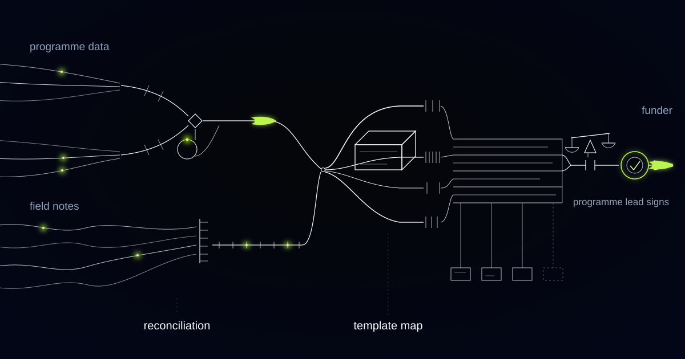

# Funder Reports Drafted From the Work Itself, With Every Figure Traceable

> How we built a grant-reporting engine for an international nonprofit running programs across several countries, and why the same approach matters for any organization that has to describe the same work to many different funders.

## The problem: the work is already documented, just never in the shape the funder wants

Most nonprofits don't have a reporting problem. They have a *reformatting* problem.

Our customer is an international nonprofit delivering programs across a dozen countries, funded by a mix of institutional donors, government agencies, and private foundations. Grants arrive in different sizes, on different calendars, with different obligations — and every one ends in a document. Quarterly narratives. Annual reports. Interim reports triggered by a milestone. Final reports that release the last tranche of money.

The information those documents need already exists. Attendance and beneficiary records sit in the monitoring database. Spend against budget lines sits in the finance system. What actually happened — the school that flooded, the partner clinic that lost its nurse, the training that had to be rescheduled twice — sits in field notes, trip reports, and message threads written by the people who were there.

None of it is in the shape any particular funder wants. One donor counts people "directly reached" and excludes anyone who attended a single session. Another wants the same activity disaggregated by age band and district. One reports on the grant anniversary, another on the calendar year, a third on a fiscal year that matches neither. Section headings differ, word limits differ, and the indicator that two funders both call "participation rate" is not the same number.

So every quarter, the best program people stop delivering programs and start writing documents. They open last period's report, copy the structure, hunt for figures across three systems, and reconcile numbers that disagree because the monitoring database counts registrations while finance counts payments. Deadlines are hard, and the pressure creates the real risk: a report is a contractual document, and a figure nobody can reconcile later is not an editing mistake. It is an audit finding.

## What we built

We built an engine that drafts each funder report from the underlying record of the work, against that funder's own template, with every figure carrying a link back to where it came from.

It assembles program data for the reporting period, structures the field notes into evidence attached to specific activities, maps everything onto the requesting funder's template and indicator definitions, and writes the narrative. What comes out is a complete draft in the funder's format — sections in their order, indicators under their definitions, narrative built from the actual events of the period — plus a reconciliation view showing where each number came from.

What it never does is assert something the record cannot support. If an indicator has no underlying data for the period, the draft says so rather than estimating. If two systems disagree, the draft surfaces the discrepancy instead of silently choosing the more flattering figure. And no report leaves the building on the engine's authority: the program lead signs the narrative, finance signs the figures, and the country director signs the document. The machine drafts. People attest.

*Every funder wants it differently. The programme data underneath stays the same.*

## How it works

### Layer 1: Assembling the program record

The first layer builds a single reporting spine for a given period: activities delivered, participants recorded, locations, partners, and spend against budget lines, pulled from the monitoring database, the beneficiary system, and finance.

The hard part is not extraction, it is reconciliation. Program and finance systems count different things at different moments, and every organization has known seams where they diverge. We made those seams explicit. Where two sources describe the same activity and disagree, the assembly layer records both values and the reason for the gap — a workshop invoiced in one month and delivered in the next is a timing difference, not an error. The discrepancy travels with the figure into the draft, so the conversation happens before the report goes out rather than a year later with an auditor in the room.

### Layer 2: Structuring the field notes

Numbers describe scale. Field notes describe what happened, and they hold the reportable substance — why attendance dipped in March, the partnership that unlocked a new district, the equipment that never cleared customs.

This layer turns that unstructured material into evidence. Trip reports, monitoring visits, partner updates, and the running notes staff write for themselves are parsed into discrete observations, each attached to an activity, place, and date, and tagged by what it explains: a delay, a deviation from plan, a risk, an outcome worth telling. Every observation keeps a pointer to the passage it came from and the person who wrote it.

Nothing here is invented or embellished. If a program officer wrote three sentences about a flooded school, three sentences is what the layer holds. The drafting layer can only use what this one collected — which is the mechanism that keeps the narrative honest.

### Layer 3: The funder template map

Every funder wants it differently, so we treated "differently" as configuration rather than as work.

Each funder has a template definition: required sections in the required order, word limits, the indicator set with each definition and disaggregation, the reporting period rule, the currency and exchange-rate convention, the mandatory annexes. Indicator definitions are the part that earns its keep. "People reached" is not one concept but several, and the map holds each funder's version as a real calculation over the assembled data rather than a note in a style guide.

When a funder revises its template — and they do — the change happens in one place, and every subsequent report for that donor follows it. The map is owned by the grants team, not by us. It is theirs to read, argue with, and correct.

### Layer 4: Drafting with every figure traced to source

Only now does anything get written. The drafting layer takes the assembled data, the structured evidence, and the funder's template, and produces the narrative section by section, at the required length, in the register that funder expects.

Every figure in the draft is linked. Click a number and you see the calculation, the indicator definition it was computed under, and the source records beneath it. Every qualitative claim points to the field note that supports it. Where the template asks for something the record does not contain, the draft leaves an explicit gap with a note naming what is missing and who would know — because an unanswered question is a task, while a fluent paragraph of nothing is a liability.

### Layer 5: Two signatures, and what the engine may never do

Approval is split deliberately, because the failure modes are different. The program lead reviews the narrative — is this a truthful account of what we did — and the finance lead reviews the figures against the accounts. Both approvals are recorded against the specific version of the document, and the country director submits it. A report cannot be exported until both are in place.

The engine has no submission rights of any kind. It does not send anything to a funder, does not resolve a data discrepancy on its own, does not estimate a missing indicator, and does not smooth an unflattering result into softer language. Under-delivery reported honestly is a conversation with a program officer. Under-delivery papered over is a fraud finding, and no drafting speed is worth that trade.

## Why this generalizes

The pattern is: one body of work, many external readers, each demanding a different shape and holding real leverage over you. Universities and research institutes live it — the same lab, the same year, reported to several grant bodies under conflicting rules. Corporate sustainability teams live it, restating the same operational data into competing disclosure frameworks. Public contractors and health providers live it, reporting delivery to ministries and commissioners under definitions they did not choose.

In all of them, the writing is the visible cost and reconciliation is the real one. Build the traceable spine once, treat every reader's format as configuration, and the quarter stops being a writing season. It becomes a review.

## Does your team stop delivering programs every quarter to write about them?

If reporting season pulls your best people out of the field to hunt for numbers across three systems, the bottleneck is not writing — it is that nothing connects the work to the template. We build these engines traceable-first, with figures linked to source and human sign-off before anything reaches a funder. Tell us what your donors ask for.
