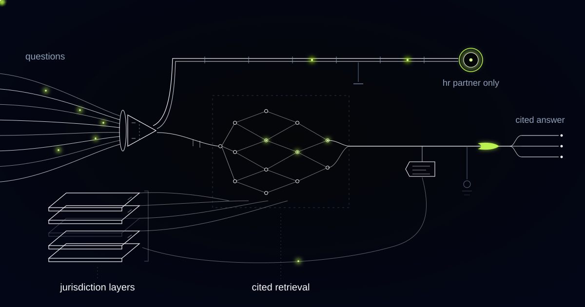

# An HR Assistant That Cites the Policy, and Knows When Not to Answer

> How we built a policy assistant and case-summarisation layer for a mid-size enterprise HR team, and why the same approach matters for any function that holds both the rules and the confidences.

## The problem: the same question, the four-hundredth time

Most HR teams don't have a policy problem. They have an *access* problem.

Our customer is a mid-size enterprise — several thousand employees across a handful of European countries, served by an HR function small enough to know one another's calendars. The policies exist and they are good: a handbook, country addenda covering what differs by jurisdiction, works council agreements in one market, a separate leave policy in another.

None of that is what employees use. What employees use is the shared HR inbox and whoever sits nearest. Hundreds of questions a week arrive, and the overwhelming majority are the same ones: does my leave carry over, what happens to my accrual on parental leave, can I expense this, how does notice work in my country. Every one has a documented answer. Every one gets typed out again.

The cost is not just hours. HR business partners — hired for restructures, performance cases, and the conversations that require judgment — spend a large share of the week as a lookup service for documents they wrote themselves. Answers drift, because a hurried reply in a chat thread is a paraphrase of the policy, and a paraphrased leave rule in the wrong jurisdiction is a liability. And the serious matters — a grievance, a harassment report, a health disclosure — queue behind the expense questions in the same inbox, at the same speed.

That last point shaped the architecture. In HR, the gap between a routine question and a serious one is not a difference of degree. It is a difference of kind, and a system that treats them as points on one spectrum is dangerous.

## What we built

Two things that share a foundation and are deliberately kept apart.

The first is an assistant employees ask in plain language. It answers only from the company's own policies, scoped to the asker's country and contract type, with a citation to the exact clause behind every answer. No citation, no answer — if the policy doesn't cover it, the assistant says so and routes the question to a human rather than improvising something plausible.

The second is a case layer for HR business partners: structured summaries of case threads, with the timeline assembled, the policy sections implicated, and the outstanding actions listed — drafted for the partner handling the case, nobody else.

Between them sits a hard boundary. A defined set of topics is never answered, never drafted, never handled by self-service at all. It goes straight to a named human, and the machine's only contribution is the speed of the handoff.

*Answers cite their source. Sensitive cases bypass drafting entirely and go straight to a person.*

*One question, one cited clause — and the sensitive path leaves the machine entirely.*

## How it works

### Layer 1: Policy ingestion with jurisdiction awareness

An answer scoped to the wrong country is not a partially right answer. It is a wrong answer delivered with confidence, which is worse than silence. So every source is ingested with its scope attached: which entity, which country, which contract types, effective from when and superseded when.

Handbooks, country addenda, works council agreements, and policy memos carry different authority, and the precedence between them is explicit rather than inferred — a local agreement overrides the group handbook in the market it covers, and the system knows that because a human told it, not because a model guessed from tone. Documents are chunked along their own structure so a procedure or an entitlement table stays intact; a leave table split down the middle is a wrong answer waiting for someone to ask. HR operations owns this layer, approves every source before it goes live, and is alerted when a new document contradicts one already indexed.

### Layer 2: Cited answering, or no answer

Every response links to the exact clause in the exact document version, in the asker's jurisdiction, and opens the source at the right place. The assistant may not answer from general employment knowledge, and that matters more here than almost anywhere else we work: a model's generic understanding of parental leave is an average of the internet, and the employee in front of it is governed by one agreement in one country.

When retrieval finds nothing solid, the assistant says so and passes the question to the HR inbox with its context attached. Those unanswered questions turn out to be the most useful output of the system. Read as a set, they show where policy is missing, ambiguous, or written in language nobody can act on — a live map of where the handbook and reality have drifted apart.

### Layer 3: The escalation boundary

There is a list of topics the assistant does not answer. Harassment, discrimination, bullying, retaliation, whistleblowing, safety concerns, health and disability disclosures, mental health, grievances, terminations, pay disputes, and anything in which the employee names another person. On any of these it produces no answer, no draft, no suggestion. It says a human will pick this up, tells the employee who and by when, and routes it to a named business partner immediately.

Two design choices make this real rather than decorative. The classifier is deliberately over-inclusive: ambiguity resolves toward escalation, and we tuned it knowing it would send routine questions to humans, because the opposite error is unacceptable. And the boundary is architectural, not a prompt instruction — the sensitive path runs through different code, with generation switched off. A model asked nicely can be talked into most things. A path that never invokes a model cannot.

### Layer 4: Confidentiality by construction

The assistant answers policy questions. It does not read employee files, does not know what anyone else asked, and cannot retrieve one employee's information while talking to another. Its retrieval surface is the policy corpus plus the minimum attributes needed to scope an answer — country, entity, contract type. It has no need to know why you are asking.

Escalated interactions never enter the general question log used for analytics; they move into the case system under the same access controls as any other case, visible to those entitled and nobody else. Retention windows are enforced by the system, not by habit. HR teams are custodians of the most sensitive data an employer holds, and their reasonable first question is never "how accurate is it." It is "who can see this." The architecture has to answer that before anything else is worth discussing.

### Layer 5: Case summaries that prepare the partner

For cases already in human hands, the system assembles what a partner would otherwise reconstruct by hand: a chronological timeline of the thread, the policy sections implicated, what was agreed, and what remains outstanding against required timelines.

It produces a summary, not a recommendation. It does not propose an outcome, assess credibility, suggest a disciplinary step, or score anything about a person. Those decisions belong to the partner, and a machine-generated suggestion would anchor a judgment that has to stay independent. Every summary is marked as drafted, reviewed before it enters the case record, and never sent to the employee. The partner's role shifts from assembling the file to deciding what happens — the part that requires a person.

## Why this generalizes

The shape is any function that holds a body of rules, fields high volumes of routine questions about them, and also handles a minority of matters where one wrong automated word causes real harm.

Finance and procurement policy desks match it closely — expense rules, approval thresholds, travel policy — with fraud and conduct reports as their sensitive tail. Member-facing service teams at insurers and professional associations run the identical structure, with the same jurisdictional patchwork and the same cases that must reach a person untouched.

Wherever the pattern appears, the design rule holds. Routine questions get answered instantly, with a citation. Serious ones get recognised early and handed to a human, unanswered and undrafted. A system that can tell those apart by construction is worth far more than one that answers everything.

## How much of your HR team's week goes to questions the handbook already answers?

If your business partners are a lookup service for policies they wrote, and the difficult cases wait behind the expense questions, that split is fixable. We build these boundary-first: cited answers where the policy is clear, a named human for everything that deserves one. Tell us what lands in your HR inbox.
