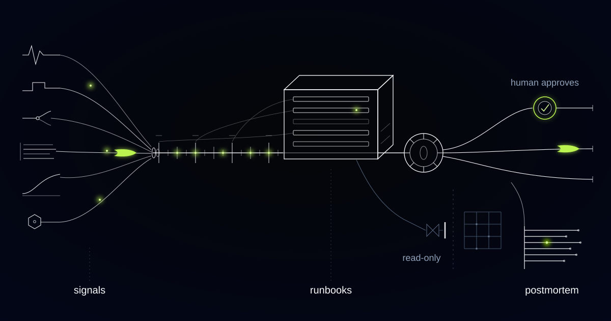

# The Incident Copilot We Built Cannot Touch Production, By Design

> DORA's four-hour clock runs from the moment a human classifies an incident as major, so the copilot's real product is a timeline that can prove, months later, when that moment was and what was known at it.

## What a supervisor can still test, months later

Ask a regulated European payments firm to show, months after the night in question, that it reported an incident inside the window the law gave it. The proof is a timestamp. A good summary saves an on-call engineer some scrolling; a timestamp made while the incident was still running is the thing a supervisor can test.

The firm runs payments and lending infrastructure across several European markets: dozens of services, a permanent on-call rotation, and the obligations that come with holding other people's money. The copilot sits in the incident channel and does the assembly work continuously. It pulls alerts, metrics movements, deploys, feature-flag changes, infrastructure events and log anomalies into one record, retrieves runbooks with citations and edit dates, keeps a rolling account of what is known and what has been tried, and drafts the first postmortem when the incident closes.

All of that is convenience, and a competent engineer could do every part of it more slowly. The one thing nobody can do afterwards is record what happened while it was happening, from the systems it happened to, which is why we treat the timeline as the product.

## Four hours from classification, and classification is a human judgement

DORA gives a financial entity four hours from the moment an incident is classified as major to submit its initial notification, and in any case no more than 24 hours from becoming aware of it. Regulation (EU) 2022/2554 then requires an intermediate report within 72 hours and a final report within a month.

Classification against the criteria is itself a human determination: clients and financial counterparts affected, data losses, geographical spread, duration and service downtime, criticality of the services involved. The legally significant instant is therefore neither the first alert nor the resolution. It is the moment somebody decided that the word major applied.

That decision is usually taken hours after the fire, from evidence that exists only if something recorded it while the fire was burning. GDPR Article 33 runs its own separate 72-hour clock on a different trigger over the same night, so one bad evening can sit inside two regulatory timelines that started at two different moments.

## Ingestion time is not event time, and under load the difference reorders the story

Ingestion lag is negligible on a calm day and a real quantity when every service in the estate is retrying at once. The timeline we built ran on ingestion time, which is correct roughly always and catastrophically wrong exactly when it matters. Under the load of a real incident the log platform's lag stretched, the reconstructed timeline showed the error spike beginning after the deploy that had in fact preceded it, and two further events came back in the wrong order entirely.

A copilot that quietly rearranges causality during an outage is worse than no copilot, because engineers act on order. The sentence "the errors started before the deploy" sends three people to look at the upstream dependency, and it was not true.

We rebuilt on event time. Every entry now carries three values: the emitting system's own clock, the time our platform ingested it, and the observed lag between the two.

A regulatory incident timeline is one in which every entry carries the emitting system's own clock, the ingestion time, and the observed lag between them. Anything that silently normalises timestamps onto a single axis is a narrative, not evidence.

Use a single axis when the timeline will only ever be read by the people fixing the thing, because it is easier to scan. Do not use it when the same artefact reaches a supervisor, an internal auditor or a lawyer, because one axis asserts an ordering the underlying data cannot support.

## We display clock skew instead of hiding it

We show clock skew as a field rather than correcting for it, because correcting for it means guessing. Once we were on event time, a partner's API gateway turned out to be running several seconds off ours, and the honest fix was not to pick a winner between the two clocks. We stopped normalising clocks at all and started displaying the offset beside the entries it affects.

The rule we settled on is narrow and holds everywhere: the copilot may present two timestamps and their sources, and may never assert an order. "The gateway logged its first 5xx at its own 14:02:11, our deploy service recorded completion at its own 14:02:09, and the measured offset between those clocks is about four seconds" is a sentence an engineer can act on and a compliance officer can defend. "The deploy caused the errors" is not.

*Runbooks and log signals converge into a live picture. The copilot never touches remediation.*

## Read-only credentials are the safety argument

Every credential the copilot holds is read-only, and that is the whole safety argument rather than a paragraph in a prompt. There is no write path to production, so no instruction, no injected log line and no chain of reasoning can produce one. Your security team verifies the property by reading the permission grants rather than by trusting a description of model behaviour.

That matters most during an incident, because incidents are when log lines carry arbitrary text from customers and partners, and when the humans in the channel are too busy to audit what a tool just did.

The boundary around what it may decide is architectural rather than editorial. It cannot restart a service, roll back a deploy, flip a feature flag, scale a cluster or fail over a region. It cannot post to the status page or send an external word to anyone. It cannot open, close or amend a regulatory notification. It cannot classify an incident.

## Contributing factors are written as questions, because a timeline shows correlation

The postmortem draft states contributing factors as open questions, never as findings, because a machine reading a timeline can see correlation and has no standing to assert cause. A typical line reads: the deploy completed two seconds before the first 5xx by wall clock, with a four-second offset between the two clocks, so the order is not established from this evidence; was it causal?

The engineers who ran the incident own the analysis and the action items. What changes is their starting point: instead of rebuilding a sequence from scrollback and memory, they begin from a record made at the time, with its uncertainties still visible, and spend those hours arguing about why.

## Who is allowed to say the word major

A named compliance officer says it, and the copilot's job is to make that person's decision faster and better evidenced rather than to pre-empt it. It assembles an evidence pack against each DORA classification criterion and presents each one as an open question with the underlying entries attached: which clients were affected and across which window, whether data losses are evidenced or merely suspected, which markets saw degradation, how long the service was down and by whose clock.

A machine that classifies an incident as major has effectively initiated a regulatory filing. A machine that classifies one as not major has effectively suppressed one. Both are decisions carrying a named person's professional accountability, and neither becomes safer because the machine is usually right.

What it does instead is timestamp the human decision as it is made, with the evidence that was in front of the person at that moment. The four-hour clock runs from classification, and classification is otherwise the worst-recorded fact of the entire night.

## Common questions

### Can the copilot file our DORA initial notification for us?

No. It assembles the evidence against each classification criterion, shows which timeline entries support each one, and then waits. A named compliance officer classifies the incident and files the notification. The copilot records the timestamp of that classification and the evidence behind it, because the four-hour clock runs from that moment and nothing else in the night is harder to reconstruct afterwards.

### Does it need write access to any of our production systems?

No, and we will not build it with any. Every integration is read-only, which makes the safety property something your own security team can verify from the permission grants rather than something we assert about model behaviour. It reads alerts, metrics, logs, deploys and flags, and it drafts. Every action and every published word comes from a person.

### How do you handle timestamps from systems we do not control, like a partner gateway?

We display the offset rather than correcting it. Each entry carries the emitting system's clock, our ingestion time and the measured skew where one can be established, and third-party entries are labelled as third-party clocks. The copilot may show two timestamps side by side with their sources, and is not permitted to assert which of the two events happened first.

### What happens when the log platform itself is degraded during the incident?

The timeline records the gap instead of smoothing it away. Ingestion lag is a displayed field, so a period of stretched lag appears as stretched lag rather than as a quiet reordering of events. Where the copilot has no evidence for a moment, it says so, which is a usable and defensible statement in a postmortem.

## What time did your last incident actually start?

An answer assembled from channel scrollback and somebody's memory is a regulatory artefact built from the two least reliable sources in the building. We build incident copilots read-only, on event time, with clock skew shown rather than hidden, and with classification left to the person accountable for it. Tell us what your last bad night looked like and who had to write it up afterwards.
