# An AI Engine That Reads, Matches, and Clears Supplier Invoices

> How we built document ingestion and three-way matching for a mid-market European freight forwarder, and why the same approach matters for any business drowning in supplier paperwork.

## The typing problem hiding inside accounts payable

Freight is a paperwork business. Every container that moves generates a trail of documents from multiple parties, and someone has to reconcile all of it before anyone gets paid.

The customer that brought us this problem is a mid-market European freight forwarder moving tens of thousands of shipments a year. Each shipment produces supplier invoices from the carrier, the port or terminal, the customs broker, and often a warehouse or last-mile trucker on top. That adds up to thousands of supplier invoices a month, arriving in every format a supplier can invent: clean digital PDFs, scans of printouts, photographed pages attached to an email, spreadsheets with the totals in a different tab than the line items.

A finance team you could fit around one table spent most of its working hours doing the same three things. Open the invoice and key it into the ERP. Find the purchase order it belongs to. Find the proof of delivery and check that what was billed is what was ordered and what actually arrived. Average handling time ran well into double-digit minutes per invoice — and that is before anything goes wrong. A carrier bills demurrage the PO never anticipated. A customs broker invoices in a different currency than the quote. A port authority references a vessel name instead of a shipment number. Every one of those becomes an email thread. And the invoices that were perfectly fine — the majority — sat in the same queue behind the problem cases. Suppliers called to chase payment. Month-end accruals were built on whatever had been keyed by the cutoff, which is to say, on a backlog.

Most companies in this position believe they have an accounts payable problem. They don't. They have a *reading* problem. The accounting logic — does the invoice match the order and the delivery, within tolerance — is simple enough to write on a whiteboard. What consumes the team is extracting structured facts from unstructured paper, thousands of times a month. That is exactly the work modern AI is good at, and exactly the work humans are wasted on.

## What we built

We built an invoice matching engine that sits between the inbox and the ERP. It ingests every supplier document regardless of format, extracts the commercial facts with an explicit confidence score on each field, and runs three-way matching against purchase orders and delivery records under the customer's own tolerance rules. Invoices that match flow straight through to posting and payment scheduling. Invoices that don't land in an exceptions queue, where a human sees only the mismatch — not the whole document, not the whole hunt.

The finance team did not get smaller. It got reassigned. The people who used to key invoices now resolve exceptions, chase suppliers on genuine discrepancies, and tighten the tolerance rules — the judgment work that was always the actual job.

<video src="media/invoice-matching-engine.mp4" poster="media/invoice-matching-engine-poster.jpg" controls playsinline preload="none" width="1280" height="720"></video>

*Documents converge, become structured facts, and clear against the order and the delivery. Only the exceptions divert.*

## How it works

### Layer 1: Ingestion from anywhere

The system watches the same channels suppliers already use: the AP mailbox, the supplier portal, a scanner folder in the office. It accepts native PDFs, scans, images embedded in email bodies, and multi-invoice attachments that need splitting. There is no supplier onboarding step and no "please resubmit in the correct format" — a rule we consider non-negotiable, because the moment a system demands that suppliers change their behavior, adoption dies. Each document is classified on arrival: invoice, credit note, statement, or noise, and routed accordingly. Duplicates — the same invoice sent by email and again through the portal a week later — are caught at this layer, before they can be keyed twice or, worse, paid twice.

### Layer 2: Extraction with confidence scores

Every classified invoice is converted into structured data: supplier identity, invoice number, currency, line items, tax treatment, and the references that tie it back to a shipment — booking numbers, container numbers, PO numbers, sometimes just a vessel and a date. The critical design decision is that every extracted field carries a confidence score. A crisp digital PDF from a major carrier extracts at high confidence across the board. A skewed scan of a handling fee from a small terminal operator might extract the total confidently but the reference number weakly. Low-confidence fields are flagged, not guessed. The system is honest about what it isn't sure of, which is what makes the downstream automation trustworthy.

### Layer 3: The matching engine

This is where the invoice meets the purchase order and the delivery record. The engine resolves the shipment even when the supplier's reference is indirect, then compares billed amounts against ordered amounts against delivered quantities. Tolerance rules are explicit and owned by the finance team: a currency rounding difference clears automatically, a small quantity variance on a bulk charge clears with a note, an unexpected surcharge does not clear at all. The rules live in configuration, not code, so the controllers tune them as they learn — tightening where leakage appears, loosening where the queue fills with trivia. Today the large majority of invoices match and post without a human touching them.

### Layer 4: The exceptions queue

Everything that fails to match lands in one queue, and the queue is the product as far as the team is concerned. Each exception shows the specific mismatch — this line, this amount, this missing delivery confirmation — alongside the source document, the PO, and the delivery record, already open side by side. The human decides: approve with justification, dispute with the supplier, or correct the extraction. Typical resolution takes minutes, because the investigation is already done. And every decision feeds back — approve the same surcharge from the same carrier a few times running, and the system proposes a tolerance rule so a person never sees it again.

The human role shifts from processing every invoice to judging the ones that genuinely need judgment. That shift, not the extraction technology, is where the value lives.

## Why this generalizes

Nothing in this architecture is specific to freight. The pattern — unstructured supplier documents on one side, structured commitments on the other, and a team of people manually bridging the two — appears anywhere a business buys from many suppliers who all invoice differently.

Construction is the obvious neighbor: subcontractor invoices, progress claims, and delivery dockets against project budgets and purchase orders, with variation claims playing the role of demurrage. Wholesale distribution runs the same loop at higher volume with supplier invoices against inbound goods receipts. Healthcare procurement adds a compliance layer — invoices matched not just to orders but to contracted pricing schedules — which is one more rule set in the matching engine, not a different system.

In every case the three-way match is the easy part. The hard part is that the inputs arrive as paper, and companies solve it today by pointing salaried humans at it. Over the next few years, the businesses that automate the reading and reserve their people for the exceptions will run finance functions their competitors can't match on cost or on close speed.

## Is your AP team buried in invoices?

If your finance team spends its days keying supplier documents and hunting for the PO that goes with them, the reading problem is solvable — without changing how a single supplier behaves. We build systems like this end to end, from the inbox to the ledger. Tell us.
