# An AI Engine That Reads Carrier Invoices and Works Out Who Owes What

> A carrier invoice bills one number for fourteen customers' goods, so the engine splits every charge to the shipments that owe it before any match is attempted.

## One invoice, fourteen house bills

One terminal handling charge on one carrier invoice covered fourteen consignments belonging to fourteen different customers. That single line is why line-level three-way matching, the technique that clears supplier paper in wholesale distribution, matched almost nothing when we first pointed it at freight.

Three-way matching is undefined for most carrier invoices. The classical version compares an invoice line against a purchase order line and a goods-receipt line. On carrier paper there is often no order line to compare against, because the charge was never ordered once and cannot be received once.

The structure behind that is the bill of lading hierarchy. A forwarder issues a House Bill of Lading to each shipper it books, then moves those consignments together under a single Master Bill of Lading with the ocean carrier. The carrier invoices the master. Costs, margins and customer commitments live at house level. A terminal handling line, a bunker surcharge, a customs inspection fee: each is one number on the master, covering many customers' goods.

The customer is a mid-market European freight forwarder moving tens of thousands of shipments a year and taking in thousands of supplier invoices a month from carriers, terminals, customs brokers and hauliers. They arrive as clean PDFs, as scans of printouts, as photographs pasted into an email body, as spreadsheets with the totals on a different tab from the line items.

Extraction is the easy half. Reading a skewed scan and returning supplier identity, invoice number, currency, charge codes, container numbers and totals (each field scored, the weak ones flagged instead of guessed) is ordinary engineering now. The hard half is deciding which of those fourteen shipments owe what share of the charge, and how much of it the forwarder can bill onward.

## Free time is a contract, not a courtesy

Demurrage and detention are two different clocks with two different contractual allowances, and treating them as one charge type is the quickest way to approve money nobody owed. Demurrage accrues while a container sits inside the terminal past its free days. Detention accrues once the equipment has left the terminal and has not been returned. Both bill in escalating daily tiers, so the fourth day costs more than the first.

Free time is written into the rate agreement or the service contract, usually per trade lane and often per equipment type. Validating a demurrage invoice therefore means rebuilding a timeline: gate-out, gate-in, free days consumed, weekends and holidays counted or not counted according to that contract, then the tier table applied to whatever spilled over. The invoice will show a total and a container number, and almost never the arithmetic.

The engine treats that as a validation problem, not a matching one. It reconstructs the clock from container events, applies the free time recorded in the agreement, and either agrees with the carrier's figure or names the specific day and tier where the two accounts diverge. A dispute that says "your day four is our day two, here is the gate-out record" gets settled. One that says "this looks high" does not.

*Documents converge, become structured facts, and clear against the order and the delivery. Only the exceptions divert.*

## Allocation comes before matching, or nothing matches

Strict line-level matching went live anyway: proven technique, standing in a week. The terminal handling line covering fourteen house bills had no order behind it to match against, so it dropped into the exceptions queue, and so did every other consolidated charge. The queue we had built for the difficult cases filled up with the ordinary ones, which is the failure the queue existed to prevent.

We rebuilt the unit of matching. The atom is no longer the invoice line. It is a charge-to-shipment allocation, and an apportionment step now runs before any comparison happens, splitting each consolidated line across the house bills that carried it on the basis recorded in the rate agreement: per container, per TEU, per chargeable weight.

Allocation-first matching: before an invoice line can be matched at all, it must be resolved to the specific shipments that owe it, using an allocation basis recorded in the rate agreement. Matching then runs per shipment-charge, never per invoice line.

With the atoms right, comparison becomes tractable again. Each allocated shipment-charge is checked against the rate agreed for that lane, the accessorials the booking anticipated, and the events that prove the service happened. One carrier invoice can now be partly cleared and partly disputed: eleven allocations post and schedule for payment, three raise exceptions with the container numbers attached.

## A charge with no purchase order is not automatically an error

A demurrage line can be entirely correct and still have no purchase order behind it, because it exists only because something went wrong. Nobody raises an order for a delay. Our first rule set treated a missing order reference as an exception, which meant the system flagged as suspect exactly the charges most likely to be valid.

So "no purchase order reference" stopped meaning "error" and started meaning "route to whoever owns the delay". A demurrage allocation goes to the operations desk that ran the customs entry, not to the accounts payable clerk, because the question is not whether the charge matches an order. The question is who caused the delay and whether it is recoverable from the customer.

Recoverability is a contractual answer, so the engine looks it up instead of reasoning about it. The forwarder's own terms and the customer's rate card say who carries the cost when the consignee collects late and when an entry is held for inspection. The system proposes a treatment (recharge to the customer, absorb as cost of service, dispute with the carrier) and shows the clause and the event trail it relied on, so the person approving is reading evidence rather than a verdict.

## Tolerances belong to the controller; recoverability belongs to the customer contract

We refuse to allocate a charge on any basis that is not written into the rate agreement. No statistical apportionment, no even spread across containers because it is close enough, no argument that the variances wash out at group level. An allocation the forwarder cannot defend line by line to its own customer is worse than an exception, because it converts an accounts payable error into a customer invoice error, and the second one is read by someone who never agreed to it.

Two further refusals shaped the build. We do not allow straight-through posting for any cost that is billable onward: it can be approved without argument, but a human sees the recharge before it reaches a customer account. We do not ask suppliers to change their formats as a condition of being paid, because coverage is the whole point and a system that demands supplier behaviour change never gets it.

Tolerance thresholds are configuration owned by the financial controller, not code owned by us. Rounding on a currency conversion clears silently, and a small variance on a weight-based charge clears with a note. An accessorial the booking never anticipated does not clear at all.

Four decisions are withheld from the system by construction: it cannot approve a disputed carrier charge, cannot create or change an allocation basis, cannot post a recharge to a customer account, and cannot release a payment. It allocates, validates, evidences and proposes; a controller approves, and the audit trail records which human agreed to what and against which clause.

## Common questions

### Can this work when our carriers invoice at master bill level and we bill customers at house level?

That gap is the reason the engine exists. Every consolidated invoice line is apportioned to the house bills underneath it before matching runs, using the basis in your rate agreement, so each shipment carries its own share of terminal handling and surcharges. Cost per house bill becomes visible the day the invoice arrives.

### What happens when a charge has no allocation basis in the rate agreement?

It stops and goes to a person. The engine will not invent a split, spread evenly or approximate, because an undefendable allocation becomes a wrong customer invoice later. A commercial owner either records the basis in the agreement, which fixes every future occurrence, or allocates this instance manually with a reason attached to the audit trail.

### How does the system handle demurrage and detention disputes with the carrier?

It rebuilds the clock. Using container events and the free-time allowance in your contract, it recalculates each day and tier, then either agrees with the carrier or produces the exact day where the two counts separate. Demurrage and detention are tracked as separate clocks, because they run against different free-time allowances and start at different moments.

### Do our suppliers have to send invoices in a specific format?

No, and we would refuse to build it that way. The engine reads native PDFs, scans, photographed pages, portal exports and multi-invoice attachments, classifies and de-duplicates them on arrival, and scores confidence field by field. Coverage matters more than tidiness: a supplier who cannot be onboarded is a supplier whose invoices go back to being keyed by hand.

## Do you know which shipment paid for that surcharge?

If your team can see what a carrier charged but not who owed it, the reconciliation problem sits in allocation rather than in reading. We build these engines allocation-first, against your own rate agreements, from the mailbox through to the ledger. Tell us what your carrier paper looks like.
