# An Inbound Agent That Refuses to Route a Lead Two Partners Can Claim

> How we built inbound qualification for a channel-sold industrial manufacturer, and why arbitrating who owns an enquiry is harder, and more expensive to get wrong, than scoring it.

## Everyone buys enrichment first, and enrichment was never the bottleneck

The first thing almost every inbound project buys is enrichment, and enrichment was never the bottleneck. Sector, headcount band, site locations, hiring signals: all of it is available, most of it is a commodity, and none of it answers the question that actually holds an industrial enquiry up for four days, which is who is allowed to contact this person.

Our customer manufactures industrial equipment sold into factories and processing plants across Europe, largely through distributors and integrators. Inbound arrives as a contact form, a general sales address and a stream of trade-show scans, and what it contains is a name, a company and one sentence of free text.

Scoring that sentence is the easy half, and it is the half everybody demonstrates. The hard layer is arbitration: working out which parties hold a contractual claim to the enquiry, and refusing to decide when two claims overlap.

## A registered deal is a contract, and a web form does not know that

Deal registration is the mechanism that makes routing contractual. In industrial and technical channels a distributor or integrator registers an opportunity with the manufacturer and receives margin protection and exclusivity on that end customer for a defined window, commonly 60 to 180 days, renewable on evidence of activity.

An inbound web enquiry from an end customer inside a live registration belongs contractually to the registering partner. Sending it to a direct rep is a breach of the channel agreement, not a sales decision, and the partner discovers it at the worst possible moment, when their own customer mentions that the manufacturer called them directly.

That is why routing sits above scoring in this system rather than after it. A lead's score changes what you say to them. A lead's claim changes who is permitted to say anything at all.

Channel-safe routing: routing that assigns an inbound enquiry only when exactly one party holds a contractual claim to it, and escalates to a named human duty desk whenever two or more claims overlap, where a claim is any of an assigned territory, a live deal registration, an existing account ownership, or a key-account exception.

## Email domains are not companies: how account resolution broke

For a while, resolving an account meant matching the sender's email domain against CRM accounts, and that looked like a solved problem. Corporate group structure is where it came apart, and the failures it produced were channel breaches rather than mere noise.

Three shapes broke it. Subsidiaries invoice and email under their own domains, so they looked like strangers. Several plants of one group shared a single group IT domain, so they looked like one company. Two acquired businesses still used their pre-acquisition domains. Enquiries from plants belonging to a registered account routed direct, which is the breach. Enquiries from independent companies sharing a shared-services domain were suppressed as duplicates, which is the same error running silently.

We rebuilt resolution to key on legal entity plus physical site, using company registration and VAT numbers together with the site address from the enrichment layer. Corporate group relationships are held separately, as an explicit account-family graph that a named human owns and edits.

Any edge the graph cannot evidence is not inferred. The lead goes to the duty desk labelled as an unresolved group relationship, and a person either adds the edge with its evidence, which fixes every future enquiry from that group, or decides this one instance by hand. Guessing a group edge is how a system converts a data problem into a partner problem.

*Fit and intent are scored against an ICP the sales team wrote, not one the model invented.*

## Fit and intent are two questions, and merging them costs you the patient accounts

Fit and intent are scored separately and never averaged into one number, because averaging them hides the two cases that matter. A perfect-fit plant with a vague enquiry is a relationship to build over quarters, and a single blended score buries it below the noise. A poor-fit company with an urgent, specific request is frequently somebody else's opportunity, and a blended score promotes it.

Fit is scored against a plain-language ICP document with named authors: the sectors this equipment suits, the production characteristics that make it work, the plant scale below which the economics fail, the geographies where an installation can actually be serviced. The head of sales and the regional leads wrote it, any of them can edit it on a Tuesday, and the edit takes effect immediately.

We refuse to build a scoring model trained on closed-won history. That history encodes the reps' existing habit of working leads from company names they recognised, and a model fitted to it launders that bias into a number nobody can contest. In industrial markets the bias is specifically expensive, because the recognisable names are often mature accounts and the unfamiliar domain is frequently the plant adding a line this year.

Every score itemises its reasoning criterion by criterion with the enrichment evidence attached, so the disagreement a rep has is with a sentence in a document rather than with a model.

## Unknown is a value the agent is allowed to return

Unknown is a permitted output at every layer, and the layers are built to prefer it over a plausible guess. An enrichment field the agent cannot establish stays empty and says so, because an enrichment layer that guesses manufactures confidence in every score built on top of it. An account it cannot resolve to a legal entity and site is labelled unresolved. A claim it cannot arbitrate goes to a person.

The agent also never disqualifies anyone. Low-scoring leads are not deleted, hidden or quietly binned. They go to a visible nurture queue that any rep can search and pull from, because the cost of a wrong disqualification is invisible and permanent, while the cost of a low-priority lead sitting in a queue is a few seconds of somebody's attention.

The agent is not permitted to decide certain things, and each boundary is enforced structurally rather than by instruction. It may not resolve a channel conflict, may not disqualify a lead, may not create or edit an account-family edge, may not override or extend a deal registration, and may not send anything to anyone.

## What a first-touch email is forbidden to promise

A first-touch draft may promise a conversation and nothing else. The rep receives a reply written in their own voice, referencing what the enrichment established, answering the specific question asked, and proposing a concrete next step. Most of the work of a good first response is having read up on the company, and that reading is already done. The rep edits and presses send, and nothing leaves without that press.

The drafting layer runs under a prohibition list enforced by architecture rather than by tone. It has no connection to the pricing system, and it may not quote a price, commit a lead time, confirm a technical specification, or make any statement about compliance or certification. In industrial sales those sentences are commercial commitments and in some markets contractual ones, and the moment a first touch becomes a quotation it belongs to a human with the authority to make that promise.

Where a partner holds the claim, the draft is addressed to the partner rather than to the end customer, and it carries the enquiry, the enrichment and the registration reference. The end customer gets their answer from the company that registered them, which is what the channel agreement says should happen.

## Common questions

### How does the agent know a partner has already registered this deal?

It reads your deal registration records as a claim on the end customer, keyed to legal entity and site rather than to email domain, and it checks the window and its renewal state. Inside a live registration the enquiry routes to the registering partner. Where a registration is expired, expiring or disputed, the agent stops and a human duty desk decides.

### What happens when two partners both claim the same account?

Nothing automatic. Overlapping claims are exactly the case this system is built to refuse, so the lead goes to a named duty desk with both claims spelled out: registration dates, territory assignment, account ownership and the evidence behind each. Speed on that decision is worth considerably less than the partner relationship a wrong answer damages.

### Why not train a scoring model on our closed-won deals?

Because that history records which leads your reps chose to work, and they worked the company names they recognised. A model fitted to it reproduces that habit as a number nobody can argue with. We score against an ICP document your sales leaders wrote and signed, which they can edit on a Tuesday afternoon and see take effect the same day.

### Will it email our leads automatically?

No. Every draft waits for a rep to read it and press send. The drafting layer has no access to the pricing system and may not quote a price, commit a lead time, confirm a specification or make a compliance claim, because in industrial sales those are commitments rather than sentences. A first touch invites a conversation and stops there.

## Who owns the enquiry that landed in your form this morning?

If answering that takes two days and a thread of people checking with each other, the delay is arbitration rather than qualification, and the price of getting it wrong is a partner reading your reply to their own customer. We build inbound agents that route only on an unambiguous claim and escalate every overlap to a named person. Tell us how your channel agreement handles a web form.
