# A Localization Engine That Keeps One Brand Voice Across Nine Languages

> How we built a context-aware localization pipeline for a consumer app expanding across Europe, and why the same approach matters for any product shipping faster than it can be translated.

## The problem: nobody is translating sentences, they're translating fragments

Most companies expanding into new markets don't have a translation problem. They have a *context* problem.

Our customer is a consumer app expanding across Europe: nine live languages, more queued, thousands of interface strings, and a release train that ships weekly. Their process was the one almost everybody starts with. Export the new and changed strings to a spreadsheet. Email it to a pool of freelance translators. Wait days. Paste the results back in. Ship.

Every failure in that process traces to one root cause: the translator can't see the product. A string arrives as a row in a spreadsheet, with no idea where it lives. "Free" is impossible to translate that way — it means one thing on a pricing page and something entirely different next to a booking slot, and the two correct translations are unrelated. So are the two for "Book," or "Order," or "Share." The translator makes a reasonable guess, the guess ships, and a user in Warsaw finds the mistake six weeks later.

The second failure is drift. Nothing enforced that the same feature was called the same thing in onboarding, in settings, and on the billing screen. Different translators, different months, different reasonable choices — and a product that quietly acquired three names for the same button in German. The brand team, who had spent real effort on tone of voice in English, had no mechanism to express it in any of the nine.

The third failure is physical. Text expands when translated, and a string that fits an English button does not fit the same button in German or Finnish. Layout breakage was found in production, by users, on the screens that matter most.

And underneath all of it: strings that changed in English and were never re-flagged for translation. The app spoke a slightly older version of itself in every language it had launched, and nobody could say which parts.

## What we built

We built a localization pipeline that treats a string as what it actually is — a piece of interface with a location, a purpose, a character budget, and brand rules attached — not a row of text.

The engine extracts strings from the codebase with that context captured automatically, translates them under an enforced glossary and tone specification with the layout constraint applied at generation time, and routes the results into a native-speaker review queue ordered by how many people will see each string.

The human boundary is architectural. Native reviewers approve anything a customer sees prominently, and every edit they make feeds back into the rules rather than dying in a single string. And one class of copy never auto-publishes, regardless of model confidence or how few people see it: legal terms, consent and privacy language, refund and cancellation policy, pricing and billing copy, safety and accessibility instructions. That copy carries regulatory weight that varies by market, so it routes to a named in-market reviewer — with counsel where the market requires it — every time. The routing is enforced by the risk class on the string itself, not by a reviewer remembering to be careful.

*Strings carry their context through translation. The glossary is enforced, not suggested.*

*Strings leave the interface carrying their context, pass the glossary, and only high-visibility copy reaches the reviewer's desk.*

## How it works

### Layer 1: String extraction with context capture

At build time, the pipeline pulls every user-facing string out of the codebase along with everything a translator would otherwise have to ask about: the screen and component it renders in, a screenshot crop showing it in place, whether it's a button, heading, error, or toast, the character budget the component allows, the variable slots it contains and what each one holds — a name, a count, a date — plus plural and gender rules and any developer note.

Automatic capture is the entire point. Context that depends on a developer remembering to write a comment does not exist at scale — it exists for two sprints and then stops. Pulled from the code and the rendered UI, it arrives whether anyone was thinking about localization that day or not.

This layer also fingerprints every source string. When the English changes, all nine translations are flagged stale immediately, with a diff showing what changed. That one mechanism ended the era of a product speaking last quarter's copy in nine languages.

### Layer 2: Glossary and tone enforcement

The brand's voice is expressed as rules, not vibes. Per language, the glossary holds product nouns and feature names with their approved translation, a never-translate list, the wrong-but-tempting alternatives explicitly banned, the formality register the brand uses, and constructions to avoid. Formality is not cosmetic — the choice between formal and informal address in German, French, or Dutch is a brand decision with a real effect on how the product feels, and not one a freelancer should be making per string, in isolation, on a Tuesday.

Enforcement happens twice. The rules are injected as constraints at generation time, then the output is checked against them programmatically. A translation using a banned term or the wrong register fails the check and is regenerated or escalated — it does not quietly ship because it looked fine.

The glossary is owned by the brand team and versioned like code. Change an entry and every affected string in every language is re-queued automatically. The brand voice in nine languages is maintained in one place instead of inside nine freelancers' heads.

### Layer 3: Translation under layout constraints

Each string is translated with its character budget as a hard requirement, not a hope. The result is rendered in the interface font at the real component width, and if it overflows, the engine retries with a tighter instruction. If a concept genuinely does not compress — and in German it sometimes does not — the string escalates with a note explaining the conflict, so a person can choose between a shorter phrasing and a wider component. That is a design decision, and it belongs to a designer.

The same pass verifies the mechanical things that break products silently: every variable slot present, in the right order, with the grammar around it working for that language's plural forms. Then the string is re-rendered into a screenshot, so the reviewer sees it exactly as a customer will.

### Layer 4: Native-speaker review, prioritised by visibility

Reviewers are a finite resource, so the queue is ordered by consequence: the impressions each string actually gets, multiplied by its risk class. The first onboarding screen, the paywall, the errors people hit when a payment fails — reviewed first, always, by a native speaker in-market. A tooltip in an advanced setting can wait, and if it sits comfortably inside the glossary and passes every check, it publishes and is reviewed later.

The reviewer sees the source string, the context screenshot, the glossary entries applied, and the engine's own flags. Their job is not to retranslate. It's to judge, and to legislate: every edit is classified as a glossary entry, a tone-spec amendment, or a one-off. Edits that repeat become rules, so the same correction is never made twice. Over time the reviewers stop being translators and become the people who define what the brand sounds like in their language — a far better use of a native speaker with product judgment.

## Why this generalizes

The shape is any content that is fragmentary, high-volume, brand-sensitive, and changing faster than humans can process it. E-commerce catalogues across markets are the obvious neighbour: product titles and attributes, huge volume, real revenue riding on whether the wording is right and consistent. Help centres and knowledge bases hit the same staleness trap, where an article updated in English silently misleads readers in five other languages. Regulated fintech and insurance onboarding is the hardest version, where the tone must stay warm while specific phrases are dictated by a local regulator — exactly the case for a system that separates the copy it can generate from the copy a human must sign.

## Shipping weekly in one language and quarterly in the rest?

If your translations arrive by spreadsheet, your product already speaks an older version of itself in every market you've launched. We build localization pipelines that capture context automatically, enforce the brand as rules, and put native speakers where their judgment counts. Tell us how many languages you're behind.
