# The Meeting Pipeline That Catches the Scope You Just Gave Away

> In professional services the same sentence in the same client call is a pipeline signal and an unbilled-work risk at once, and a pipeline that only writes to CRM fields books the opportunity while losing the margin.

## Minute thirty-four, and nobody uses the word scope

Thirty-four minutes into a steering meeting, the client asks for something that is not in the contract, and everyone present experiences it as a good moment. The phrasing is casual: while your team is in the source systems anyway, could you look at the German entity too. The engagement manager says of course, we can pick that up. Two people have just agreed to a piece of work, warmly, without either of them using the word scope.

That exchange is two commercial events wearing one coat. It is a pipeline signal, because a client asking for more is a client with appetite and probably budget. It is also the moment a fixed-fee engagement starts leaking, because the German entity is not in the deliverables list.

On a fixed-fee engagement, work that falls outside the deliverables listed in the statement of work has to be captured as a change request before it is performed. Once it has been performed it is unbilled work in progress, and work in progress that ages past the engagement's billing milestone gets written off far more often than it gets invoiced. Firms measure the whole cycle, from effort spent to cash collected, as lock-up, counted in days.

In professional services this is structural rather than occasional, because a client meeting is delivery and origination at the same time.

## Four extraction categories, and the expensive one was missing

Stakeholders, budget signals, next steps, risks. Those were the four categories in the extraction schema we built first, the standard set that every meeting tool ships with, and not one of them caught the sentence above. It ran for weeks against real client conversations, the partners liked it, the CRM stopped being reconstructed from memory on Friday afternoons, and it never once surfaced the thing that was actually costing the firm money.

A scope expansion does not sound like a budget signal. It sounds like agreement. Phrases such as of course, no problem and we can fold that in are not risk language, they are rapport, and a classifier looking for hesitation, competitors and procurement delays files them under nothing at all.

So we added an extractor that does not run against generic categories. It runs against the engagement's own statement of work: the deliverables list, the stated assumptions, the exclusions, parsed once at kickoff and attached to the account. Every request, assumption and agreement voiced in a conversation is tested against that specific document, and anything landing outside it is flagged as a scope delta.

Scope delta: a request, assumption or agreement voiced in a client conversation that falls outside the deliverables listed in that engagement's statement of work. A scope delta is an unbilled-work risk and a pipeline signal at the same time, and it is recorded before it is classified as either.

The ordering in that definition is the whole design. Record first, classify second, because the classification is a commercial judgment and the record is a fact.

*What was actually said lifts out of the conversation and settles into the record.*

## The consultant usually opens the gap, not the client

The first weeks of scope-delta alerts produced a finding nobody enjoyed: the extractor fired far more often on the consultant's words than on the client's. Clients ask for things, which is free and expected and creates no obligation. The gap opens when somebody on the firm's side agrees, and the person opening it was usually the one saying of course, we can pick that up.

That finding is exactly why the system does not classify what it finds. A flagged sentence can be a change request the firm should raise this week, deliberate goodwill on an account the partner is protecting, or something already covered by an assumption the extractor read too literally. Telling those apart needs the pitch, the relationship history and the renewal date, none of which live in a transcript.

The system is not permitted to decide whether a scope delta is billable, to raise a change request, to move an opportunity's stage or value in the CRM, or to send anything to a client. It proposes the sentence with its surrounding context to the engagement lead, and the engagement lead decides. Approving a proposed CRM update takes one click from Slack or email; dismissing it takes one click too, and a dismissal is logged as an answer rather than as silence.

## A quote with coordinates, or a debrief that admits what it is

Recording a client call is not a free input, and consent rewrote part of this system. Across several European jurisdictions all-party consent is the legal baseline for recording a conversation, and in Germany recording another person's non-public spoken word without consent is a criminal offence under §201 StGB rather than a policy matter. One of the firm's markets could not be recorded at all.

Typed debriefs therefore became a first-class input rather than a degraded fallback. A consultant writes what was asked and what was agreed, in the same structure the extractor uses on transcripts, and the extractor runs on that text.

Every extracted claim then carries a provenance grade, because the two inputs are not equally strong. A verbatim claim links to a transcript timestamp. A recalled claim links to a debrief, with the author and the time it was written. A citation never claims to be verbatim when it is recalled, which matters the moment a scope delta becomes a change-request conversation: here is the recording at thirty-four minutes is a different conversation from our manager's note says this was discussed.

## Lock-up is the number this system actually moves

Lock-up is the number this system moves, and CRM hygiene is a side effect. The honest description of the change is narrow: a scope delta surfaces within a day of the conversation, while the change request can still be raised before the work is performed, instead of surfacing months later at the write-off review, when the only remaining options are absorbing it or invoicing for work the client thought was included.

Pipeline reviews changed too, in a less comfortable direction. When the record is built from what was said, engagements expanding without paperwork show up as expanding, and deals with no agreed next step across three consecutive calls show up as stalled.

This approach is wrong for one common case, and it is worth naming. If the firm sells time and materials against an approved rate card with no enumerated deliverables, there is no boundary for a sentence to fall outside, and the scope-delta extractor has nothing to run against. A plain meeting extractor is the right tool there, and the effort belongs in timesheet discipline instead.

## Why the scope alert never becomes a performance metric

Scope-delta data is never a performance metric, and we will not build the version where it is. An alert is visible to the fee-earner who was on the call and to the engagement lead. It is not aggregated into an individual scorecard, it does not roll up into a leaderboard, and it never reaches a partner dashboard.

The reason is operational rather than sentimental. The moment an alert can be used against the person whose sentence triggered it, that person stops recording calls, stops writing debriefs, and starts describing meetings in language vague enough to survive review. The system's only input is people willingly putting conversations into it, and a metric that punishes candour dries the input up within a month.

The firm's partners asked, reasonably, whether the system could rank consultants by how much scope they gave away. It could. We said no, and built the aggregate view at the level where the fix lives instead: which engagement types generate the most deltas, and which statements of work carry assumptions loose enough to argue about.

## Common questions

### Can this work if we are not allowed to record client calls?

Yes, and one of our markets required it. Typed debriefs are a supported input, structured the same way as transcripts, and the extractor runs on them identically. The difference appears in provenance: claims from debriefs are graded as recalled rather than verbatim, so nobody ever quotes a recollection back to a client as though it were a recording.

### How is this different from a meeting notetaker that syncs to the CRM?

A notetaker summarises a call against generic categories. This tests every request and agreement against your engagement's own statement of work, so it flags sentences that create unbilled work rather than only sentences that sound commercial. The output is a proposed CRM update and a scope delta, each with a citation, and neither is written without a human approving it.

### What do you need from us before it can run?

Three things, and all of them already exist. The statements of work for live engagements, including deliverables, assumptions and exclusions. The CRM field definitions you actually use rather than the ones in the manual. And a named engagement lead per account who receives the scope deltas and decides what each one is.

### Will consultants see alerts about their own calls?

They see every alert from their own conversations, first, before anyone else. That is deliberate. Scope-delta data goes to the fee-earner and the engagement lead only, is never aggregated into an individual scorecard, and never appears on a partner dashboard, because a system people are afraid of is a system people stop feeding.

## How much scope did your firm agree to last quarter without writing it down?

If the answer lives in the memories of the people who were on those calls, it is not recoverable and it is not billable. We build the pipeline that catches the sentence on the day it is said, cites it, and puts the commercial decision in front of the person who is allowed to make it. Tell us how your engagements handle change requests today.
