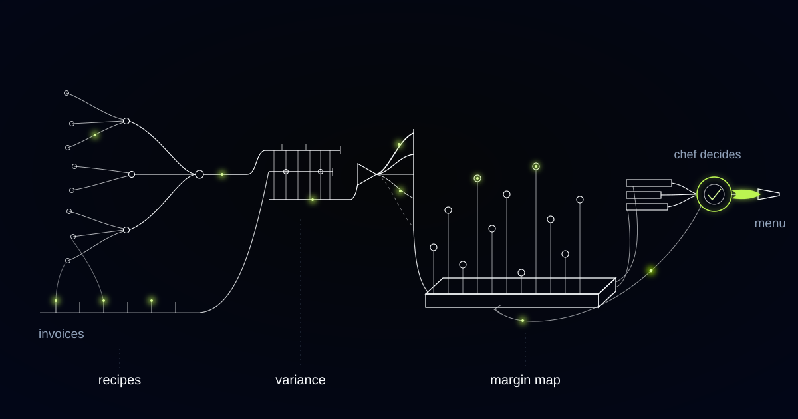

# A Costing Engine Where the Allergen Matrix Holds a Veto

> A cheaper thickener four levels down a prep tree can rewrite thirty-eight allergen declarations, so the allergen matrix vetoes substitutions before ranking ever sees them.

## One ingredient, thirty-eight dishes, four levels down

One ingredient in this group's catalogue appears in thirty-eight dishes, and in most of them it sits four levels down a preparation tree. It is on none of those thirty-eight ingredient lists. It is in a stock, which is in a reduction, which is in a base sauce, which is in the thing a guest orders.

That number reframes what a costing engine is for. A distributor reprices one case and thirty-eight plate costs move, none of them visibly. It also reframes what a substitution is, because swapping that ingredient rewrites thirty-eight allergen declarations at the same moment it moves thirty-eight margins.

The group runs dozens of sites across several cities under a handful of formats. In a multi-site kitchen, cost and legal declaration are the same object. Any substitution that improves plate margin also rewrites an allergen declaration and can invalidate a published dietary claim, which is why the allergen matrix has to veto cost recommendations at generation time rather than review them afterwards.

## As purchased is not edible portion, and the gap is site-specific

Kitchens cost on edible portion, not as purchased, and the conversion between the two is a yield test rather than a constant. A cut or a case arrives at an as-purchased price; trimming, boning and peeling leave a smaller quantity of usable product at a higher cost per kilogram, and that edible-portion cost is the only one that belongs in a plate cost.

The yield achieved varies by supplier specification and by the person doing the prep. That is why the same recipe genuinely costs different amounts at two sites buying from the same distributor, and why a group-average yield factor is a comfortable fiction.

Trim yield on the same cut varied enough between two approved suppliers to exceed the margin difference the engine was recommending on, which meant a single group yield factor was quietly producing the wrong answer everywhere, including in the places where it looked most confident.

Yield-true plate cost: the cost of a dish computed through every level of its preparation tree using the yield each site actually achieves on the supplier specification it actually receives, rather than a group-average yield factor applied to the as-purchased price. It is the only plate cost that moves when a distributor changes a pack size.

## The substitution list that would have put wheat into a gluten-free sauce

We ranked substitution proposals by cost saving per portion, and the first list the engine produced included swapping a thickener for a cheaper equivalent containing wheat starch. That thickener sat in a base sauce four levels down a prep tree feeding a dozen dishes, several of them sold as gluten free.

No chef would have shipped it, and that is not the reassurance it sounds like. The engine could compose the proposal and rank it first, which meant the constraint lived in somebody's head instead of in the system, and a food-safety constraint enforced at review is a constraint that will eventually be reviewed by somebody in a hurry.

Regulation (EU) No 1169/2011 requires the fourteen named allergens to be declared for non-prepacked food sold in hospitality, and food prepacked for direct sale must carry a full ingredient list with those allergens emphasised. The declaration is a legal statement about a finished dish, and every preparation level beneath that dish is inside its scope.

Substitution proposals now run an allergen and dietary-claim propagation pass up every branch of the recipe tree before ranking. A proposal that alters the allergen set of any dish above it, or breaks a published claim, is not demoted and not flagged for a human to catch. It is never generated.

*Cost, waste and popularity meet at the dish, where a chef can actually act on them.*

## Waste is five different things and one percentage hides all of them

We refuse to report a single waste percentage, because the number that arrives each month as "food cost is over, tighten up" is at least five distinct phenomena with five different owners. Trim and prep loss. Spoilage. Over-portioning. Comps, voids and remakes. Till errors that make recorded sales differ from what left the pass.

The engine computes theoretical usage by exploding every ticket back into ingredients through the recipe tree, compares that against actual usage from deliveries and counts, and splits the gap by cause. Prep waste comes from bench logs, spoilage from expiry and rotation records, comps and voids from the till, over-portioning from a persistent one-directional gap on a specific dish at a specific site.

Whatever cannot be attributed is reported as unexplained. It is not spread across the named causes to make the model look complete, because a tidy attribution nobody can act on is worse than an honest gap somebody investigates.

Comps and remakes are not kitchen waste at all. They are service recovery, and filing them under food cost sends a head chef to examine portioning when the real answer is a dining room running badly behind.

## Variance is a question, never an accusation

Attribution runs by site, by shift and by ingredient, and stops there. We refuse to attribute variance to a named shift team, and that refusal sits in the data model rather than in a usage policy somebody could relax.

Variance is a question addressed to a site, not an accusation aimed at a person. A spike on a Saturday night is a prompt to go and look, and the looking is done by somebody who knows the fryer was down and the section ran a cook short.

The practical reason is that accusatory reporting destroys the data it depends on. Bench logs, spoilage records and portion checks are entered by the same people who would be named, and a system that turns their honesty into a disciplinary exhibit gets fed less honestly within a month. Measurement changes the thing measured, and in kitchens it does so quickly.

## What the engine may propose and what only the chef may do

The engine costs and proposes; the executive chef owns the menu and finance owns the price. It does not change a menu, a price, a purchase order or a recipe, and it holds no write access to the systems that would let it.

Each proposal states the observation, the mechanism and the options: this dish's contribution has fallen since a named ingredient repriced, and the choices are reformulate, resize the portion, change supplier, reprice or retire. The chef accepts, rejects or defers. Price changes need finance on top of that.

Rejections carry their reason and become constraints the engine respects afterwards. This dish is why a table of six chooses us. That supplier fails our sourcing standard. That portion is the portion. A recommendation list that gets shorter and sharper is working; one that repeats itself every month is being ignored, which is the same signal a chef would give you if you asked.

The engine is very good at knowing what things cost. It knows nothing about what a restaurant is for.

## Common questions

### Will it change our recipes or place orders automatically?

No. The engine holds no write access to menus, prices, purchase orders or recipe specifications. It produces a short list of proposals with the reasoning and the options attached, and a named human accepts, rejects or defers each one. Price changes require finance approval in addition to the executive chef's decision.

### How does it stop a cost-saving swap from breaking an allergen declaration?

Every substitution proposal runs an allergen and dietary-claim propagation pass up every branch of the recipe tree before ranking. If a swap would alter the allergen set of any dish containing it, or break a published claim such as gluten free, the proposal is never generated. The constraint sits at generation, not at review.

### Why will you not give us one waste number for the group?

Because that number would blend trim loss, spoilage, over-portioning, service recovery and till errors, which have different causes and different owners. A single percentage produces the same monthly meeting and no action. We report variance split by cause, site, shift and ingredient, with anything unattributable reported honestly as unexplained.

### Do we need yield tests at every site before this works?

Not before it works, but before it can be trusted on substitutions. The engine runs on group yield assumptions initially and marks every plate cost derived from one. Site-level yield tests on your highest-value cuts replace those assumptions first, because that is where a wrong yield factor exceeds the margin difference you are deciding on.

## Do you know what your dishes cost at the site that actually cooks them?

If your plate costs come from a group spreadsheet applying one yield factor to an as-purchased price, they describe a kitchen that does not exist. We build these engines so costing runs through the whole preparation tree at site-level yields, and so no proposal reaches a chef if it would rewrite an allergen declaration. Tell us what your menu looks like.
