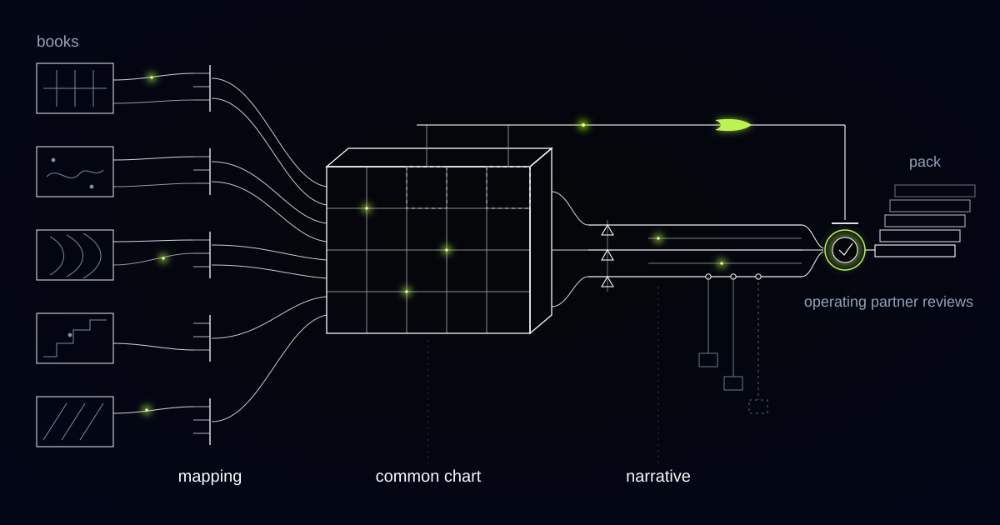

# A Reporting Engine That Computes Two Correct EBITDAs From One Trial Balance

> How we built a portfolio reporting engine for a mid-market private-equity operating team, and why the same ledger has to produce more than one right answer.

## Day eleven, and an analyst is on the phone about one line again

It is the eleventh working day of the month. An analyst has a trial balance open on one screen, a mapping workbook on the other, and a controller on the phone explaining why a cost line moved. In a folder sits the facility agreement for that same company, which defines the number the lender will test at quarter end, unopened since the deal closed.

Our customer is a mid-market private-equity firm with a portfolio in the low double digits, manufacturers, distributors and a couple of software businesses across several countries, run by an operating team small enough to fit in one room. Every month that team produces a pack per company: the numbers, the variances, the operational metrics, the commentary. The packs feed the investment committee, the boards, and eventually the LPs.

Every company keeps its books differently and none of them is wrong to. One runs a mature ERP with a chart of accounts refined over twenty years, one runs entry-level software where half the analysis lives in the memo field, and two use the same system configured in incomparable ways. The first fortnight of every month goes to translating between them, and the people hired to improve businesses spend it doing data entry.

## Who each number in the pack is written for

Each number in the pack is computed for a named reader, and EBITDA is where that bites. The investment committee reads Management EBITDA under the fund's adjustment policy; the lender reads Consolidated EBITDA as defined in that company's facility agreement. Those are different contractual constructions of the same ledger, and the engine's job is to keep both computable, labelled and reconciled rather than to choose between them.

Basis: the named rule set under which a metric was computed, comprising the mapping version, the adjustment policies applied, their caps, and their look-forward limits. A metric published without its basis is an assertion rather than a number, since the same trial balance yields a different and equally correct EBITDA on the fund's management basis and on a facility agreement's basis.

Every metric the engine publishes names its basis, and any two figures shown side by side must share one or be reconciled line by line from the one to the other. That reconciliation is an exhibit in the pack rather than a working file on a laptop, because the gap between the management number and the covenant number is where the uncomfortable surprises live.

## Add-backs are contract terms, not accounting opinions

Covenant compliance is tested on Consolidated EBITDA as defined in the facility agreement, not on any accounting standard. That definition enumerates the permitted add-backs, frequently caps them at a stated proportion of unadjusted EBITDA, and limits run-rate synergies and cost savings to those expected within a stated look-forward period, commonly twelve to eighteen months. Certificates are due within a set number of days of each test date, and equity cure rights are limited in number and usually cannot be exercised in consecutive quarters.

We implemented adjustments as one policy list applied uniformly to mapped accounts. It produced an adjusted EBITDA that was internally consistent across the portfolio and useless to the deal team. Two companies' facility agreements treated add-backs differently, one capping them as a proportion of unadjusted EBITDA and one excluding run-rate savings beyond a twelve-month look-forward, and our number silently exceeded both. The management pack and the covenant certificate diverged, and nobody could see the seam.

Adjustments became typed objects. Each carries a policy identifier, the agreement clause it derives from, its cap rule and its look-forward window, so the engine can apply a cost as an add-back on one basis and refuse it on another from the same entry. A cost that looks exceptional but matches no policy on either basis is raised as a question for the CFO and the operating partner. It is never quietly stripped out, and no adjustment is applied that is not tied to a written policy or a clause.

*Companies that keep their books differently converge on one chart of accounts.*

## The mapping proposal that never activates itself

The system proposes mappings for new accounts and never activates one on its own. It recognises that an account called "Freight Out, Region 2" belongs with distribution costs, and that recognition is a suggestion sitting in front of the named person who owns that company's mapping. Until they resolve it, the account is an exception and the affected pack carries a visible flag.

Silent mapping is the most dangerous thing a system like this can do, because it produces a pack that looks complete, reconciles to nothing, and is believed. A company adds a general ledger account, the mapping does not know about it, and the trend line lies without anyone noticing.

Each company connects the way it can, through an API where the accounting system has one, a scheduled export where it does not, and a defined file drop for the businesses whose finance function is one person and a spreadsheet. We refuse the project everyone reaches for first. Replacing a portfolio company's accounting system to make fund reporting easier is a two-year programme aimed at the wrong constraint, and the translation layer above the source systems is the thing that actually needs building.

## An unexplained variance found on day two is a phone call

When a line moves materially against budget, forecast or prior period, the engine drafts the explanation an analyst would otherwise assemble by hand and grounds it in the detail underneath. Gross margin fell at one company because a mix shift toward a lower-margin line coincided with a raw material price increase, with the specific accounts and volumes cited beneath the sentence. Where the portfolio company submitted its own commentary, it is carried through and attributed rather than paraphrased into the fund's voice.

The draft is also required to admit ignorance. When a number moves and nothing in the data explains it, the draft says so and names the question to put to the controller. An unexplained variance surfaced on day two is a phone call. The same variance discovered in a board meeting is an incident.

Operational data arrives on the same period boundaries: headcount, units shipped, bookings, utilisation. A margin discussion without volume underneath it is guesswork with a chart attached.

## Covenant headroom is the exhibit nobody should draft from memory

Headroom against each financial covenant is computed on the agreement's own basis, with the certificate due date, the permitted add-back caps and the remaining equity cure rights shown alongside it. Cures are limited in number and typically cannot run in consecutive quarters, so how many remain belongs in the pack rather than in somebody's memory during a board meeting.

Sign-off stays with the operating partner who owns the company. A pack cannot be signed while blocking exceptions are open, and exceptions are never silently excluded from totals to make a pack render cleanly. An incomplete pack states what is missing, because one that quietly drops what it could not handle is worse than one that arrives a day late.

The engine does not decide what counts as exceptional, does not activate a mapping, does not select a basis for an external audience, and does not publish any metric without naming the basis it was computed on. Every figure traces through its basis and its mapping version back to the source trial balance line, so the answer to "where does this come from" is a path rather than a recollection.

## Common questions

### Why can't we just agree one definition of EBITDA across the portfolio?

Because one of the definitions is not yours to set. Each company's facility agreement defines Consolidated EBITDA for covenant purposes, with its own permitted add-backs, caps and look-forward limits, and lenders test that number regardless of fund policy. A single portfolio-wide definition is useful for comparing companies and unusable for compliance, so both have to exist and reconcile.

### Do our portfolio companies have to change their accounting systems?

No, and we will argue against it. Each company connects through an API, a scheduled export or a defined file drop, and the mapping to the fund's chart of accounts is versioned and owned by a named person. An ERP consolidation to improve fund reporting is a multi-year programme aimed at the wrong constraint, and it still leaves you needing the translation layer.

### Who signs off, and what happens if something is unresolved?

The operating partner responsible for the company signs every pack, and the pack cannot be signed while blocking exceptions are open: unmapped accounts, adjustments awaiting a decision, unexplained variances, missing submissions. Nothing is silently excluded to make the totals render. The pack states what is missing and who owes the answer.

### Can it produce the covenant compliance certificate itself?

It computes the number on the agreement's basis, shows the clause behind each add-back and the cap applied, and tracks the certificate deadline against the test date. The certificate itself is signed by the people whose signature the agreement requires, on figures they have reviewed. We build the arithmetic and the audit trail, not the signature.

## Does your pack agree with your covenant certificate?

If your management EBITDA and your lender's definition are reconciled once a quarter by an analyst with two documents open, the seam is invisible until it matters. We build the translation layer above the source systems, keep every metric labelled with the basis it was computed on, and leave sign-off with the partner who owns the company. Tell us what your month-end looks like.
