# A Horizon Scanner That Diffs Provisions, Not Files

> A supervisory Q&A row can change a payment firm's obligations without any document changing, so this scanner watches provisions and database entries rather than files and feeds.

## The text that binds you arrives years after the law is passed

Level 1 is the least useful place to watch. Under the Lamfalussy structure that organises European financial regulation, Level 1 is the regulation or directive, Level 2 is the delegated and implementing acts drafted as regulatory and implementing technical standards by the European Supervisory Authorities, and Level 3 is the guidelines, recommendations and Q&As. The operational detail that changes what a payments firm has to build lands at Level 2 or Level 3, years after the headline law passed and long after the trade press stopped covering it.

The fintech we built this for is licensed across several European markets. Its rulebook is written by a national regulator in each of them, by the European supervisory authorities, and by the official journals where the legal text finally appears. One compliance officer tracked all of it through newsletters, consultation papers, guideline pages and a folder of bookmarks, at a reading load well into double-digit hours a week. She was good at it, which is exactly why nobody had ever questioned the arrangement.

Reading was never the job. The job was what follows the reading: deciding which controls a change touches, who owns them, and the date by which something has to be true. Scanning was consuming the hours that assessment needed.

## Level 3 changes your obligations without changing a document

An answer in the ESAs' Single Rulebook Q&A can change how a rule is applied in practice without amending any published legal text at all. A row appears in a database, a supervisory expectation moves, and nothing a file monitor would recognise as a document has happened.

That fact rules out an entire product category. Feed readers, newsletter digests and PDF watchers are built on the assumption that obligations arrive as documents with publication dates. Several of the most consequential Level 3 events are rows, timestamps and translations.

So the system treats a Q&A entry as a first-class monitored object, with its own identifier, question text, answer text and revision history, and it links each entry to the provision it interprets. A changed answer routes exactly like an amendment to the article it concerns, because for the firm the consequence is the same.

## Hashing the PDF was noisier than the newsletters

Content hashing on the source URL was the obvious first move, resting on the correct assumption that regulators replace PDFs in place. Regulators do precisely that: same URL, same filename, different text, no announcement.

What we did not anticipate was the opposite failure. Many regulator pages embed a generated render timestamp, a session identifier or a rotating consultation banner, so the hash changed daily on pages where nothing substantive had moved. Within a fortnight the compliance officer was ignoring the system exactly as she had ignored the newsletters, and she was right to. Hashing produced more noise than the manual process it replaced.

That failure set the standard the system is now held to. An alert that is wrong costs more than an alert that is late, because a person who has learned to dismiss your alerts will dismiss the true one at the same speed as the rest.

## Diff the provision, not the file

We rebuilt around structural extraction. Each instrument is parsed into its numbered provisions, articles and paragraphs, guideline numbers, Q&A identifiers, and the comparison runs provision by provision against the stored previous version. An alert reads "Article 12(3) amended, reporting window unchanged" instead of "file changed". Boilerplate churn stopped generating anything at all, because a render timestamp is not a provision.

Provisions are also the join key to the business. A register links each provision to the internal artefacts that cite it: controls, policies, procedures and product features. When Article 12(3) moves, the system names the outsourcing register, the incident-response policy and the merchant-onboarding flow, per market, where the mapping differs by market. We built that register in working sessions with the compliance officer, who could already recite most of it from memory. Writing it down is what makes it survive a handover.

Horizon scanning is not document monitoring. Document monitoring tells you a file changed. Horizon scanning tells you which provision changed, which internal control or policy cites that provision, who owns it, and the first date on which the company loses the ability to influence the outcome.

*Change arrives from many sources, gets compared against what stood before, and lands on an owner.*

## The comply-or-explain clock starts with the translations

Under Article 16(3) of Regulation (EU) 1093/2010, national competent authorities must state within two months whether they comply with an EBA guideline, and that two-month window runs from publication of the official translations rather than from the English text. The operative date for a firm is therefore a translation date, published quietly, in a language section, on a page nobody has bookmarked.

The system watches translation publication per language and starts the clock from it, market by market. One guideline published in English can carry three different comply-or-explain deadlines across three licensed markets, and those dates decide when each national regulator's position becomes knowable to you.

None of this is exotic to anyone who has lived it, and none of it is visible to a monitoring tool that treats the English PDF as the event.

## The deadline worth routing on is the consultation closing date

Every routed change carries a deadline, and the one we default to is the first date on which the company loses the ability to influence the outcome. For a consultation paper that is the closing date, not the eventual date of application. Once the consultation closes, the only remaining option is compliance.

Application dates, transposition deadlines and dates of entry into force still travel with the task, because implementation needs them, but they arrive as the second date rather than the first. A consultation closing in six weeks outranks a regulation applying in two years. A task list sorted the other way around is how firms end up complaining in public about rules they were invited to comment on.

## We do not let it say whether a rule applies to us

The system states what changed and which internal artefacts cite the affected provision. It does not state whether a change applies to us, and it never answers the question "are we compliant with this?". An answer to that question is legal advice manufactured by a machine and handed to a person who is personally accountable for it.

We also refuse auto-closure of tasks. A task does not close because a deadline passed, because a linked policy file was edited, or because the system inferred that somebody probably acted. A regulatory obligation is discharged by a named human recording what they did, or it is not discharged. The record that falls out of this, what arrived, who was told, what they did and when, is the artefact a supervisor asks to see.

Every summary links back to the passages it came from, and the compliance officer reviews each assessment before it ships, confirming relevance, correcting the impact mapping and redirecting an owner when the register chose wrong. Her corrections update the register itself, so the mapping improves in the place where it is used rather than inside a model nobody can inspect.

## Common questions

### How is this different from a regulatory newsletter or an alerting feed?

A feed tells you that a document was published. This tells you that Article 12(3) changed, that your incident-response policy and merchant-onboarding flow cite it, who owns each of them, and the first date on which you lose the ability to influence the outcome. The unit of work is a provision mapped to an internal artefact, not an item to read.

### Will it tell us whether a new rule applies to our business?

No, by design. Applicability is a legal judgement that a named, accountable person makes. A machine-manufactured answer would sit in your files looking authoritative while being nobody's professional opinion. The system hands that person the changed provision, the affected internal artefacts and the operative dates, so the judgement takes minutes instead of a day.

### Regulators publish badly. How do you cope with sources that have no API?

By parsing structure rather than watching files. Instruments are broken into numbered provisions and compared provision by provision, so a replaced PDF at the same URL is handled and a rotating banner produces nothing. Q&A entries are monitored as objects with their own revision history, since a new answer changes practice without changing any document.

### Who closes a task once a change has been handled?

A named human, always. The system will not close a task because a deadline passed or a policy file was edited. The owner records what they did, and that record becomes the audit trail: what arrived, who was informed, what action was taken and when. Auto-closure produces a clean board and an empty evidence file.

## Which changed rows in a supervisory Q&A would reach you this month?

"Somebody would probably notice eventually" is a detection strategy resting on one person's reading stamina and their holiday schedule. We build the layer that watches provisions, maps them to your controls and puts a date on them, so your experts spend their hours on the response. Tell us which sources you are trying to watch.
