# A Tender Engine That Works Out What to Ask Before It Drafts a Word

> How we built tender parsing, ambiguity detection and answer assembly for an engineering services contractor bidding into regulated public procurement, where nobody is allowed to ring the buyer and ask what a requirement means.

## You cannot phone the client, and your questions are published

In regulated public procurement you are not permitted to call the buyer and ask what a requirement means. Contact outside the formal channel is grounds for exclusion, so the only route is a written clarification submitted through the portal, and the contracting authority answers it publicly to every bidder, anonymised. Your question fixes your ambiguity and simultaneously tells your competitors how you read the specification, and that you found something worth asking about.

The clarification deadline closes well before the submission deadline, often by a fortnight or more. That single scheduling fact reorders the whole bid. The work of understanding the tender has to finish while there is still time to act on what you did not understand, which is early, and long before anyone has written a word of a technical response.

Our customer is an engineering services contractor with several hundred engineers, pursuing dozens of tenders a year across infrastructure frameworks, industrial maintenance contracts and design-and-build packages. Each serious tender arrives as hundreds of pages of instructions, technical specifications, annexes, evaluation criteria and forms, in a mixture of native PDFs, portal exports, spreadsheets and scans. The people who can interpret it are the same senior engineers delivering billable work during the day.

So ambiguity detection became a week-one deliverable with a deadline of its own, and the compliance matrix stopped being a checklist for what to write. It became the instrument for deciding what to ask.

## Not every "shall" is yours to answer

The bid manager who opened our first compliance matrix scrolled for a while and then asked which of the rows were his. Several thousand had come back from a single framework tender, because the extraction lifted every "shall" and every "must" in the pack into a row of its own. The technical specification incorporated external standards by reference, and each of those standards carried its own obligations, so the matrix inherited an entire library of engineering requirements. The genuinely mandatory bid-time rows sat somewhere inside that, indistinguishable from the noise, which is the exact failure the matrix existed to prevent.

The modal verb was the wrong extraction unit. We changed it to two properties instead: who the obligation falls on, and when it has to be satisfied. A row is created only where the obligation falls on the tenderer at bid time.

Bid-time obligation: a requirement the tenderer must satisfy inside the submission itself, whether a document, a declaration, a form or a stated commitment, as distinct from a delivery-phase obligation the contract imposes after award. Only bid-time obligations become rows in the compliance matrix.

Everything else is routed rather than deleted. Delivery-phase obligations go to a separate register owned by contract review, where they belong, because they are commercial risk to be priced rather than paperwork to be produced this week. An incorporated standard collapses into a single row asking for a compliance statement against that standard, which is what the authority is actually evaluating.

The matrix that came back was short enough to read in a sitting: page limits, font and formatting rules, forms to be signed, certificates to be declared, method statements with word counts, evaluation criteria with their weightings, and the exact location of each in the source document. Every row has an owner, a status and a deadline, and a bid manager reviews the extraction against the source before work starts, because a parsing step nobody checks is a new place for requirements to hide.

*Requirements become a grid; answers rise from the library and dock into place, cell by cell.*

## The ambiguity register is the first deliverable, not the last

Within days of a tender dropping, while the clarification window is still open, the rebuilt matrix hands a bid manager the ambiguity register: the list of places where the tender can be read in more than one way. That register outranks every draft answer the engine writes later, because the window it depends on closes first.

An ambiguity is not a gap in your knowledge. It is a defect in the document, and the engine looks for specific shapes of defect. A requirement with two defensible readings that price differently. A contradiction between the instructions to tenderers and the technical specification. A page limit that cannot accommodate the content the evaluation criteria demand. An evaluation criterion that references a section number the pack does not contain. A form named in the instructions and absent from the annexes. A scope boundary that decides whether a whole discipline is in or out of your price.

Each entry is ranked by disqualification risk first and price exposure second, because those two consequences are not comparable and the ordering matters. A misread scope boundary costs margin. A misread eligibility condition costs the bid, before anyone reads your technical solution.

The system never drafts the questions that go to the authority. It identifies ambiguities, ranks them and shows the passages they come from. A bid manager decides which ones to ask, because publishing a question to every competitor is a commercial disclosure decision rather than a completeness one. Sometimes the right answer is to ask. Sometimes it is to price the more expensive reading and say nothing, and no system should be making that call.

## The certificate nobody checks until you win

Under the European Single Procurement Document regime, bidders self-declare eligibility at bid time and only the preferred bidder is required to produce the underlying certificates before award. Nobody verifies your declaration while you are competing. A self-declaration resting on a lapsed accreditation therefore surfaces at the exact moment it costs most, after you have won and while the standstill clock runs.

The answer library is built for that timing. Every entry carries provenance, which bid it came from, when it was written and who approved it, and every entry that depends on a dated artefact carries that artefact's expiry: ISO certificates, insurance schedules, financial statements, trade registrations, individual engineer accreditations, health and safety records. When the underlying evidence expires, the entry stops being usable rather than quietly ageing inside a shared drive.

An expired entry cannot flow into a draft. It appears in the matrix as a blocked row with the reason and the owner attached, which converts an invisible future problem into a visible present task. Renewing an accreditation takes weeks. Discovering you need to renew it during a post-award verification takes the contract.

## A gap is a row; an invention is a disqualification

We refuse to generate an answer where the library holds no approved entry. When nothing covers a requirement, the engine says so, leaves the row visibly empty and assigns it to the engineer who knows, rather than producing fluent prose that reads correct to everyone except the one person who could tell. A tender response binds the winner contractually, and an evaluator reads it with that weight.

Every drafted answer cites the library entries it was assembled from, with their freshness dates visible, so a reviewer is checking sourced claims rather than judging tone. If a passage says the firm has delivered comparable work under a similar framework, the citation points at the approved entry that says so, and the reviewer can see when it was last verified.

The system is not permitted to decide certain things. It cannot submit anything, cannot complete or sign a declaration of eligibility, cannot decide which clarification questions are published to competitors, cannot mark a mandatory row compliant without a named human, and cannot touch price. It supplies completeness, provenance and early warning. Bid managers and engineers supply judgement, and every mandatory row is green with a name against it before anything leaves the building.

## Common questions

### We bid into public frameworks. Does this help before the clarification deadline, not just before submission?

That is the point of it. The compliance matrix and the ambiguity register are produced within days of the tender dropping, while the clarification window is still open, so the questions worth asking are visible with time to act. Drafting comes afterwards. A tender you fully understand in week three is a tender you priced on assumptions.

### How do you stop the compliance matrix turning into thousands of unusable rows?

By extracting on obligation holder and obligation moment rather than on "shall" and "must". Only requirements the tenderer must satisfy inside the submission become rows. Delivery-phase obligations go to a contract review register, and standards incorporated by reference collapse into one row seeking a compliance statement, instead of importing every clause they contain.

### What happens when we have no approved answer for a requirement?

The row stays visibly empty and gets assigned to a named person with the deadline attached. The engine will not write a plausible answer to fill it, because a fluent invention in a tender is a contractual commitment and, where it touches eligibility, a disqualification. A visible gap on day three is an afternoon of an engineer's time.

### Does the system write the clarification questions we send to the authority?

No. It finds and ranks the ambiguities, shows the conflicting passages, and stops there. Every clarification is published to all bidders anonymously, so asking reveals how you read the specification, and that trade-off is a commercial judgement for your bid manager. The system makes sure nothing worth asking about goes unnoticed.

## Do you know what your tender does not tell you, while you can still ask?

If your ambiguities surface during writing rather than during the clarification window, you are pricing assumptions and calling it a bid. We build these engines to produce the matrix and the ambiguity register in the first days, and to leave every disclosure decision with your bid manager. Tell us what your next tender looks like.
