# A Shared Inbox Where Every Tenant Email Is a Notice

> In lettings a tenant's email is a legal instrument the moment it arrives, so the thing worth building is not a triage tool but a register of notices with immutable timestamps.

## We built the classifier first; the audit wanted something else

The visible problem in a lettings inbox is the sorting, so the sorting is where we started. Thousands of tenant emails a month were landing in one shared address for a portfolio of several thousand units, mixed together in arrival order: maintenance requests, billing questions, lease queries, complaints about neighbours, parking. The classifier labelled each message by type and urgency, resolved every sender to a tenant and a unit, and drafted an acknowledgment for a manager to send, and all of that worked.

The pilot then failed an internal audit for a reason no accuracy metric would have caught. Three tenants reported the same lift outage within an hour. The system correctly recognised them as the same fault, deduplicated them into one work order, and two of those tenants vanished from the record as individual reporters. Every classification in that batch was correct. The legal position was still wrong, and no amount of model tuning would have found it, because the defect was in the data model rather than in the predictions.

That failure sent us back to a question we had skipped: what is a tenant's email, legally, at the moment it arrives. Answering it properly changed the shape of the system, and everything since has been built downward from the answer rather than upward from the inbox.

## Receipt is notice. Reading is not.

A landlord's liability for disrepair generally runs from the point at which the landlord or its managing agent has notice of the defect, and notice given to the agent is notice to the landlord. Receipt starts the clock. Reading does not. An email sitting unopened in a shared inbox on a Friday evening has already started something that no amount of Monday-morning diligence can unstart, and the agent is the party that received it.

Specific hazards now carry fixed statutory timescales on top of that general position. Under the Awaab's Law regulations phased in for social landlords in England from October 2025, emergency hazards must be made safe within twenty-four hours, and damp and mould hazards must be investigated within a set number of working days of the report. The clock runs from the tenant's report, not from the moment a manager opens it, not from the moment a work order is raised.

Notice event: the moment a tenant's report is received by the agent, independent of whether any human has read it. Every inbound message describing a defect creates a notice event with an immutable timestamp, and the operational record is assembled from notice events rather than from tickets.

The practical consequence is that the ticket stopped being the primary object. A ticket is an operational convenience that can be merged, reassigned, reopened and closed. A notice event is a fact about a specific person on a specific date, and facts do not get merged for convenience.

*Urgency takes the express rail. Everything else resolves to a tenant, a unit, a work order.*

## One lift, three notices, one work order

Deduplication is right operationally and wrong legally, so the data model had to hold both. Three tenants reporting one lift outage is one repair job and three notices, because each report creates a separate obligation to a separate person, and each of those people can bring a separate claim in which the only question that matters is when their report was received and what happened next.

Reports are never merged. Work orders are. Every report keeps its own received timestamp, its own acknowledgment to its own sender, its own status trail and its own due-by, and links to the shared work order that will actually fix the lift. When the engineer signs off, the work order closes once and three notice events each record their own outcome, addressed to three people who each get told.

This also fixed a quieter failure the audit had not reached yet. Under the old arrangement, the second and third reporters received nothing, because their messages had been folded into a ticket someone else owned, and silence to a tenant who has reported a hazard is exactly the evidence that turns a repair into a claim.

Closing a report is a human act, and so is deciding that two reports are the same notice. It proposes the link, a property manager confirms it, and the link is recorded with who made it and when.

## Urgency is a hazard class with a due-by, not a colour

Urgency in this system is a hazard classification with a named regime and a due-by timestamp attached, not a red flag in a queue. The word urgent, applied by a tool nobody configured against any standard, is indefensible six months later when a solicitor asks what the agent understood the report to be and what timescale applied to it.

So a report is classified into a hazard category with the regime that governs it, and the regime supplies the deadline. Water where it should not be, the smell of gas, no heating in a cold snap, a door that will not lock, damp and visible mould: each maps to a category, each category carries a response requirement, and the due-by is computed from the notice timestamp rather than from the moment a human triaged it. Photographs are read as part of the message, because tenants photograph problems more reliably than they describe them.

Classification runs on the message content and context rather than on whether the tenant wrote URGENT in the subject line, since people in a genuine emergency rarely write tidy emails. Where the classifier is not confident, the report is escalated rather than downgraded, and a manager sees it with the candidate categories ranked.

Contractor dispatch stays with a person, including on emergencies. The work order is created and flagged within seconds, the on-duty manager is notified, and the callout that commits somebody else's money is authorised by a human who can also tell the difference between a leak and a burst main.

## Drafts that acknowledge and never interpret

Draft replies acknowledge and inform. They never interpret, and this is the refusal that surprises clients most. The system will not answer a question about a tenant's rights or a landlord's repairing obligations, even when the answer is sitting in that tenant's own agreement, because a wrong sentence about a repairing obligation, sent in writing by the agent, is evidence in a claim and cannot be retrieved.

What a draft does contain is factual and checkable: confirmation that the report was received, the timestamp it was received at, the reference of the work order it created, the category it was logged under, and what happens next. A billing question gets a reply grounded in the account state. A lease query gets an acknowledgment and a routing to the person who is allowed to answer it, not an answer assembled from the contract.

A property manager reviews and sends. Nothing leaves the inbox unsupervised, and the minutes saved on routine acknowledgments are spent on the tenant who is angry for a good reason.

There is a case where this whole design is overbuilt, and it is worth naming. If your inbox carries no statutory clock, a conventional triage tool is cheaper and perfectly adequate. The notice register earns its cost precisely where a timestamp may one day have to be produced in evidence, which in lettings is every single day.

## Common questions

### Does this replace our property managers?

No. It removes the sorting, the retyping into the maintenance system and the first draft of routine acknowledgments. Every action that touches a tenant, a contractor or a work order's closure is authorised by a person. Managers spend the recovered morning on the reports that need judgment rather than on reading a pile to discover which ones those are.

### What happens when the system classifies a hazard wrongly?

Low-confidence reports escalate rather than downgrade, so ambiguity produces a person looking at it, not a quiet delay. Every classification is recorded with the evidence it used, the manager who confirmed or changed it, and the timestamp, which means a reclassification is an auditable event. The notice timestamp itself never changes, whatever the category becomes.

### We manage private rented stock. Do the statutory timescales apply to us?

The Awaab's Law regulations phased in from October 2025 apply to social landlords in England. The underlying position on notice applies far more widely: liability generally runs from the point the landlord or its agent has notice, and notice to the agent is notice to the landlord. The register is built for that principle first, with hazard regimes configured per portfolio.

### Can it dispatch a contractor automatically for an emergency?

No, and that is deliberate. The work order is created and flagged within seconds of receipt, and the on-duty manager is notified immediately, so nothing waits for the morning. Committing somebody else's money to a callout stays with a person who can weigh the report, the property and the contractor against what the message actually describes.

## When did your oldest unanswered tenant email become a notice?

When the record cannot answer that, the answer will eventually be supplied by somebody else's solicitor, working from your own inbox. We build the register that timestamps every report on receipt, tracks each one to its own outcome, and leaves every send, every dispatch and every closure with your people. Tell us how your inbox handles a hazard report today.
