# The SOP Assistant That Refuses the Most Common Question on the Floor

> The question a floor assistant hears most, whether a dish contains an allergen, is the one it must never answer from a manual, and drawing that boundary was the real design work.

## The right answer changes with the delivery van

Guests ask whether a dish contains nuts, or celery, or sulphur dioxide more often than they ask anything else, and no retrieval system should be answering that. The correct answer depends on which supplier delivered which batch of which component that week, so it can change without a word of the operations manual changing. A manual cannot know that. Neither can an assistant built on it, however clean the retrieval and exact the citation.

The operator is a hospitality franchise network with dozens of locations across three countries. The operating knowledge exists: a 400-page operations manual, brand standards, HR policies, food-safety procedures and a growing folder of training decks. Nobody opens any of it during service, because a 400-page PDF is unanswerable at the speed a shift runs at. The working knowledge system was a phone call to head office and whoever had been there longest.

We designed the boundary before the index, because getting the boundary wrong is the only failure here that hurts somebody.

A question is answerable from the manual only if its correct answer changes when the manual changes and at no other time. Questions whose answer changes when a delivery arrives, a supplier reformulates, or a batch is substituted are not retrieval questions, and must never be answered from a document however well cited.

That rule removes the highest-volume question category from the assistant on day one, and it is the correct trade. Composition belongs to the specification system, which knows the current recipe and supplier, or to a named person on site holding the pack.

## Fourteen allergens in one market, nine in another, and one operations manual

Allergen obligations are split by jurisdiction, and the split is not cosmetic. EU Regulation 1169/2011 names 14 allergens that must be declared, including celery, mustard, lupin, molluscs and sulphur dioxide. The United States names nine, having added sesame under the FASTER Act, and omits most of the European list. In the United Kingdom, Natasha's Law has required full ingredient listing with allergens emphasised on food prepacked for direct sale since October 2021. Precautionary "may contain" labelling sits outside all of it: its wording is voluntary and it is not regulated as a declaration at all.

A network operating in three countries therefore holds three correct answers to what staff experience as one question. Front-of-house staff do not think in jurisdictions. They think in dishes, with a guest waiting.

Every chunk in the index is consequently true only inside a country and a date window. A paragraph lifted from a food-safety procedure is a fact in one market, from one date, until something supersedes it.

## No jurisdiction and no effective date means no index entry

Jurisdiction and effective date are mandatory fields on every chunk, with no default and no inference permitted. The rule has a scar behind it.

Retrieval evaluation on the first build looked strong, and the real defect was in the metadata. A supplier-change memo effective in one market was being served to a location in another, because the ingestion pipeline inferred country and effective date from the document header, and this memo carried its country only in the filename. Retrieval was doing what it had been asked. The label was wrong.

So we removed inference from ingestion entirely. A chunk lacking either field is not indexed; it goes to an exception queue, where a human assigns both before anyone can retrieve the content.

Document structure survives the same pass. A procedure split down the middle is a wrong answer waiting to happen, so chunking follows the manual's own hierarchy of chapters, procedures, checklists and tables, keeping each procedure and each table whole.

*One question, one lit path through the manuals, one answer that can name its source.*

## A citation proves provenance, not currency

A citation tells you where a sentence came from and nothing about whether it is still true. Those are separate properties, engineered separately.

Provenance is the citation rule: every answer links to the exact section of the exact document that produced it, and tapping it opens the source at the right place, so a staff member, a manager or an inspector can verify it in one action. Where retrieval finds nothing solid, the assistant says so and logs the question.

Currency is the version registry: it retires superseded chunks when a policy is updated and respects effective dates, so the procedure amended on Monday is the one cited on Tuesday, in every location at once. When a memo contradicts a manual section nobody remembered to update, the conflict goes to head office. It is never settled silently by whichever chunk ranked higher.

We refuse to answer any question whose correct answer can change without the manual changing. That is a hard class boundary enforced at query classification rather than a caution in a system prompt, and it routes allergen composition, batch substitution and live pricing to the specification system or to a named human every time.

We also refuse a general-knowledge fallback. An assistant that answers a food-safety question from the model's pretraining produces exactly the confident, plausible, uncited sentence that gets a location in trouble with an inspector. The system may not decide whether a dish is safe for a particular guest, may not resolve a contradiction between two documents, and may not approve a deviation from procedure. Those decisions have names attached, and they stay with the people whose names they are.

## What the exception queue revealed about the network's own documents

On the first full ingestion run, the exception queue swallowed a substantial slice of the corpus, and that was the actual finding of the project. The network could not say, from the documents themselves, which of its own documents applied where.

Country lived in filenames, in folder structures and in the memory of whoever had circulated the file. Effective dates were frequently the date a PDF had been emailed. Several memos amended procedures without naming the procedure they amended. None of it was visible in a shared drive, because a shared drive never asks a document what it applies to.

Fixing the index meant fixing the documents. Every item leaving the queue acquired an owner, a jurisdiction and an effective date before it went back in, and that discipline now applies to anything the network publishes.

## Head office reads a live map of where the manual and the floor disagree

The log of questions nobody could answer turned out to be worth as much as the answers. It is the only place the network sees its own operating knowledge from the outside.

Refusals are grouped by class. Heavy refusal volume in the composition class at one location tells head office that staff there need faster access to the specification system, which is an access problem rather than a documentation one. Questions no document can answer, asked repeatedly across locations, mark where the manual and practice have drifted apart: a procedure that exists on paper but not on the floor, or on the floor but not on paper.

Demand data also sets the rewriting order. A short list of questions accounted for the bulk of everything the network asked, and those sections were rewritten first, in plainer language, because usage showed where clarity was owed.

## Common questions

### Can it answer allergen questions if we keep our manual up to date?

No, and no manual discipline changes that. Allergen composition changes when a supplier reformulates or a batch is substituted, which can happen between deliveries and never touches the manual. The assistant routes those questions to the specification system or to a named person on site. It will answer the procedure around allergens, which is a different question with a stable answer.

### What happens when the assistant cannot find an answer?

It says it cannot answer, names the closest documents it did find, and logs the question with the location, the shift and the wording used. Head office sees those logs grouped by topic. A documented refusal is safer than an improvised answer, and the log is the shortest route to the procedure that should exist.

### Our documents are a mess. Should we clean them up before starting?

Start anyway, and budget for the exception queue. Ingestion refuses any chunk without a jurisdiction and an effective date, so the first run tells you which documents nobody can place in a country or in time. That list is uncomfortable and useful, and clearing it moves faster than a documentation project with no forcing function.

### How do we know an answer reflects the current policy?

Every answer carries the document, the section and the effective date it came from, so currency is visible in the answer instead of assumed. When a policy is superseded, the old chunks are retired at ingestion and stop being retrievable everywhere at once. A memo that contradicts a manual section is escalated to head office rather than quietly resolved by ranking.

## What does your floor do when nobody on shift knows the answer?

Answers that travel by phone call and tribal memory make your standards whatever the most experienced person on shift remembers. A cited answer fixes part of that, and an honest refusal fixes more than most operators expect. Tell us which questions your floor asks most, and we will tell you which ones a manual is entitled to answer.
