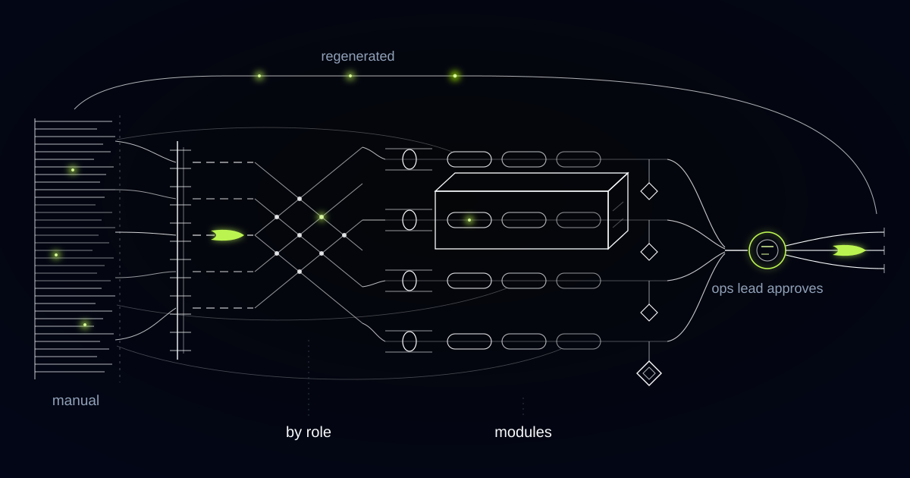

# A Generator That Turns a 400-Page Manual Into Training People Actually Finish

> How we built a training generator for a franchise network, and why the same approach matters for any organization whose standards live in a document nobody reads.

## The problem: the manual is the most complete document in the business and the least read

Most franchise networks don't have a documentation problem. They have a *transmission* problem.

Our customer operates a franchise network across several countries — hundreds of locations, most of them owner-operated, most of the frontline staff in their first job or their third this year. The operating manual is excellent. It runs past four hundred pages, it has been refined over two decades of running these locations, and it contains the answer to almost every question a new employee will have in their first month.

Almost nobody reads it. Not because staff are lazy, but because the manual was never written for them. It was written for the network: organized by system, phrased for consistency and legal defensibility, structured so a franchise auditor can find a clause. A new front-of-house hire on their first shift does not need the section on inventory reconciliation, the equipment maintenance schedules, or the appendix on supplier onboarding. They need the eleven things they will actually do today, in the order they will do them, in language a nervous nineteen-year-old can absorb between customers.

So what happened instead is what happens everywhere. Onboarding became oral tradition. New hires learned from whoever was on shift, which meant they learned that person's version — the shortcuts, the local habits, the step somebody dropped in 2019 because it seemed unnecessary. Multiply that across hundreds of owner-operated locations and the network's standards drift into hundreds of dialects. The manual says one thing. The floor does another. Nobody is lying; the transmission channel is just a game of telephone with high staff turnover at every node.

Head office knew this, and had tried the obvious fix: build proper training modules. They got through a handful of roles before the effort collapsed under its own weight, because manual training design is slow, and because the moment a policy changes, every module touching it becomes quietly wrong. Training built by hand ages badly. Training that ages badly is worse than no training, because staff learn to distrust all of it.

## What we built

A generator that takes the operating manual as its source and produces role-specific onboarding modules with checks for understanding — every statement traceable to the paragraph of the manual it came from. Head office defines the roles. The system maps the manual to those roles, drafts the modules, drafts the assessments, and — this is the part that makes it survive contact with reality — regenerates the affected modules whenever the underlying policy changes.

The governing rule is that the system has exactly one source of truth and no imagination. If a claim is not supported by the manual, it does not appear in a module. When the generator finds that a role genuinely needs an answer the manual does not contain, it does not fill the gap with plausible industry practice. It raises the gap to the operations team as a question, which turns out to be one of the more valuable outputs of the entire system: a list of the things the network assumed everyone knew and never wrote down.

*One manual, many roles. When the policy changes, the affected modules regenerate.*

*The manual is decomposed into procedures, routed by role, and rebuilt as modules — with a human approving every publish.*

## How it works

### Layer 1: Parsing the manual and mapping it to roles

The first layer decomposes the manual into atomic units — individual procedures, policies, standards and safety rules — each anchored to its exact location in the source document. A procedure keeps its steps, its preconditions, and its stated reason. Nothing is summarized yet; this stage is about structure, not prose.

Then each unit is mapped to the roles it applies to. The role definitions come from the operations team, not the model: shift lead, front-of-house, kitchen, opener, closer, franchise owner. The mapping is proposed by the system and reviewed by an operations lead, who can move any unit between roles. That review is quick, it happens once per manual revision, and it is where a person makes the judgment call that matters most — who genuinely needs to know this.

### Layer 2: Module generation per role

With a role's units assembled, the generator writes the training. Short modules, sequenced in the order the work actually happens rather than the order the manual is organized in, framed as situations instead of clauses: not "policy 7.3.2 governs allergen handling" but what to do when a customer asks whether the sauce contains nuts.

Every generated sentence keeps its citation back to the manual paragraph behind it, visible to any reviewer and to the staff member taking the module. This is what makes the output auditable rather than merely fluent. When an operations lead disagrees with a module, they can see instantly whether the problem is the module — a bad rewrite — or the manual itself, which is a different and often more important discovery.

### Layer 3: Assessment generation, and the line the machine may not cross

Each module gets checks for understanding: scenario questions with a cited correct answer, drawn from the same units the module teaches. Questions that cannot be answered from the module are discarded automatically, because a question testing knowledge you were never given is a trick, not a check.

Here the boundary has to be architectural, because this is where a training system stops being a convenience and starts touching legal obligation. Modules covering food safety, workplace safety, alcohol service, or anything else the network is legally required to train and certify are routed to a named compliance owner for approval before they can be published, and they cannot be published any other way. The system also never records that a person is certified. It records that they completed a module and how they answered — evidence, not a verdict. Certification remains a signature from a qualified human trainer, exactly as the law in these markets requires. A generator that could quietly mark someone qualified to handle allergens would be a liability wearing the costume of a productivity tool.

### Layer 4: The currency loop

The final layer is the reason the system doesn't rot. Policy changes are made once, in the manual. When a section is edited, the system identifies every module and every assessment question derived from it, regenerates them, and produces a diff showing precisely what changed and why.

An operations lead reviews the diff and approves the publish — nothing reaches staff automatically. On approval, the network gets two things it never had before: updated training within days of a policy change instead of never, and a list of exactly which people at which locations were trained on the superseded version and need to retake it. Head office stops asking whether the network knows about the new procedure and starts knowing.

## Why this generalizes

The shape is common: a large, high-quality body of written standards, a distributed frontline workforce with real turnover, and a legal obligation to demonstrate that people were trained. That is hotel groups, where brand standards run to volumes and the housekeeping team changes constantly. It is clinic and care-home networks, where mandatory training is inspected and the consequences of drift are clinical rather than commercial. It is industrial contractors and logistics operators, whose safety documentation is thorough, current, and largely unread by the people on the yard at six in the morning.

In each case the manual is not the problem. The manual is the asset. What has been missing is a way to turn it into something a person can absorb on their first shift — and to keep doing that automatically every time the standard changes, with someone accountable signing off before it reaches the floor.

## Sitting on a manual nobody reads?

If your standards live in a document your frontline staff have never opened, your training is currently oral tradition, and it drifts a little further from the manual with every hire. We build these generators source-anchored and approval-gated, so the training says exactly what your manual says and a human always signs the publish. Tell us what your onboarding looks like today.
