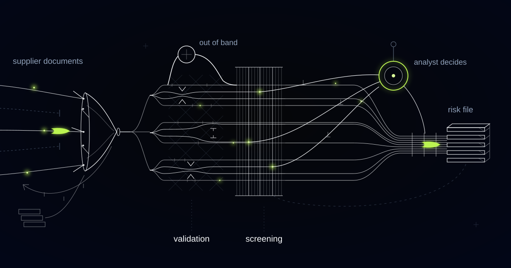

# A Supplier Onboarding Engine Whose Real Output Is an Ownership Graph

> Why screening a supplier's name misses the counterparty procurement is obliged to refuse, and why we resolve identity along the chain before adding anything up.

## The counterparty you must refuse may be on no list at all

The screening record in a typical supplier file is a saved PDF of one search against one name. Type the supplier's name into the sanctions lists, read the hits, save the file: that procedure will pass a company you are prohibited from paying, because prohibition propagates up ownership chains and the entity at the bottom appears on no list at all.

Under OFAC's 50 Percent Rule, an entity owned 50 percent or more, directly or indirectly, in aggregate, by one or more blocked persons is itself blocked, whether or not it has ever been named. EU practice applies a comparable ownership and control test. The prohibition attaches to a structure, and a structure is not a string you can search for.

The buyer is the procurement team at an industrial manufacturer with plants in several countries, onboarding hundreds of new suppliers a year, from a workshop machining one bracket to a contract manufacturer building subassemblies. Before a first order can be raised, a supplier has to produce company registration, ultimate beneficial owner declarations, tax and VAT registration, bank details, insurance and quality certificates, a signed code of conduct, and a screening record.

All of that used to arrive by email, and elapsed time was measured in weeks, almost all of it waiting. Delay does not stay administrative: a plant needs a part, so somebody raises an emergency supplier and completes the onboarding retroactively. The workaround path is precisely the path on which screening does not happen, which makes the slowest process in procurement the largest hole in its controls.

The portal that collects those documents matters, and it is not the interesting part. The documents are raw material for an ownership graph, and the graph is what the analyst needs.

## Fifty percent, in aggregate, through any number of hops

Aggregation is the trap, because no single ownership path has to look remarkable for the threshold to be crossed. Two intermediate holdings of thirty percent each, registered in different jurisdictions, tracing to the same blocked individual, put the supplier over the line while each path on its own reads as an ordinary minority stake.

The system builds the ownership chain from what it can evidence: shareholder registers and UBO declarations from the supplier, national corporate registry filings, group structure charts, and the directors and shareholders extracted from the registration documents. Each edge carries its source and the date that source was current, because an ownership percentage with no provenance is a rumour with a decimal point.

Extraction never normalises a discrepancy away. When the entity on the insurance certificate differs from the entity on the registration, or a registry shows a shareholding the supplier's declaration omits, both values surface side by side as a flag. A system that quietly reconciles two different company names is not saving time, it is deleting the finding.

Screening then runs across the whole graph, not the trading name: the legal entity, its parents, its ultimate beneficial owners, its directors, and the countries the goods will actually move through. Matching is fuzzy by design, covering aliases, transliterations, name-order variations and date-of-birth proximity, and tuned toward recall, because a missed sanctions match is categorically worse than another false positive on an analyst's desk.

## Two thirty-percent stakes, one man, and the sum we got wrong

Aggregate the stakes before you resolve the identities and the report comes back clean whether or not the supplier is. We know because our first traversal did exactly that: two levels of ownership walked, stakes summed per parent, no aggregated exposure reported on a supplier that had it.

Two holding companies in different jurisdictions each held roughly thirty percent of the supplier, and both traced back to the same person: a name spelled two defensible ways under different transliteration conventions, with dates of birth recorded in different formats. Because we aggregated before we resolved identity, the graph treated one man as two shareholders, and two thirty-percent stakes summed to nothing worth reporting. The arithmetic was correct. The nodes were wrong.

We inverted the order. Candidate identity resolution now runs across the whole chain first, matching persons and entities on names, transliterations, dates of birth, national identifiers, addresses and directorship overlap, and only then does aggregation run over the resolved graph. The change sounds like sequencing. It is the difference between a clean report and a true one.

*Screening produces evidence for an analyst. It never rejects a supplier on its own.*

## A range beats a number when the identity is unresolved

Where identity resolution along the chain is uncertain, the system refuses to emit a single percentage and emits a range instead: the minimum on the assumption that the ambiguous nodes are different people, the maximum on the assumption that they are the same, with the disambiguating attributes shown side by side for the analyst who decides which it is.

Aggregated ownership exposure is the total share of a supplier held, directly and indirectly, by listed persons or entities, summed across every ownership path after the persons at the ends of those paths have been resolved to a single identity. Because aggregation is meaningless before identity resolution, a system that sums first reports clean chains that are not clean.

We also refuse to build the composite supplier risk score that procurement teams reliably ask for, in which a sanctions match, an expired insurance certificate and a weak ESG questionnaire answer are weighted into one number. A sanctions match is not a magnitude on the same axis as a late document. Averaging them produces an amber traffic light that hides a prohibition.

## Bank details are a payment instruction wearing a PDF

Bank details are handled as a higher-trust artefact than any other document in the pack, because they are the only one that moves money on its own.

They are never accepted from an email attachment. They are confirmed out of band against a contact established independently of the document that supplied them, and any change re-enters verification with finance confirming it rather than procurement. Payment diversion fraud comes through this door dressed as a routine update to remittance details from a supplier you have paid for years.

Every other document is validated against something outside itself: is the registration number live in the national register, is the certification body accredited, does the certificate's scope cover the parts being bought. Scope mismatch is the quietest failure in supplier quality, because the certificate is genuine, current, and about something else.

## Every disposition names a person, a reason, and a list version

Screening produces evidence for a human decision, never a verdict. The system does not approve a supplier, does not reject one, and cannot dispose of a hit. It can rank a hit as likely irrelevant and show its reasoning, and there it stops.

Each hit is presented with what matched, what distinguishes the two entities, which list it came from, and which dated version of that list. Adverse media is retrieved with publication, date, and the status of what is described: allegation, ongoing investigation, or court outcome. A dismissed claim from years ago and a current indictment must never look the same in a file.

The assembled file carries a recommended path, not a decision: routine, enhanced due diligence, or the procurement risk committee that includes legal. A clean file can be approved by one analyst in minutes because the evidence is already assembled. Suppliers are rescreened on a schedule and on ownership events, with results appended to the same file rather than replacing it, and every disposition is written down with its reasoning, its timestamp, the analyst's name, and the list version in force at the time. That is what makes the file defensible years later, when somebody asks why this supplier was approved.

## Common questions

### Can the system block a sanctioned supplier automatically?

No. It assembles evidence and stops. Calling a company sanctioned is a determination about a real business and real people, and being wrong either way has consequences: a legitimate supplier blocked with no recourse, or a prohibited counterparty sitting in your master data. A named analyst dispositions every hit.

### Why won't you give us a single supplier risk score?

Because a sanctions match and an expired insurance certificate are not the same kind of fact. Weighting them into one number produces an amber light that hides a prohibition behind a document lapse. You get separate outputs: sanctions and ownership findings, document validity, and category or country context.

### What if we cannot establish the full ownership chain?

The file says so explicitly, naming which layer is opaque and why, whether that is a bearer-share jurisdiction, a nominee shareholder, or a registry with no beneficial ownership data. Unknown ownership is a finding you can act on, and it routes to enhanced due diligence. It is never reported as a clean chain.

### How much faster does onboarding actually get?

The waiting disappears and the judgment does not. Document chasing, validation and screening run without a buyer remembering to follow up, so a straightforward supplier moves in days rather than weeks. Files with unresolved ownership or an undisposed hit take as long as the analyst needs, which is the part worth paying for.

## Do you know who actually owns the suppliers you paid last month?

A name typed into a search box screens a string, not a structure. We build these systems evidence-first: an ownership graph with resolved identities at its ends, honest ranges where identity is uncertain, and every disposition made by a named person. Tell us what your onboarding looks like.
