# A Support Engine That Checks Whether Its Own Draft Is Still True

> In subscription commerce the correct reply depends on where the batch cycle stands at the moment of sending, so this engine acts first, writes second, and rechecks its facts at send time.

## Tuesday at two, the pick list leaves the building

At 13:58 on a Tuesday a customer writes to say she has moved and wants her next box sent to the new address. The draft is ready in seconds and tells her the address has been changed. At 14:00 the renewal charges run and the pick list is released to the third-party logistics provider. At 15:30 an agent working down the queue reads the draft, agrees, and sends it. Every sentence in that reply was correct when it was written and wrong when it arrived.

Subscription commerce runs on a hard cut-off, and the cut-off is the fact that governs support. Once the renewal charge has run and the pick list has gone to the logistics provider, skips, swaps, pauses and address changes stop being reversible in the order management system, even though nothing has physically shipped. Carrier label generation is a second, later point of no return. After a label exists, an address change is no longer a change at all: it is a carrier redirect, which most carriers charge for and some refuse outright on certain services.

The brand behind this build ships subscription boxes across Europe and takes thousands of tickets a month in nine languages. A few dozen intents cover the great majority of that volume, which is what makes drafting worth automating.

Classifying intent is the trivial part. Knowing what to tell her means knowing where her subscription sits in the fulfilment cycle at the moment the reply lands.

## One question, four right answers, depending on the clock

The same question from the same customer has four different true answers, and the correct one depends on cycle position, not on anything in the message. Before the cut-off, the address is changed in the subscription platform and the next box goes to the new address. Between the cut-off and label generation, this box is committed and only an operations amendment can touch it. After label generation, the honest answer is a carrier redirect with a fee and no guarantee. After delivery to the old address it is not an address change at all, but a lost parcel investigation with a different owner and a different clock.

Skips and pauses branch the same way. A customer told her box was skipped, when the charge has already run and the parcel is packed, gets both a charge and a box she declined, which becomes a refund, a return food subscriptions often cannot accept, and a cancellation conversation.

So the drafting step branches on cycle position before it composes anything, resolving where the subscription sits against the current batch window and only then writing. A draft that cannot establish cycle position goes to a human with the reason attached; writing it anyway at lower confidence is the one thing the system will not do.

*Volume funnels into intent, context merges in, and the hard cases keep their own path.*

## Every fact in the bundle carries an expiry

"We have updated the address for your next box." The first build pulled subscription state at drafting time and wrote that sentence, which was true at 13:58 and false by 15:30, because the batch had locked at 14:00 and the parcel was already labelled for the old address. Nothing had hallucinated. The fact had simply expired between generation and approval, and grounding would not have caught it, because grounding checks where a fact came from rather than how long it stays true.

So every item in the context bundle now carries a validity window. Carrier tracking is good for minutes, subscription state until the next batch cut-off, the price on file until the next renewal, stock allocation until the pick list closes. Each fact arrives stamped with the moment it stops being safe to assert.

Perishable draft: a reply whose correctness expires. A draft is perishable when any fact it asserts has a validity window shorter than the expected approval latency. Perishable drafts must be regenerated at send time or blocked from sending.

A draft inherits the earliest expiry among the facts it asserts. If that moment has passed when the agent clicks send, the draft is invalidated and regenerated against fresh state. Approval latency in a busy support team is measured in hours, so in practice this fires far more often than anyone expects.

## Act first, write second

A reply may never promise an action that has not already been executed and confirmed in the system of record at the moment of sending. We inverted the order of operations to enforce it: the system performs the change in the subscription platform, waits for confirmation, then writes the sentence describing what it just did. The draft reports history rather than intention.

We refuse to build the reverse, whatever it costs in demo elegance. Writing first and executing on approval means the sentence and the state can diverge in the window between them, and the customer holds the sentence.

Execution failure becomes useful material. When the platform rejects the change because the batch has locked, the draft is composed from that rejection: this box is already on its way, a redirect is available with a fee where the carrier allows one, and the change applies from the following box, which it has already done. The customer gets one accurate message instead of a promise followed by an apology.

## Nine languages and one sentence that is never translated

Consumer-rights and withdrawal-rights sentences are not generated by the model in any language. They are per-market legal strings, written once by counsel and inserted verbatim. The model never translates them and never paraphrases them into a warmer register, which is the failure mode that matters, because a friendlier version of a legal statement is a different legal statement.

The reason is specific to what is in the box. Under the EU Consumer Rights Directive the fourteen-day withdrawal right does not apply to goods liable to deteriorate rapidly, so a food subscription cannot honour a change-of-mind return the way an electronics retailer can. A model asked to be helpful about returns will reliably invent the version the customer would prefer.

Everything outside those strings is drafted directly in the customer's language from a versioned brand instruction set: what the product is called and never called, and the correct formality register per language, because the right level of formality in German is not the right level in Spanish. Translation of an English draft is not part of the pipeline, since a translated apology reads like one.

## Autonomy that gets revoked on a schedule

Auto-send is earned per intent, and it is revoked on a schedule, not only on failure. When an intent runs for weeks at a near-zero edit rate, a human promotes it. Every promoted intent then loses that autonomy for the hours either side of each batch cut-off, because those hours are exactly when a confident answer is most likely to be wrong.

Edits are the feedback signal we care about: they mark the precise point where the machine's answer and a person's judgement separated, and edits clustered around a cut-off tell us a branch is drawn in the wrong place.

A hard list of decisions never leaves people: refunds or credits beyond published policy, cancellations, any edit to the legal strings, and any send at all on a ticket flagged as bereavement, safety, allergy, chargeback or legal. Those route to a person with the full context bundle attached, so the agent starts from understanding rather than an empty tab.

## Common questions

### How is this different from a chatbot answering our customers directly?

The customer never talks to the model. Every reply is drafted for an agent, who approves, edits or rejects it, and autonomy is granted per intent only after weeks of clean approvals. The expensive failures in subscription support are confident and wrong rather than slow, so a person stays between the draft and the customer.

### What stops it telling a customer something that was true ten minutes ago?

Every fact in the context bundle carries a validity window, and a draft inherits the earliest expiry among the facts it asserts. If that moment has passed when send is clicked, the draft is regenerated against fresh state before anything goes out. This matters most around the batch cut-off, when state changes without anyone touching the account.

### Does it actually change the subscription, or only write about it?

It changes it first. The engine executes the skip, swap, pause or address change in the subscription platform and waits for confirmation before a sentence is written, so the reply describes what has already happened. Where the platform refuses because the batch has locked, the draft explains the options that remain.

### How do you keep quality in languages nobody in the team reads?

Drafts are written directly in the customer's language against a versioned instruction set that fixes vocabulary and formality register per market. Nothing is translated from English. Legal wording is inserted verbatim from strings your counsel wrote. Native reviewers sample per language, and any language can drop back to full review on its own.

## What does your cut-off do to your inbox?

Replies drafted against state that can change while the ticket queues are wrong by timing, not by writing. We build these engines to act first, write second, and to recheck their facts at the moment of sending. Tell us where your cycle locks.
