# Mining Ten Years of Tickets Without Publishing Workarounds as Answers

> Why most of an enterprise service desk's resolution history records circumventions rather than fixes, and how we made a knowledge base that publishes the two under different promises.

## Ten years of resolution notes is ten years of workarounds

A decade of resolution notes is overwhelmingly a record of workarounds, not fixes. Telling one from the other is the central engineering job in mining that archive, and everything else in the system exists to support it.

The distinction is not ours. In ITIL practice an incident record exists to restore service and a problem record exists to remove cause. When a problem's root cause is established and a temporary circumvention is documented, the pair becomes a known error and lives in a known error database alongside the change that will eventually remove it. Service desk resolution notes are therefore mostly known-error workarounds typed under an SLA clock, and they inherit an expiry that the note itself never states.

The provider runs service desks for large corporate clients across several countries, and their ticketing system holds a decade of history: millions of resolved tickets, each one a question somebody asked and an answer that worked at the time. It is the most complete account of how the business solves problems, and nobody could use it.

The official knowledge base was a few hundred articles produced during a documentation push years earlier. Many described systems since decommissioned, policies since changed, and steps that no longer matched the console anyone was looking at. Engineers stopped trusting it, so they stopped searching it, so it decayed further.

A workaround published as an answer is a specific and delayed hazard. It carries no expiry, so it survives the fix that made it unnecessary, and it will eventually be applied by a competent engineer to a system where restarting that service or clearing that cache does real harm. The article was never wrong. It was right in 2019, about a machine that no longer exists.

## We clustered on the symptom and produced articles that were right one time in three

Clustering on the reported symptom demos beautifully. That was our first pipeline, and its clusters were clean and convincing; the drafts underneath them were dangerous.

One cluster labelled around a VPN connection failure contained three unrelated causes: an expired device certificate, a split-tunnel policy change, and exhaustion of a licence pool. The symptom text was near-identical across all of them because users describe the same failure the same way. Synthesis dutifully merged the steps into a single confident procedure that was correct for roughly a third of the tickets underneath it, and the draft read smoothly, which was the problem.

We moved clustering onto the resolution signature instead: which configuration item was touched, which change record was linked, which console path or command family the engineer used, and whether the note pointed back at a prior ticket. Symptom text became a label on the cluster, not the key it was formed on. A second pass now splits any cluster whose fix families diverge, so three causes sharing one symptom become three articles rather than one confident average.

## Known error, workaround, permanent fix: three different promises

Every draft carries a field stating whether its steps restore service or remove cause, and that field is printed at the top of the published article rather than buried in metadata.

An article that removes cause is published as a fix and reviewed on an ordinary cycle. An article that restores service is published as a workaround, tied to the known error it circumvents, and given a review date pinned to the change record that will retire it. When that change closes, the article is queued for its owner with the change attached, so the retirement of a workaround is an event rather than an oversight nobody scheduled.

Reading the archive properly means separating what the user reported from what actually fixed it, and the real signal is scattered across comments, internal notes, attachments and linked change records. A note reading "same as last time, applied the workaround" is a pointer, and the system follows it rather than treating it as content.

*Years of resolutions become articles that know exactly where they came from.*

## Step-level provenance changes the question the reviewer is answering

Provenance attached to each step, rather than to the article, is what makes review a technical act instead of a proofread.

Step-level provenance means every individual step in a published article names the source tickets whose resolutions produced it, so the reviewing owner is asked whether they agree with eleven specific resolutions rather than whether the article reads plausibly. Provenance attached to the article as a whole is a citation. Provenance attached to each step is a review.

The machine drafts and a named human publishes. Every article has an owner, a senior engineer in that domain, who approves it before anyone can see it and stays on record as the person accountable. Where a cluster contains genuine disagreement between resolutions, the draft says so and puts the choice to the owner instead of smoothing it into a false consensus.

Before anything is synthesised, credentials, tokens, hostnames, personal data and client-identifying details are removed. We refuse to build a single cross-client knowledge pool: knowledge mined inside one tenancy does not reach another tenancy, even when it reads as generic, until a named human promotes it into the shared library. In a multi-client service business that boundary is the contract, not a preference.

## Two articles disagree, and neither of us gets to break the tie

When two published articles give conflicting instructions for the same symptom, the system opens a review task for both owners with the conflicting passages and the evidence behind each, and it does not pick a winner. Deciding which runbook is correct is an engineering judgment with operational consequences, and a system that resolves it silently will eventually be silently wrong.

Decay is detected mostly through divergence: new resolutions in a cluster where engineers are visibly doing something other than what the published article says. Weaker signals sit behind it, including change records touching the systems an article covers, citations ageing, engineers quietly editing steps, and users who received a cited answer and came back anyway.

Stale articles are demoted in the assistant's ranking and flagged to their owner, never deleted. Quiet deletion is how a good article that nobody had time to review disappears for good, and a demoted article is still recoverable by the person who knows whether it is true.

## Privileged steps carry a tag, and the tag is enforced in routing

Steps that are privileged or destructive are tagged at synthesis: restarting a production service, resetting credentials, editing a registry, deleting profile data. The tag lives in the article metadata and is enforced by the routing logic, not by a prompt asking a model to be careful.

The assistant answers end users from published articles only, and it hands over the safe portion of a tagged article while opening a ticket to an engineer with the full article attached. We refuse to let it answer from raw ticket history when nothing published covers the question. In that case it says so, routes to a human, and reports what it searched.

What the system may not decide is short and fixed. It cannot publish. It cannot promote knowledge across tenancies. It cannot choose between two contradicting articles. It cannot delete anything. Questions it could not answer become a ranked queue of knowledge gaps, which is the most honest content roadmap the organisation has, because it is built from what people actually asked.

## Common questions

### Won't this just publish our outdated documentation faster?

The opposite risk is the real one, which is why every article states whether it restores service or removes cause. Workarounds are tied to a known error and carry a review date pinned to the change that retires them. Nothing publishes without a named owner approving it, and drafts arrive with per-step citations they can check.

### Can the assistant answer from ticket history when no article exists yet?

No, and that is deliberate. It answers from published articles only, with links to the articles it used. When nothing published covers the question it says so and routes to an engineer with a summary of the request and what it searched. Unpublished ticket history has not been reviewed, redacted, or checked for expiry.

### How do you keep one client's knowledge out of another client's assistant?

Structurally, not by policy. Mining, synthesis and retrieval run inside a tenancy, and redaction removes client-identifying details before synthesis. Cross-tenancy reuse happens only when a named human promotes an article into a shared library and takes ownership of it. There is no single pooled index that a filter is asked to police at query time.

### What does this need from our engineers?

Review time from a handful of senior people, concentrated at the start. Their queue is ordered by how often a problem recurs and how recently, so the first articles reviewed are the ones costing the desk hours this quarter. Ongoing effort is mostly disposing of divergence flags and contradiction tasks, which arrive with the evidence attached.

## How much of your resolution history is a fix, and how much is a workaround still running?

If nobody can answer that, your best documentation is a note somebody typed at the end of a long shift and nobody has read since. We build these systems provenance-first, with a named owner behind every published article and an expiry on every circumvention. Tell us what your ticket history looks like.
